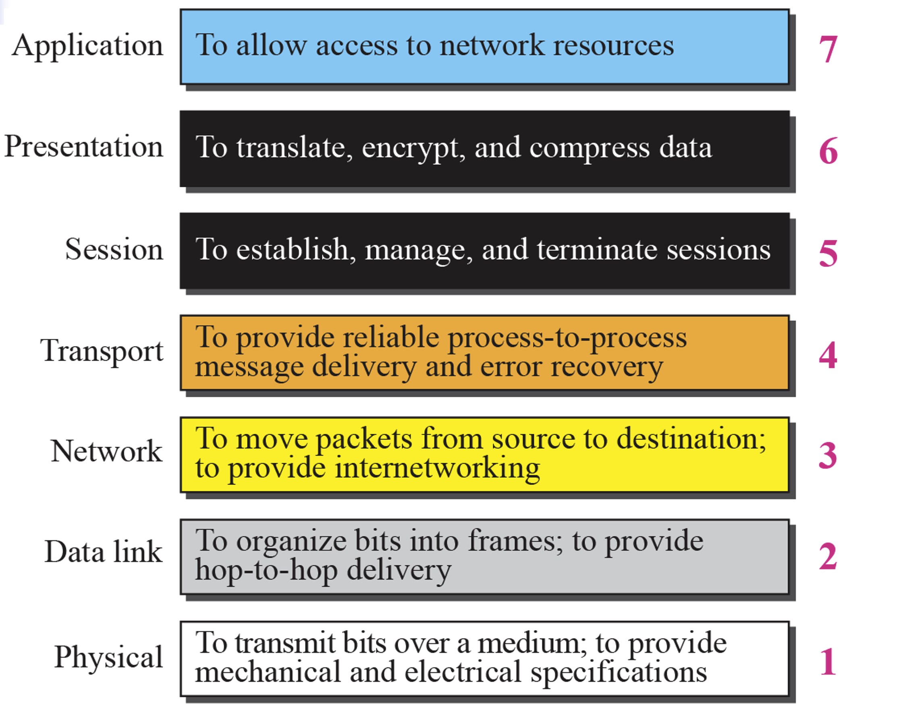
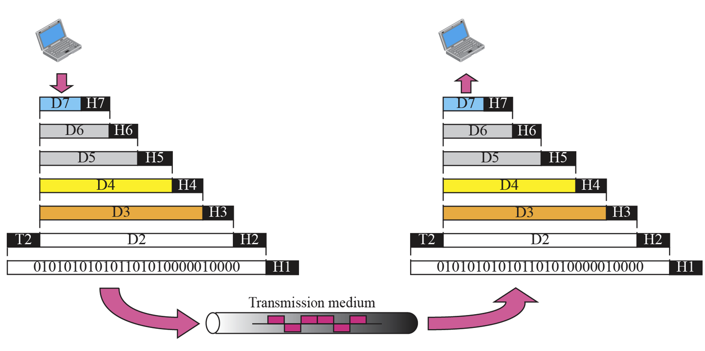
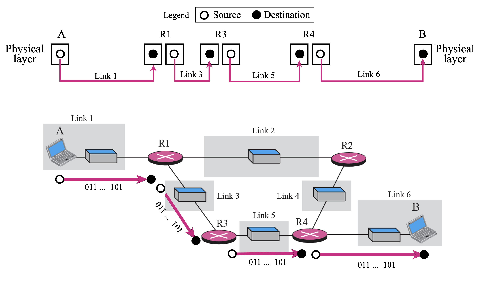
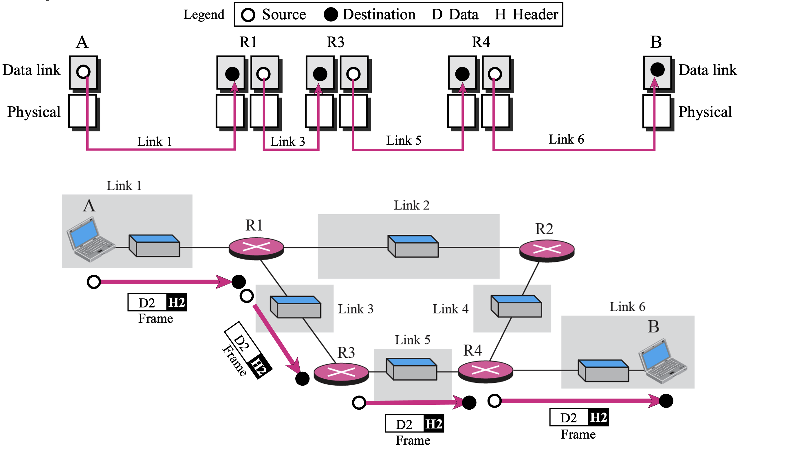
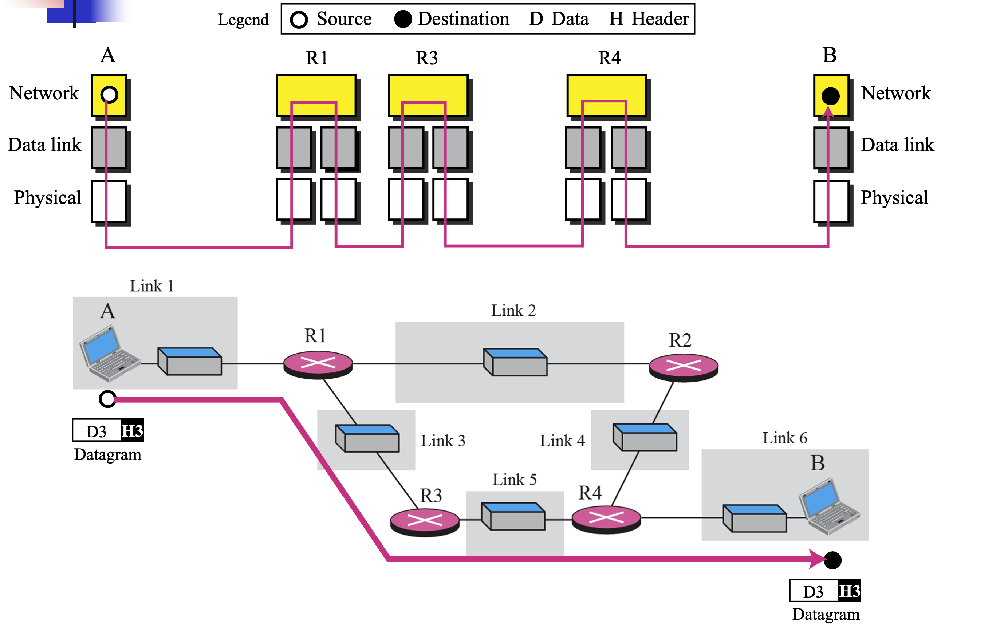
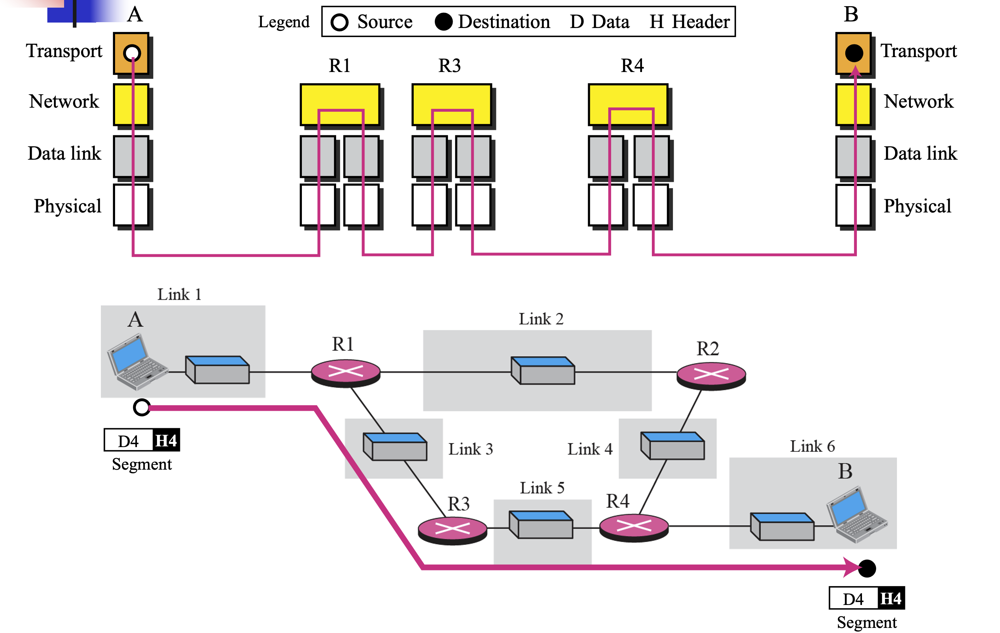
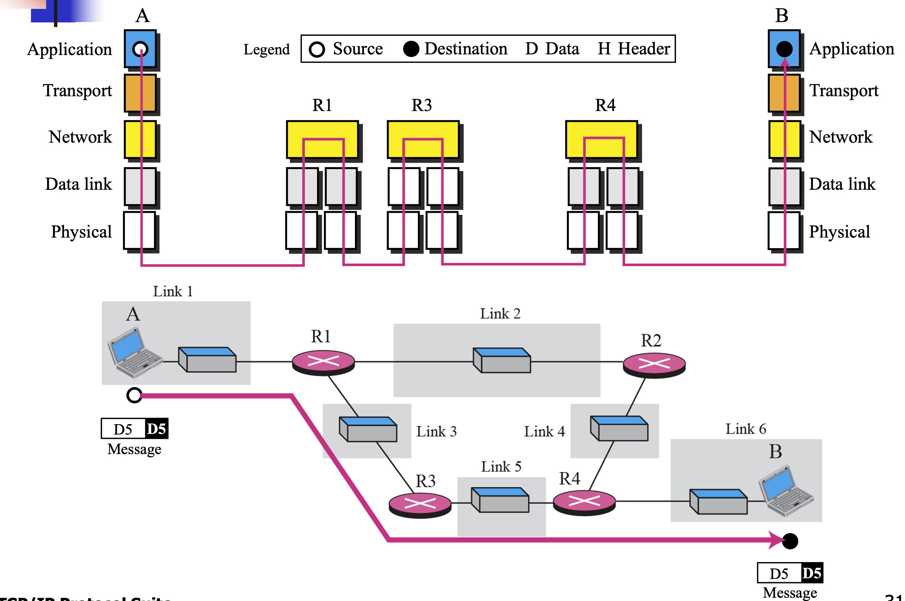
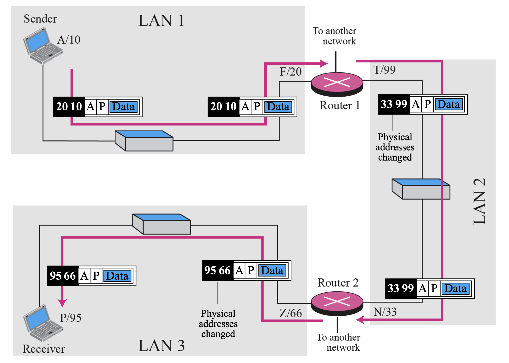
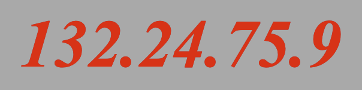
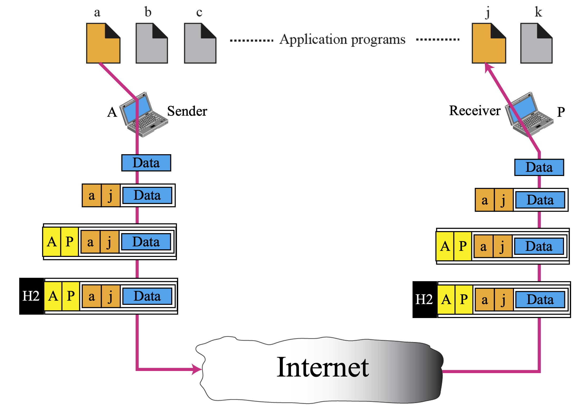

## **배운 내용**

### 네트워크의 7계층

### OSI Layers

1. Interface
      - 상위 계층에 위치한 유저가 하위 계층의 서비스를 호출하여 이용할 수 있도록 하는 기능
    - 각 계층 사이에는 interface가 위치함.
2. Layer-to-Layer Communication
    - 계층 간 통신이며 주의할 점은 반드시 같은 계층끼리만 통신할 수 있다.(6계층 <-> 7계층 통신 x)
    - 계층 간 통신은 프로토콜이 존재함.

1. Header
    - 각 프로토콜을 제어하기 위한 규칙이 들어감(송신자,목적지 등)
    - 각 계층마다 헤더가 존재하며 주소를 활용하여 제어 정보를 저장
2. Trailer
    - L2에만 존재함
    - 헤더와 다르게 뒤에 붙는다. 그 이유는 전송하기 전 계산하고 헤더에 저장하는 행위가 비효율적이기에 전송하며 계산하기 위해서이다.
    - 수식 측에서 데이터 수신 후 트레일러와 헤더를 제거하면서 상위 계층으로 이동한다.

### TPC/IP의 계층

1. 5계층
    - TCP/IP의 계층은 OSI와 다르게 5계층으로 구성되어있음.
    - OSI에서 Application, Presentation, Session 계층이 Application 계층에 모두 들어가 있다고 생각하면 됨.

2. 물리 계층 통신(1계층)
    
    - 물리 계층 통신에서는 특정 프로토콜을 규정하지 않음.
    - 통신은 두 홉 또는 노드 간, 컴퓨터나 라우터 간 통신으로 진행됨.
    - 물리 계층 통신은 '비트' 단위로 진행됨.

3. 데이터링크 계층(2계층)
    
    - '프레임' 단위로 통신이 진행됨.

4. 네트워크 계층(3계층)
    
    - '데이터그램' 단위로 통신 진행
    - 데이터그램이라는 패킷에 데이터를 전달.

5. 전송 계층(4계층)
    
    - 특이하게 단위가 되게 여러 가지인데 특정 프로토콜에 따라 다름.
    - '세그먼트', '사용자 데이터그램', '패킷' 등의 단위가 있음.
    - 하나의 컴퓨터 내부의 process 레벨까지 접속한다고 함.(책에는 없는데 교수님이 언급하심)

6. 응용 계층(6계층)
    
    - '메시지' 단위로 통신 진행

### TCP/IP에서 사용하는 주소들

- 5계층이지만 address는 4개만 사용함.(1~2계층을 physical address로 퉁침)
- 응용 계층 주소 : 사람이 사용하는 주쇼(이메일 등)
- 논리, 포트, 물리 주소 : 컴퓨터 내부가 사용하는 주소

1. 물리 주소
    - 유선인 경우 컴퓨터 간 1대1로 통신함.
    - 무선의 경우는 중앙 HUB를 통해 broadcasting 형태로 통신함.
    - LAN : 여러 망을 user들이 공유하는 방식임
    - 무선의 경우 유선에 비해 방송 형태라 보안에 취약함.
    
    - 물리 주소 번호 표현 방식이다. (16진수, 전체 6byte(48bit))

2. 논리 주소
    
    - 우리가 잘 알고 있는 IP임.
    - 왜 필요함? -> 여러 망이 연결 되어있는 형태를 위함.
    - 즉 하나의 LAN 안에서의 통신이라면 괜찮지만 여러 LAN끼리의 연결에서는 물리 주소만으로는 정확한 목적지를 표현하는데에 한계가 있음.
    - Sender 기준
        * 20 : LAN 내부에서의 목적지(물리주소)
        * 10 : Sender의 주소(물리주소)
        * A & P -> 논리 주소
    - 물리주소는 홉에서 홉으로의 연결마다 변경되지만, 논리주소는 **불변**
    
    - 논리 주소 표현 방식이다.(10진수, dot notation)

3. 포트 주소
    
    - Process to Process의 완성을 위해 필요한 주소임.
    - 위 사진을 기준으로 소문자 a가 출발 process j가 도착 process
    - 포트 주소도 **불변**
    - 0~65535까지의 번호 중 하나(2^16개)
    - 아무 번호가 아닌 각 번호마다 특징이 있음(이건 나중에 자세하게)

