#### Objectives

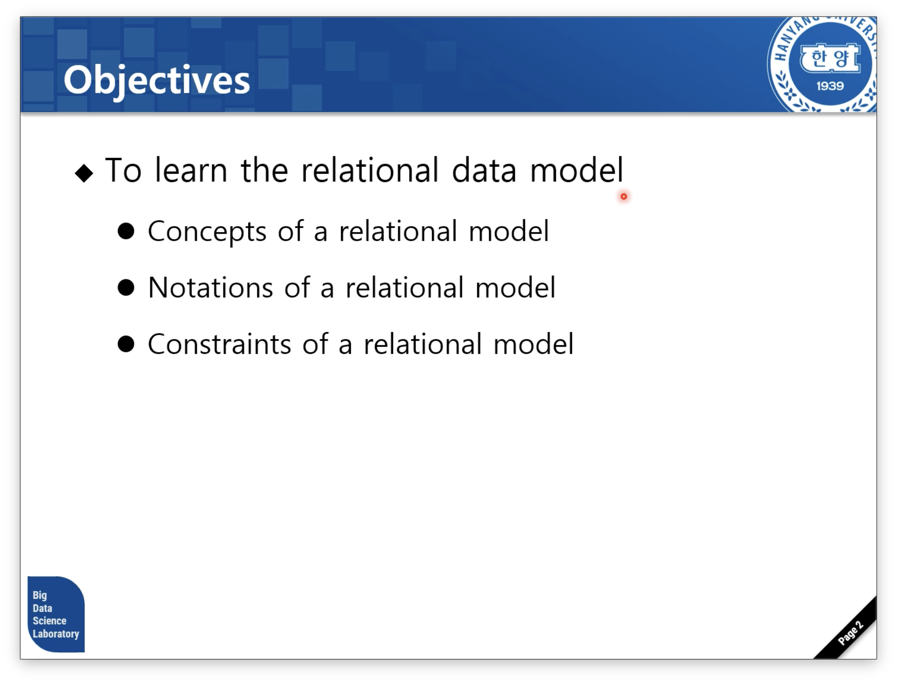

- Relational model에 대해서 배움
    - 개념
    - 표기법 → relational model을 기술하기 위해서 필요한 표현
    - 제약 조건들..

#### Outline

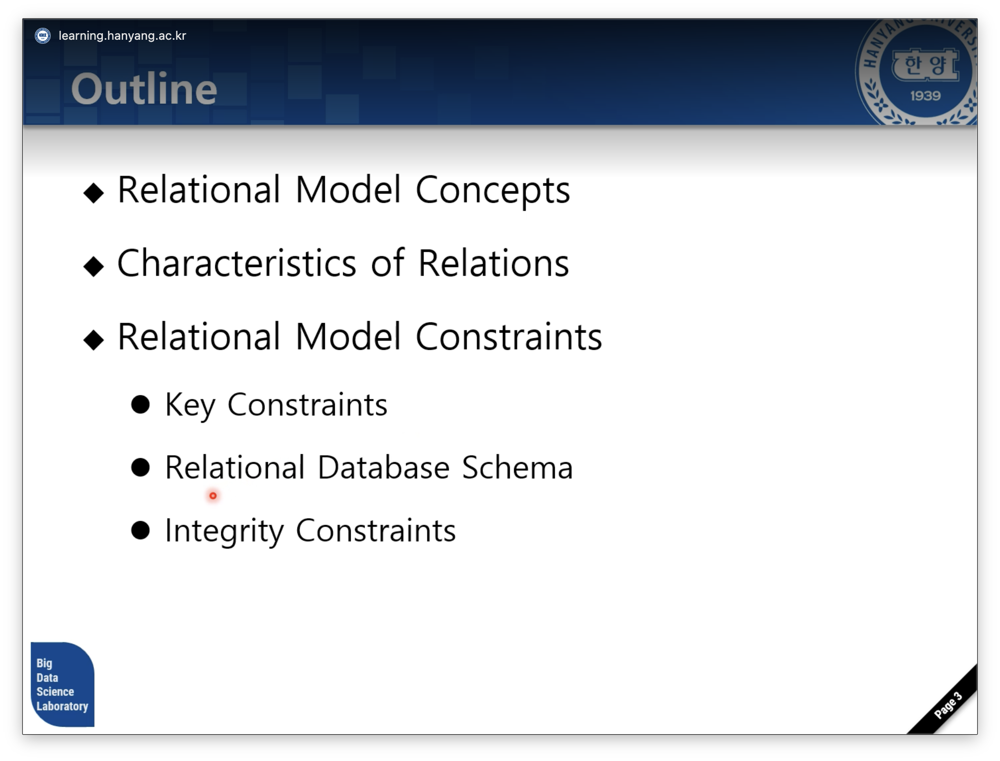

- Relational Model의 개념
- Relation이 뭐고 그 특징이 무엇인가
- Relational Model에서 요구하는 Constraints
    - key 제약
    - integrity 제약
    - entity 제약
- Relational Database의 구조(schema)

#### Relational Model Concepts

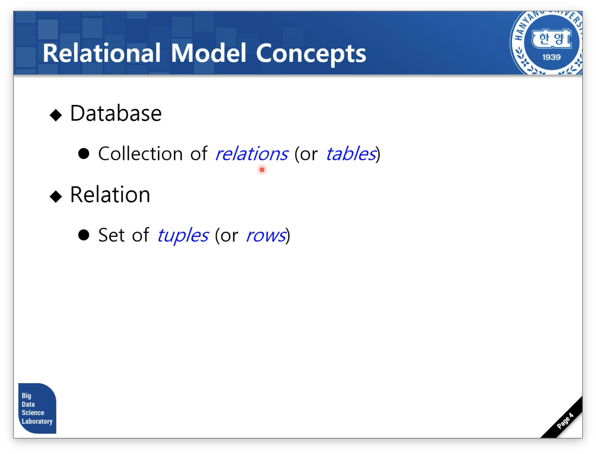

- Database
    - 하나의 Database는 relation들의 집합이다.
    - 여기서 말하는 Relation은 다른 말로 Table이라고 말하기도 함.
- Relation
    - 하나의 Relation(Table)은 여러 개의 tuple(row) 들의 집합이다.

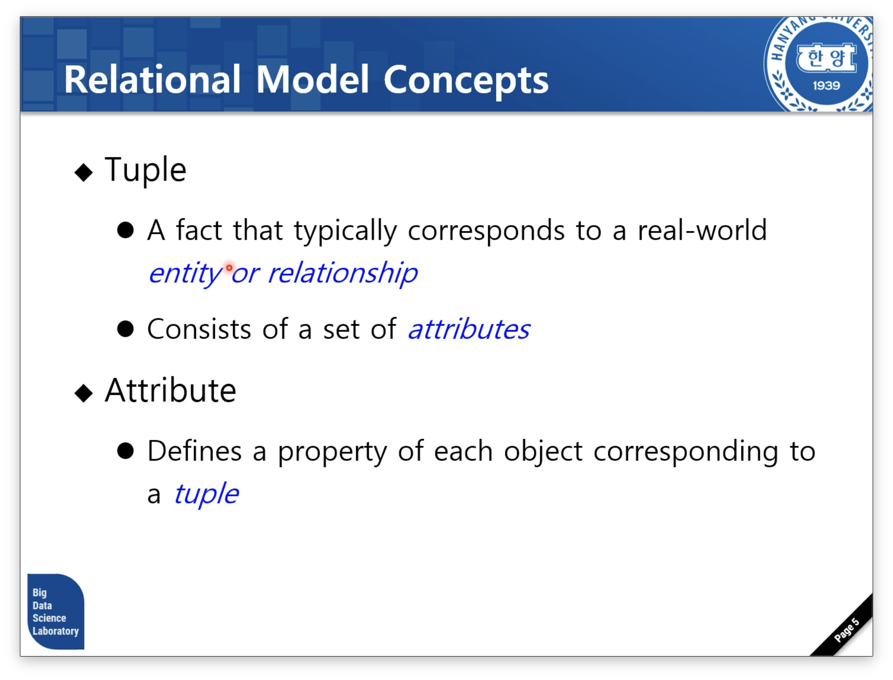

- Tuple
    - 실세계에서 나타나는 어떠한 fact. 전형적으로는 실세계에서 나타나는 entity 또는 relationship에 대응되는 fact.
    - 이러한 fact가 tuple로 표현되는 것
    - tuple은 attribute들의 집합으로 구성되어 있음.
    - Relational Model에서는 모든 정보를 tuple로 표현함. → E-R model에서 나타나는 entity & relation도 tuple로 표현됨.
- Attribute
    - 그 tuple과 대응되는 어떠한 것. 그것의 하나의 특징

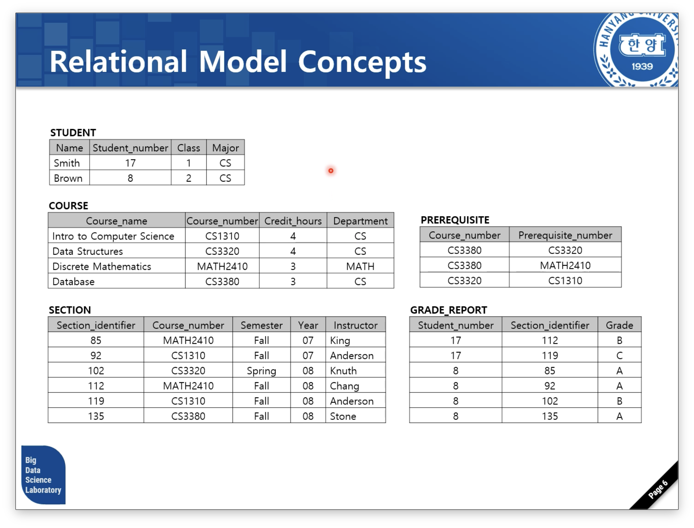

- 사진 전체는 Database(University)
- 하나하나가 Relation 또는 Table이라고 부름.
- Database는 5개의 table들로 구성되어 있음
- 하나의 Table은 Tuple(여러 행)으로 구성되어 있음.
- 하나의 tuple에는 여러 열의 relationship이 있음. → 하나의 tuple의 attribute value의 집합.
    - ex) GRADE_REPORT - 학번 ↔ 성적의 관계 등

> Database는 Table들의 집합.  
> 각 Table은 Tuple들의 집합.  
> 각 Tuple은 실세계에 존재하는 Entity를 표현하거나, 또는 실세계에 존재하는 Relationship을 표현하기 위한 것.  
> 하나의 Tuple에는 여러 attribute의 값으로 각 tuple에 대응되는 object의 특징을 표현.

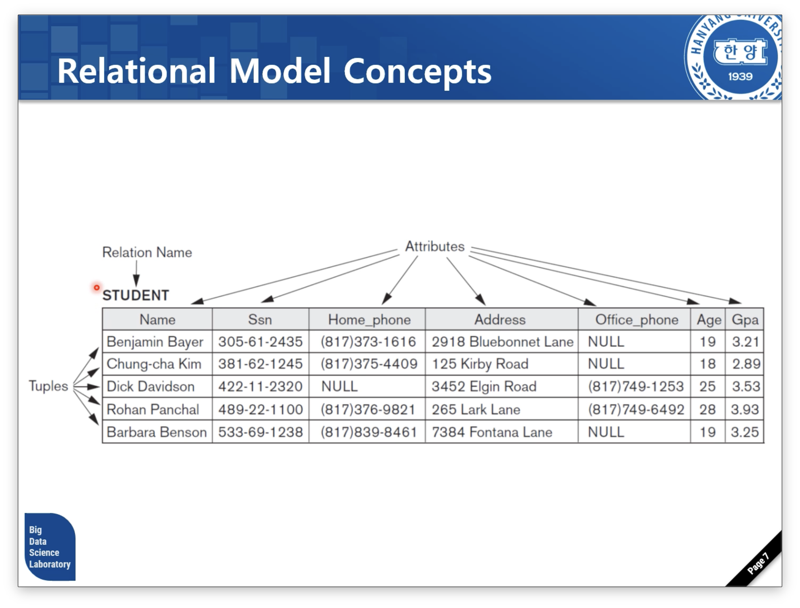

- Table Schema : Relation Name(Table Name) + Attributes Name
- 1개의 Tuple : Attribute Value들로 이루어져 있음
    - Name → Attribute / Benjamin Bayer → Attribute Value

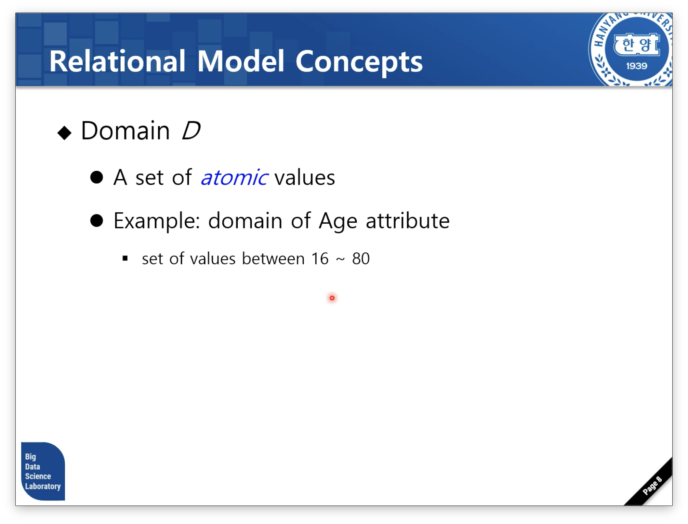

- Domain
    - Domain은 atomic value들의 집합
    - 보통은 어떤 Attribute의 Domain의 꼴로 있을 것임.
    - Ex) Age attribute의 Domain → 16세 \~ 80세

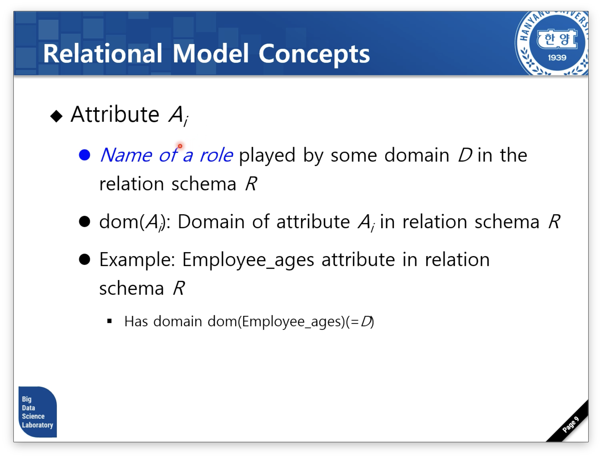

- Relationship Schema R에 들어있는 Attribute A(i)가 있다. → R에 있는 어떤 Domain D가 있다면 그 도메인이 하는 역할의 이름을 나타내는 Attribute  
  → 이 Attribute의 Domain이 이 relation에서 하는 역할의 이름.
- dom(Employee_ages)라고 표현함.
    - Employee_ages → attribute name
    - dom( ) → attirbute의 domain

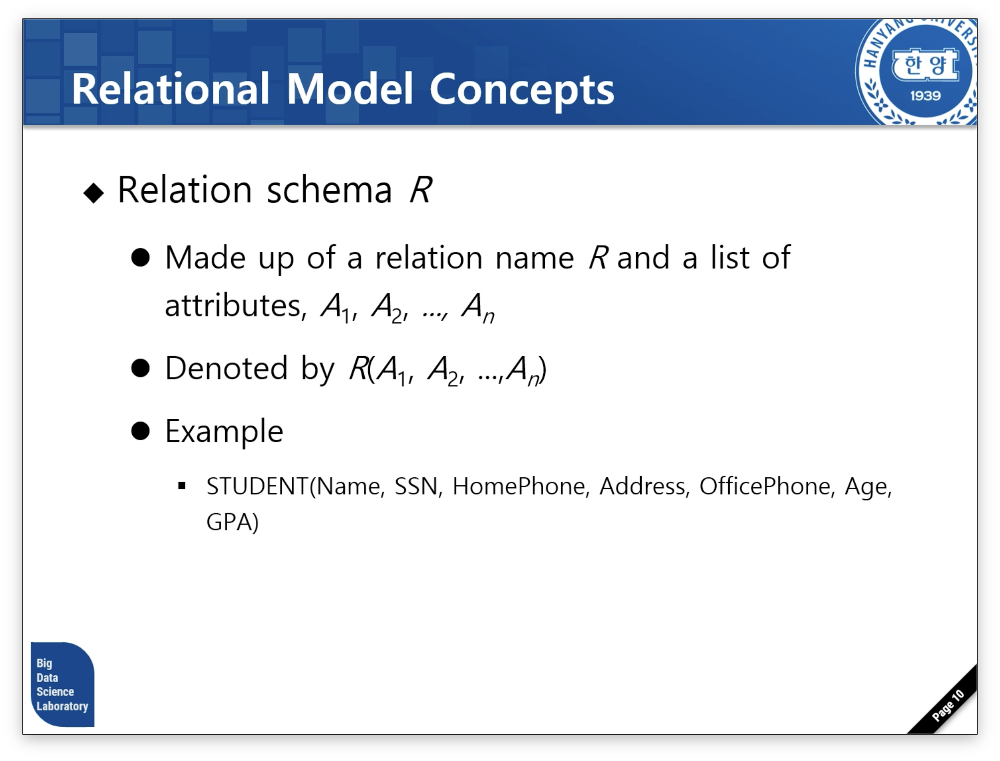

- Relation Schema R → relation name( list of attribute ) 형태로 이루어짐.

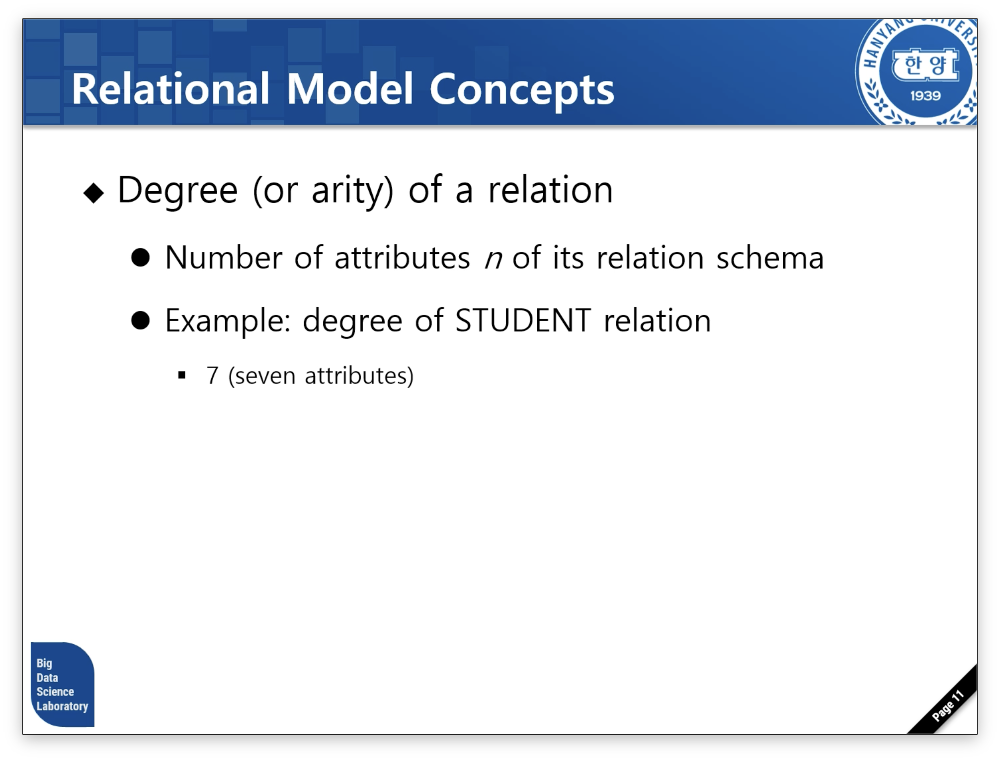

- Degree(arity) of Relation
    - Table에 들어있는 attribute의 수
    - Relation에 포함되는 attribute 들의 수

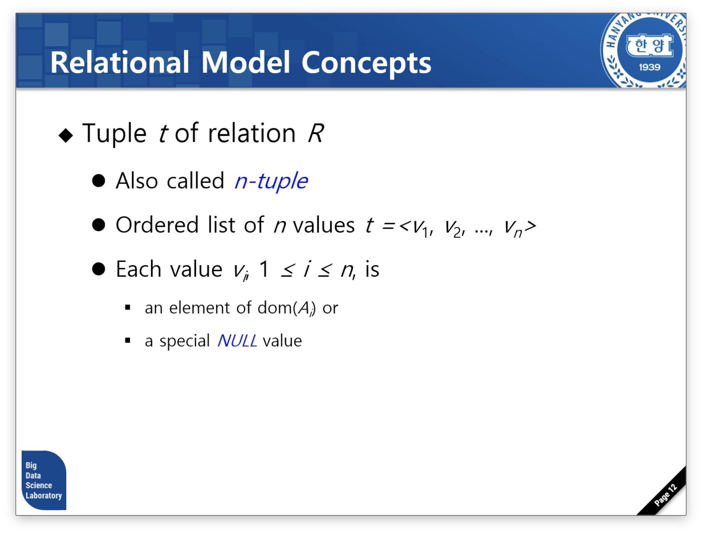

- Table Relation Schema를 따르는 attribute value로 구성되는 tuple
- n - tuple → n이란 relation schema에 속하는 attribute의 수
- t = \< v1, v2 … \>
    - Relation Schema는 ( ) 로 표현하지만
    - n - tuple은 \< \> 로 표현
- v(i) : i 번째 attribute domain에 속하는 하나의 값
- 어떠한 attirbute의 값을 `NULL` 로 줄 수 있다. → NULL의 의미는 뒤에서..

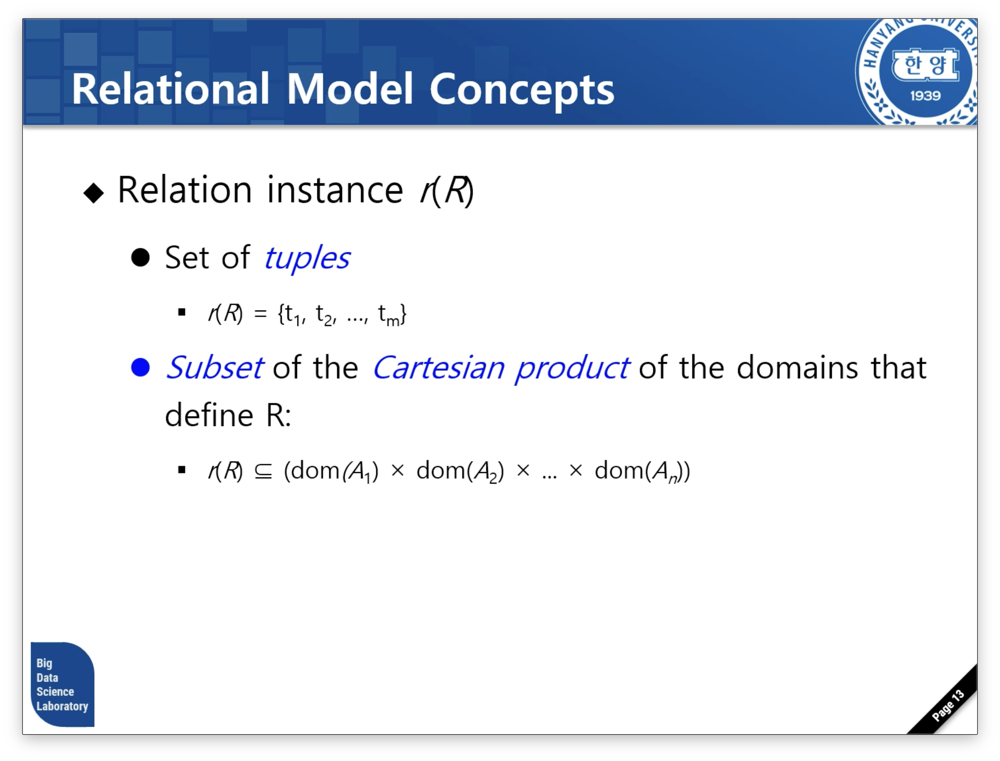

- Relation Instance r(R)
    - 해당 되는 relation schema R을 따르는 tuple들의 집합
    - r(R) = \{ t1, t2, … \} →  \{ \}으로 감쌈.
    - R을 정의하는 Domain 들의 Cartesian Produce의 subset임.

        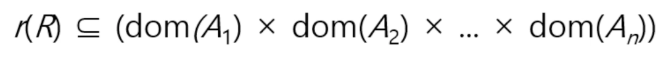

#### Relation들의 특징

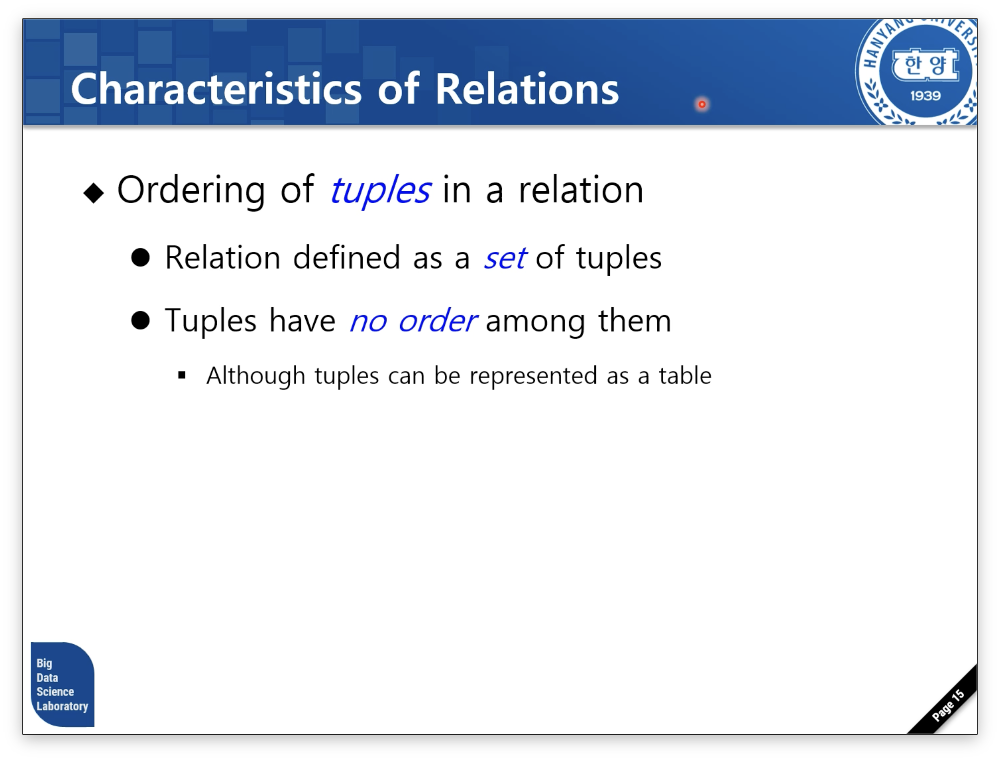

- 한 Relation 내에 tuple이 있을 때 이들의 순서가 중요할까??
    - 순서가 달라도 같은 relation임.
    - Relation의 정의는 tuple들의 “집합”이기 때문에 순서가 달라져도 집합의 구성 요소가 달라지지 않기 때문이다 같은거임.
    - 즉, Relation 내에 tuple 들의 순서는 중요하지 않음.

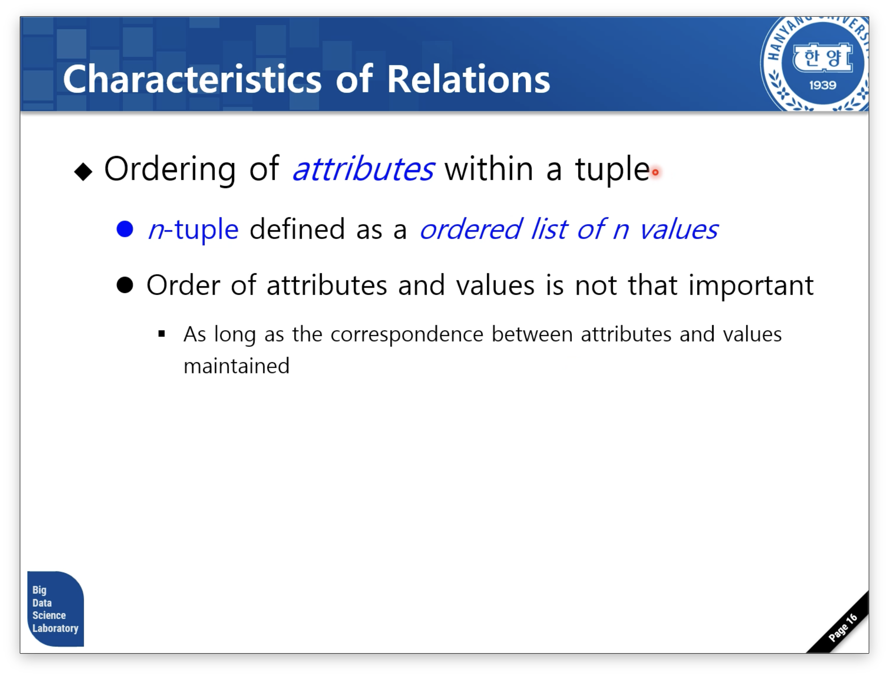

- 한 tuple 내에 attribute의 순서가 중요할까??
    - 여기에서는 말이 달라짐. attribute의 순서가 다르면 다른 tuple이라고 봐야함.
    - n - tuple의 정의는 n개의 value 들의 ordered list(순서가 정해진 list)이기 때문임.
    - 사실 실제로는 order는 그렇게 중요하지는 않음.

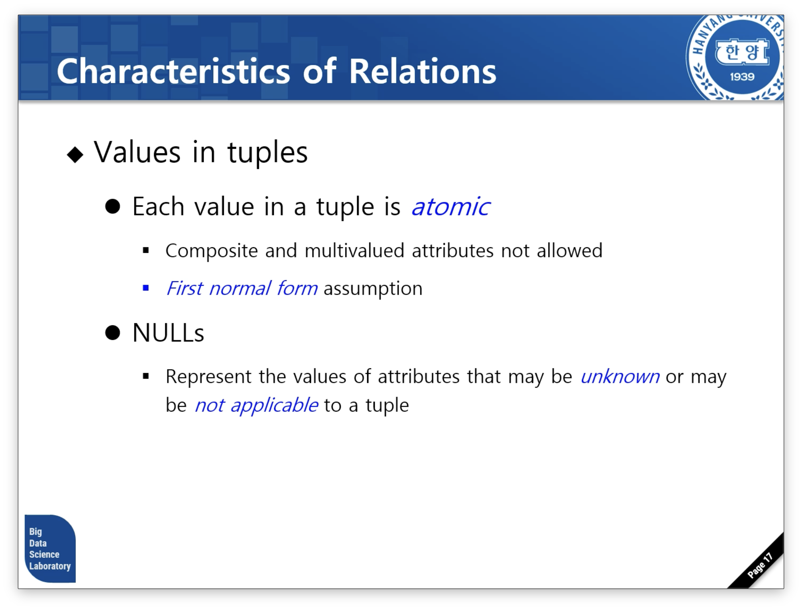

- Tuple에 저장되어 있는 Value
    - Tuple 내에 저장되어 있는 각각의 value는 모두 atomic 하다. → First Normal Form
    - ex) 학교의 주소 → 서울시 성동구 행당동 1동 17번지라는 주소 value가 있을 때 행당동에 있는 대학교를 찾아라 → 찾을 수 없음. Full String을 검색해야 한다는 소리. ⇒ 하나의 value는 atomic 하기에 indivisable함.
    - Relational Model에서는 Composite , multivalued attribute를 허용하지 않는다.
    - E-R model에 있는 composite & multivalued인 attribute을 Relational Model에서는 수작업을 통해 다른 형태로 수정해야함.
- NULLs
    - 어떤 attribute의 value
    - 어떤 attribute의 value가 null이라면 unknown의 의미 혹은 해당 tuple에 적용될 수 없는 value라는 의미를 가지고 있음.
    - 어떤 Employee라는 Table이 있을 때 managing department에 대한 attribute가 있다. 일반 사원은 해당 attribute에 대해 not applicable한 attirbute인거임.

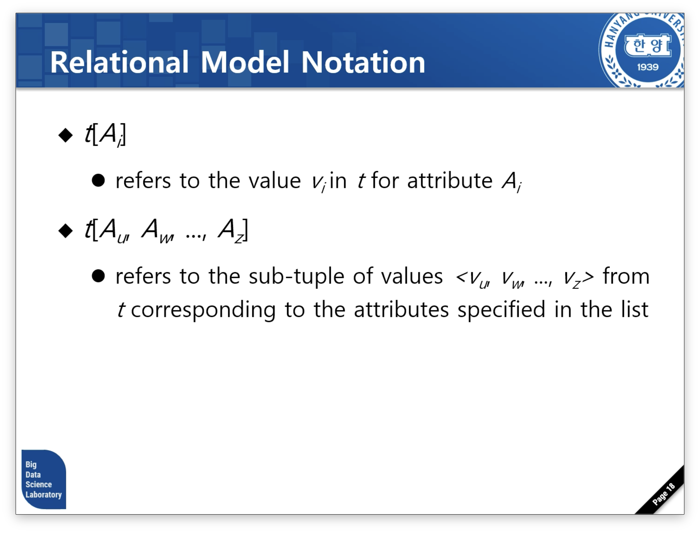

- t\[ A(i) \] : t라는 tuple 안에 attribute A(i)에 해당되는 attribute value 값을 의미.
    - 즉, t라는 tuple에서 A(i)라는 attribute에 대해 어떤 value를 갖는가.

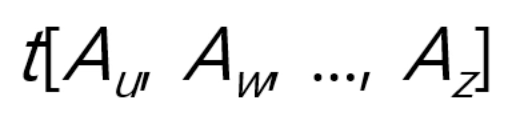

- t라는 tuple 내부의 어떠한 sub-tuple임.
- U attribute부터 Z attribute까지의 값들로 구성되어 있는 sub-tuple.

#### Relational Model Constraints

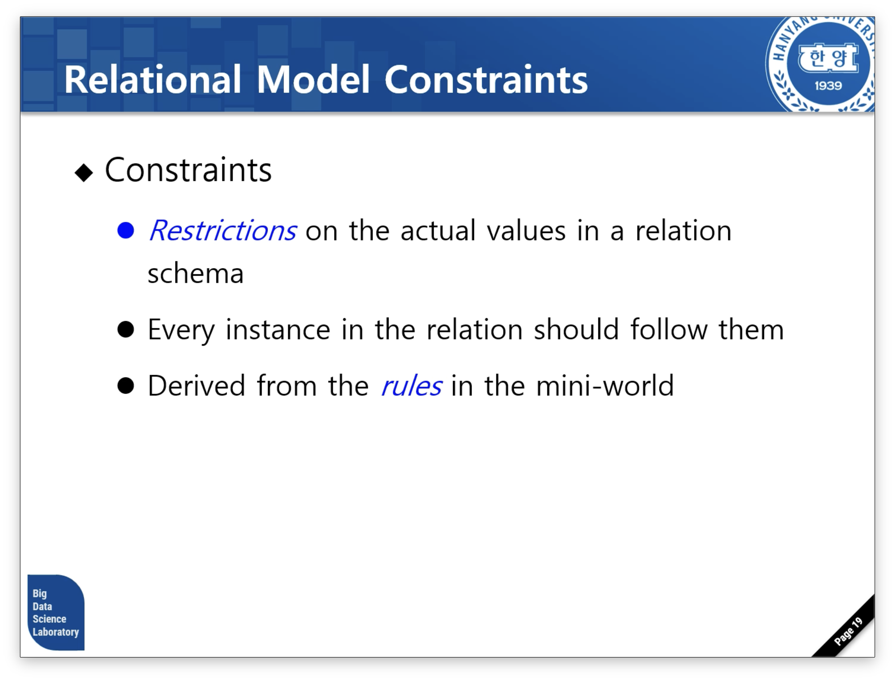

- 어떤 relation schema에 해당되는(포함되는) relation instance에 속하는 실제 value 들에 대한 제약조건. ex) 어떠한 범위 내어야함. 어떠한 값을 가지면 안됨 etc..
- Schema에 정해놓고 enforce함.
- 해당 Relation Shema에 따르는 모든 instance가 이 제약을 지켜야함.  
  → DBMS는 이러한 constraint를 정하게 하는 방법을 제공함.  
  → 정해진 constraint이 항상 hold 되는지를 체크함.
- Constraint는 실제 DB가 운영되는 mini-world에서 실제 돌아가는 rule 들로 부터 유추되서 정해짐.

    ex) 어떠한 Company의 정년이 65세다. Age attribute의 value는 65세를 넘어서는 안된다는 contraint 생성

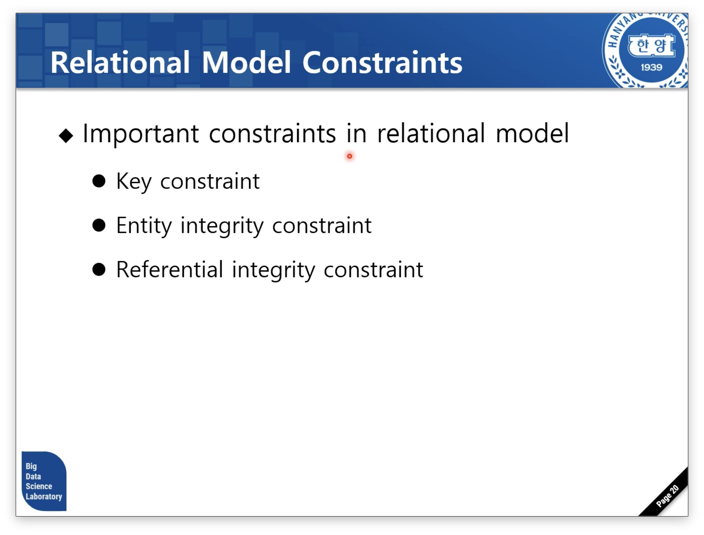

- Relational Model 자체에서 요구하는 constraint도 있음.
    1. Key constraint
    2. Entity Integrity Constraint
    3. Referential Integrity Constraint

#### Key Constraints

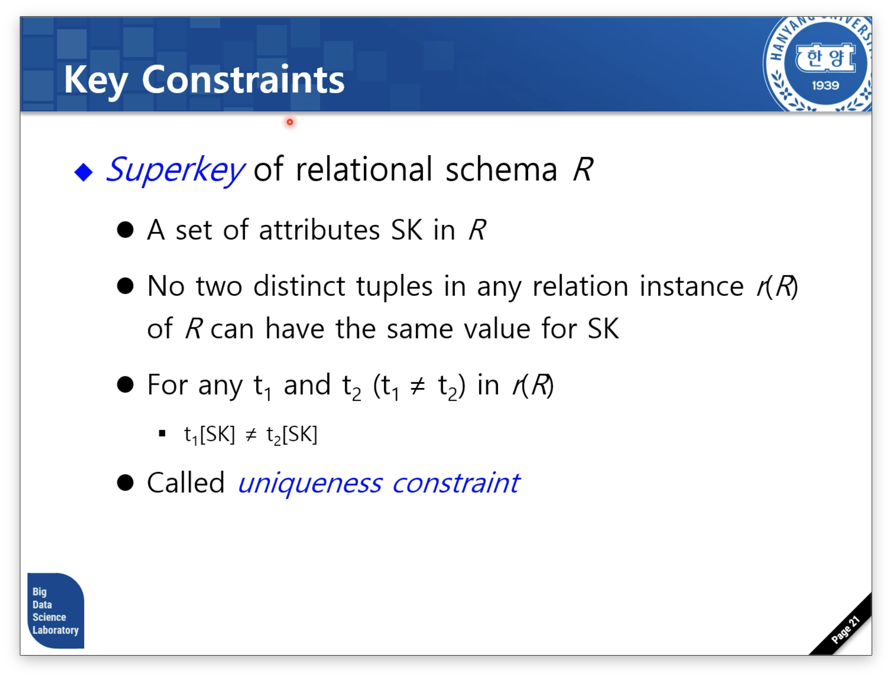

- Relational Schema R의 Superkey
    - Relational Schema R에 대해서 거기에 속하는 어떤 attribute 들의 집합.
    - 단, Superkey란 relational schema R에 해당되는 어떤 relation instance라 하더라도, 서로 다른 Tuple들은 SK에 대해서는 같은 값을 가질 수 없다.
    - 즉, t1의 SK 값과 t2의 SK 값은 항상 달라야함.
    - Superkey를 Uniqueness constraint라고 함.

    → 그럼 Superkey는 집합인거임???

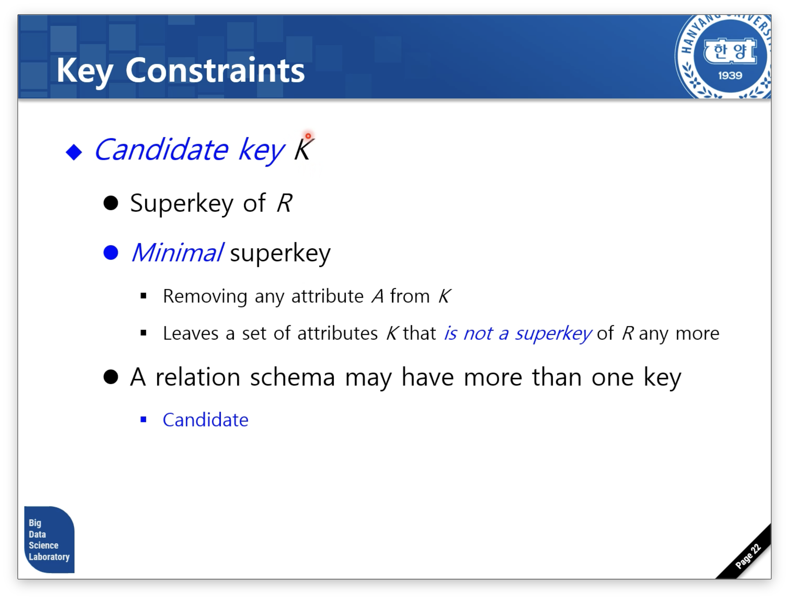

- Candidate Key K
    1. K는 R의 Superkey이어야 함.
    2. Minimal Superkey이어야 함.
        1. Superkey에서 어떠한 attribute 하나라도 제거하면 더 이상 Superkey가 아닌 Superkey
        2. 그래서 minimal superkey
        3. 만약 하나를 제거했는데도 Superkey가 유지 된다면 그 superkey는 minimal superkey가 아니기 때문에 candidate key가 아님
    3. 하나의 relation schema는 하나 이상의 candidate key가 존재할 수 있음(그래서 이름이 candidate key)
        1. candidate key 중 하나를 정하면 그게 primary key가 되는 구조.

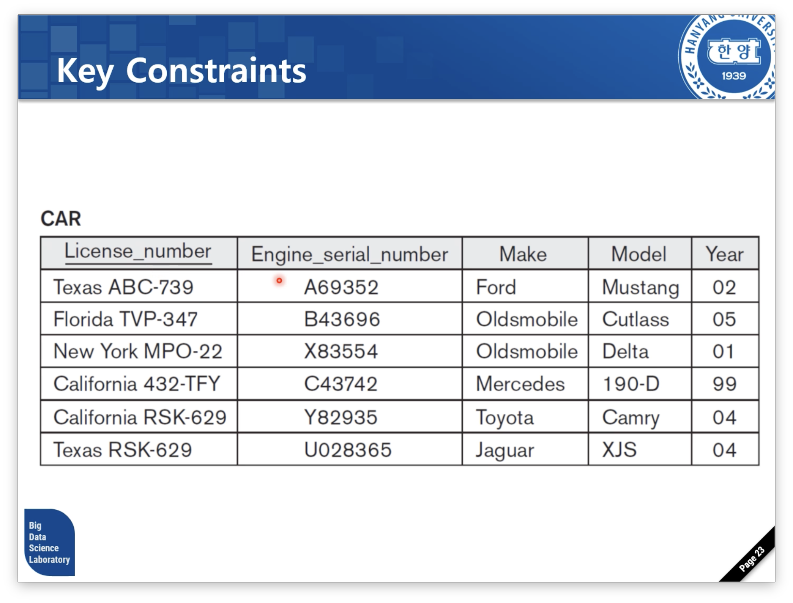

- 모든 attribute를 포함하는 집합은 superkey일까?
    - ㅇㅇ superkey임 → 5개의 value가 모두 같은 tuple은 존재할 수 없기 때문에
- 그럼 Candidate key일까?
    - ㄴㄴ minimal superkey라는 조건을 충족하지 못함.
- 위의 사진에서 **License_number** 가 primary key임.

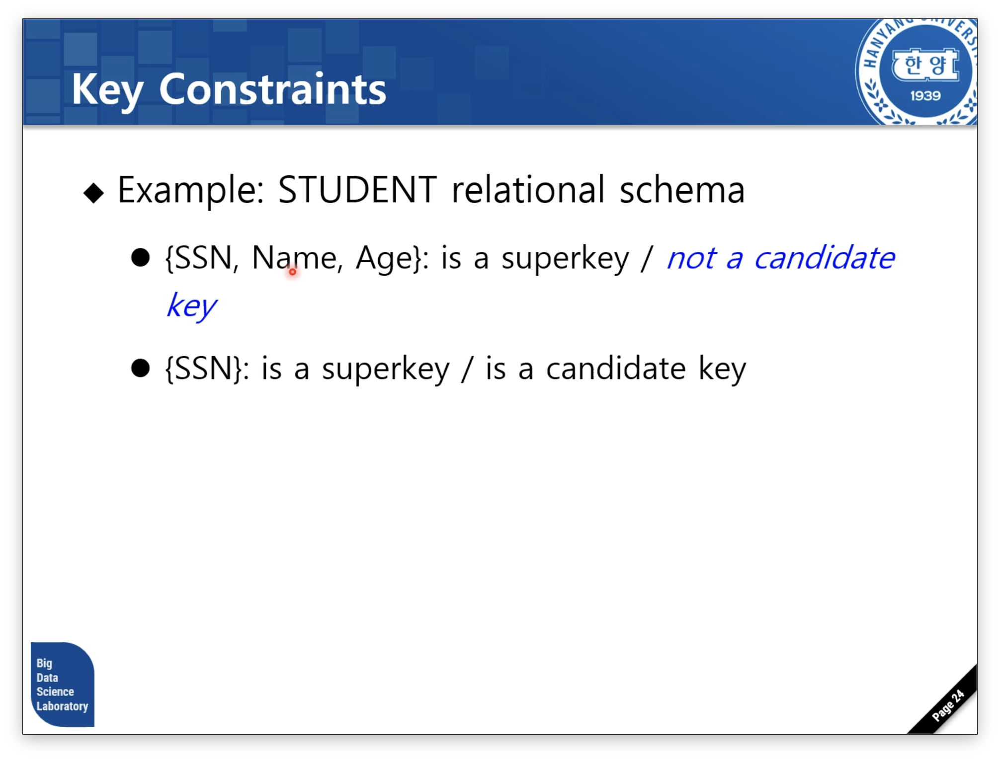

- \{ SSN, Name, Age\} → superkey 맞음 ㅇㅇ 근데 Name, Age를 지워도 superkey이기 때문에 candidate key가 아님.

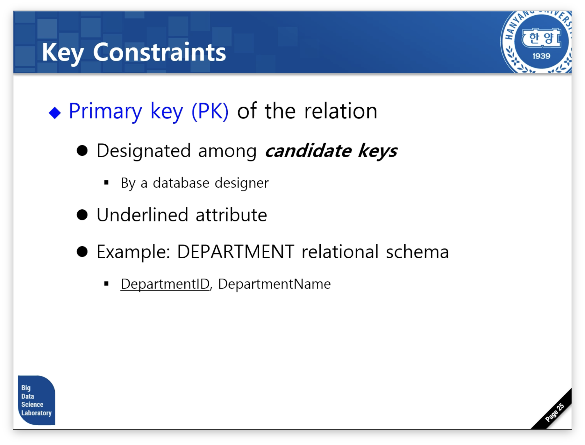

- Primary key
    - 2개 이상의 candidate key가 존재한다면 Designer가 하나를 primary key로 선택
    - ex) DEPARTMENT의 경우 DepartmentID & DepartmentName 각각이 candidate key. → Designer가 하나를 선택
    - Key는 가급적이면 숫자이면 좋고, 길이가 고정이면 좋음(학번, 식별 ID etc..)
    - **DepartmentID**(Primary Key), DepartmentName(Secondary Key)

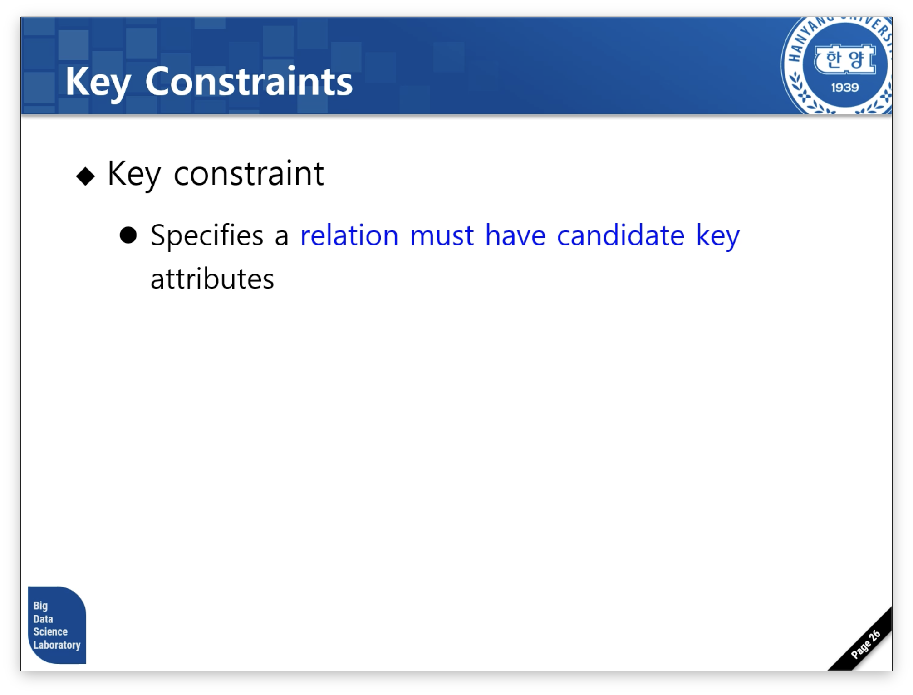

- Key Constraint(Integrity Constraint 중 하나)
    - **하나의 Table은 반드시 하나의 Candidate Key를 가져야함.**
    - 사실상 Relational Database에 존재하는 Table은 모두 Candidate Key가 있는 것임.  
      → 모든 attribute를 다 합치면 Candidate Key가 될 수 밖에 없기 때  
      → 모든 attribute가 같은 Tuple이 2개가 존재할 수 없음.

#### Relational Database Schema

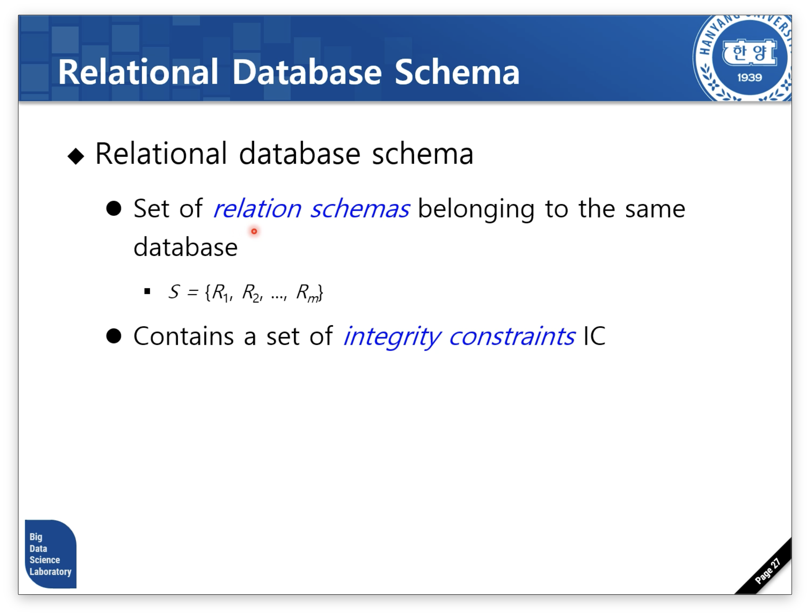

- Relation Schema 혹은 Table Schema의 집합.
    - 그 Database에 포함되는 Relational Schema들의 집합이 Database Schema가 되는 것임
    - Data Schema S는 거기에 포함되는 Relational Schema R들로 구성이 된다.  
      → S = \{ R1, R2, … \}
    - Relational Schema들이 가져야하는 Integrity Constarints(무결성)도 포함됨.

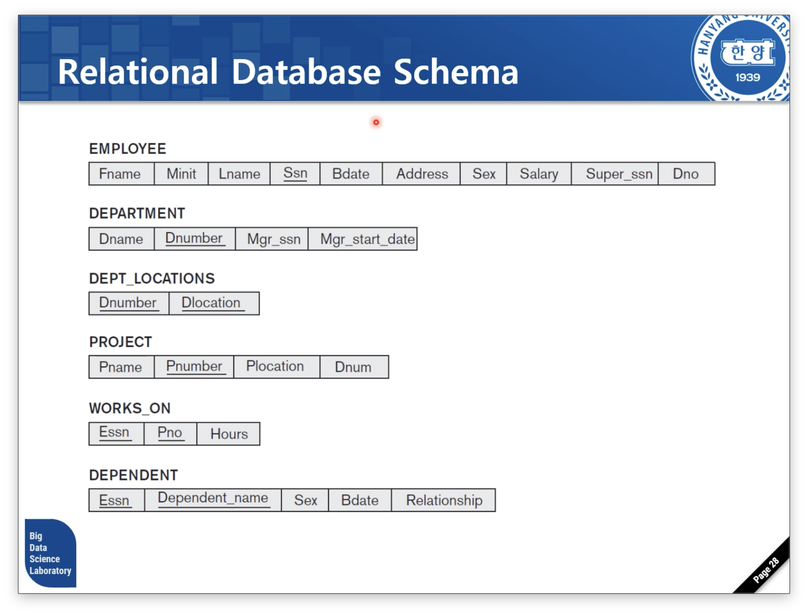

- 앞서 E-R Model을 이용해서 Conceptual Schema를 작성한 것을 Relational Database Schema로 바꾼 것. → 바꾸는 방법은 나중에 배움.

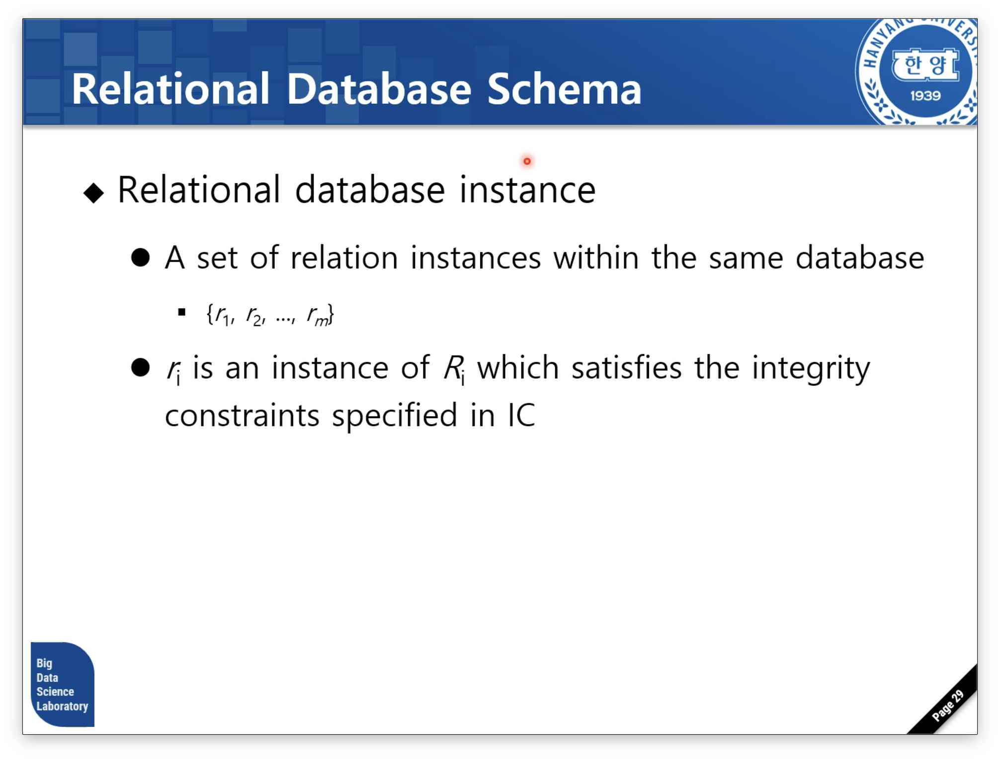

- Relational Database Instance
    - 같은 database에 속하는 relation instance 들의 집합
    - relation schema가 m개가 있었다면, 각각의 relation schema에 해당되는 relation instance 들로 구성된 집합.
    - r(i)는 Relation Schema R(i)의 instance → r(i)는 integrity constraint를 만족함.

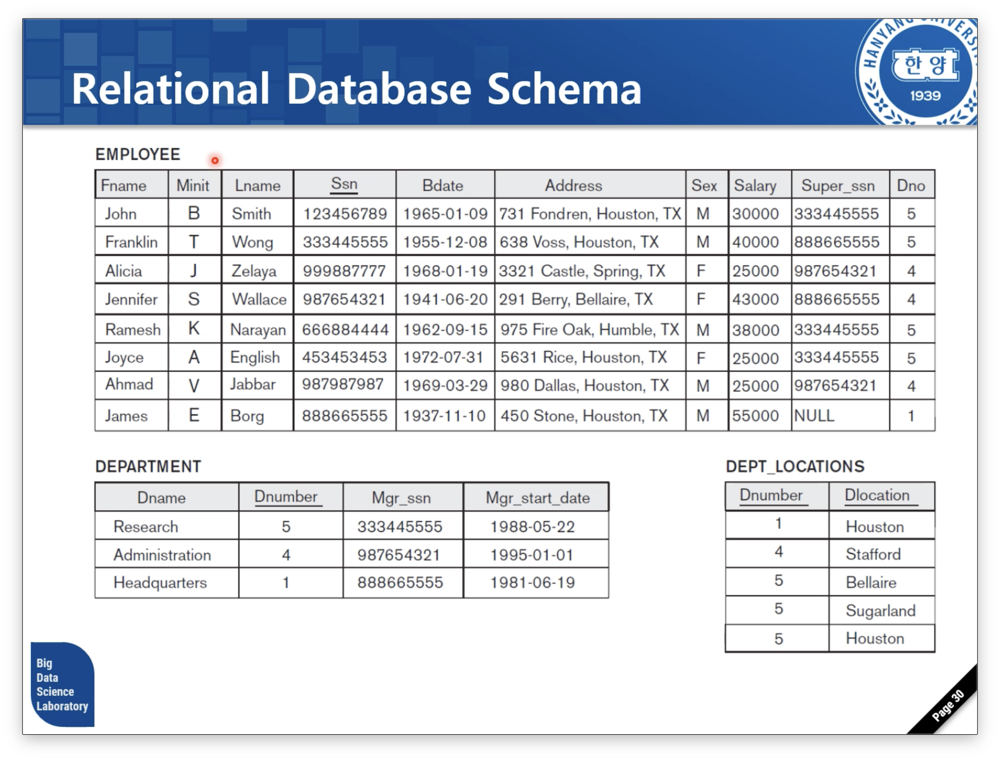

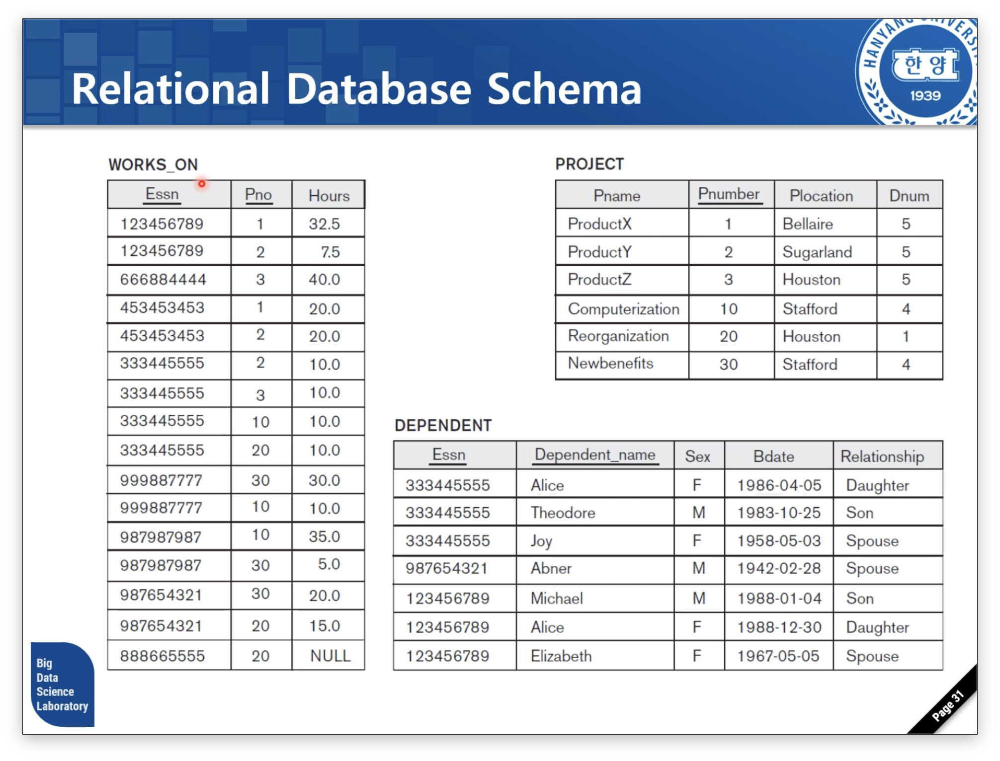

- Relation Name → EMPLOYEE , Attribute name → 각각의 attribute 이름
- 이 Schema를 따르는 Tuple 들의 집합 → Relation Instance
- EMPLOYEE 안에 있는 instance 집합 : EMPLOYEE relation instance

#### Entity Integrity Constraints

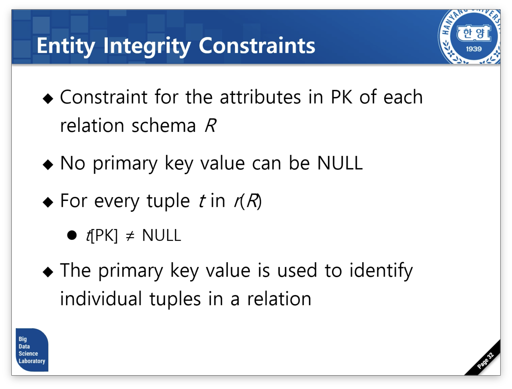

- Entity Integrity Constraint : 각 Relation Schema의 Primary Key와 관련된 constraint.  
  Primary Key에 해당하는 attribute의 value는  `NULL` 이 될 수 없다.
- Relation Instance R에 속하는 모든 Tuple들은 primary key에 해당하는 attribute value가 NULL이 아니다.
- Primary Key에 해당하는 attribute value는 relation의 tuple을 identify하기 위해 사용하기 때문임. → NULL이면 식별이 안되잖아.

#### Referential Integrity Constraints

→ 참조 무결성 제약(?)

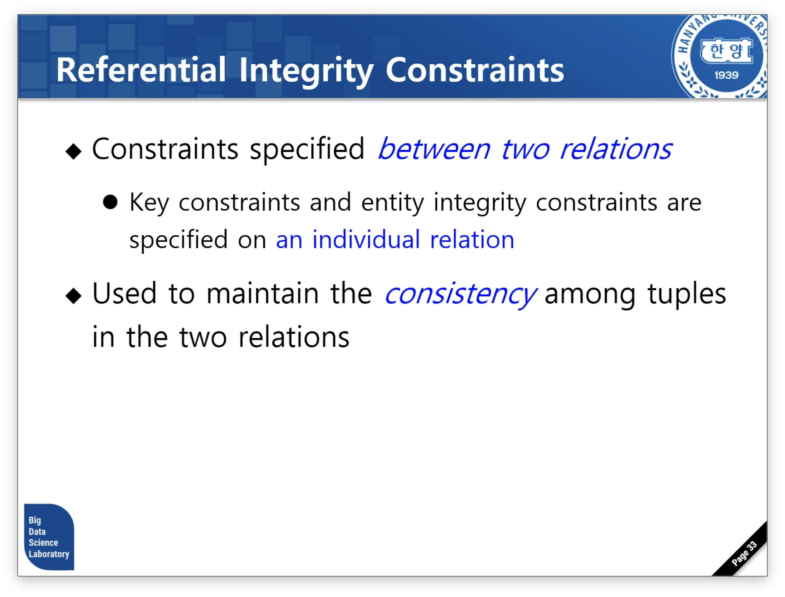

- 이 constraint는 2개의 table(relation)에 관련된 constraint임.
    - 앞에서 배웠던 key & entity integrity는 하나의 테이블 내에서의 constraint
- 2개의 table에 속해있는 각각의 tuple들의 관계를 설명할 때 일관성(consistency)을 만들어주는 constraint.

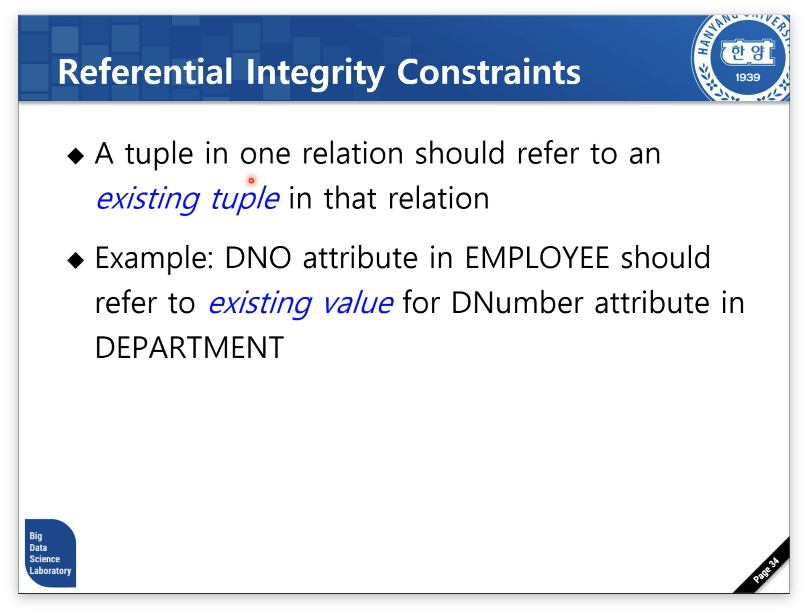

- 하나의 table에 속하는 tuple이 다른 relation(다른 table)에 속하는 어떠한 존재하는 tuple을 참조해야만 한다. → 즉, 존재하지 않는 tuple을 참조해서는 안된다.
- Foreign Key와 관련되어 있음.

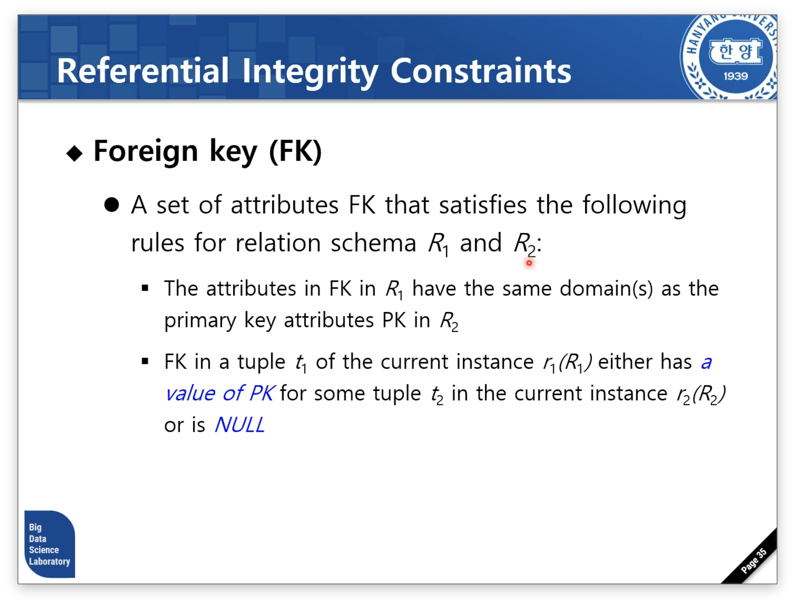

- Foerign Key
    - 어떤 attribute 들의 집한인데, R1과 R2에 대해 아래는 만족하는 집합임
        1. R1(참조하는 relation)의 FK는 R2(참조 당하는 relation)의 PK는 같은 Domain을 갖는다.
        2. R2 내부에 t1이라는 tuple이 있을 때, t1의 FK에 해당하는 attribute value는 R2의 t2라는 tuple의 PK값을 가져야함.  
           (t1의 FK는 t2의 PK 값이어야 함 → 참조하는 놈이 반드시 존재하는 놈을 참조해야함)  
           (단, FK가 NULL일 때는 허용함)

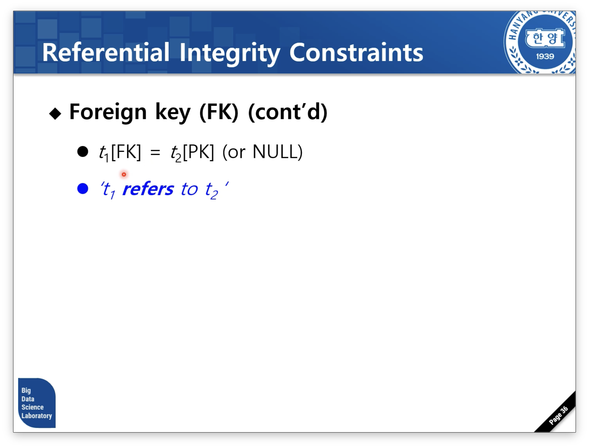

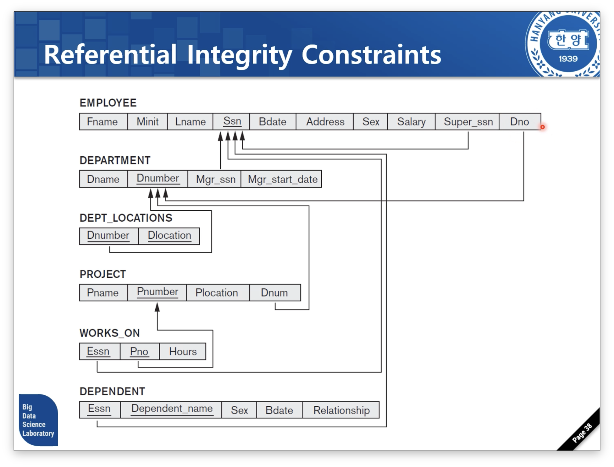

- EMPLOYEE의 Dno는 FK로서 DEPARTMENT의 PK인 **Dnumber** 를 참조함.

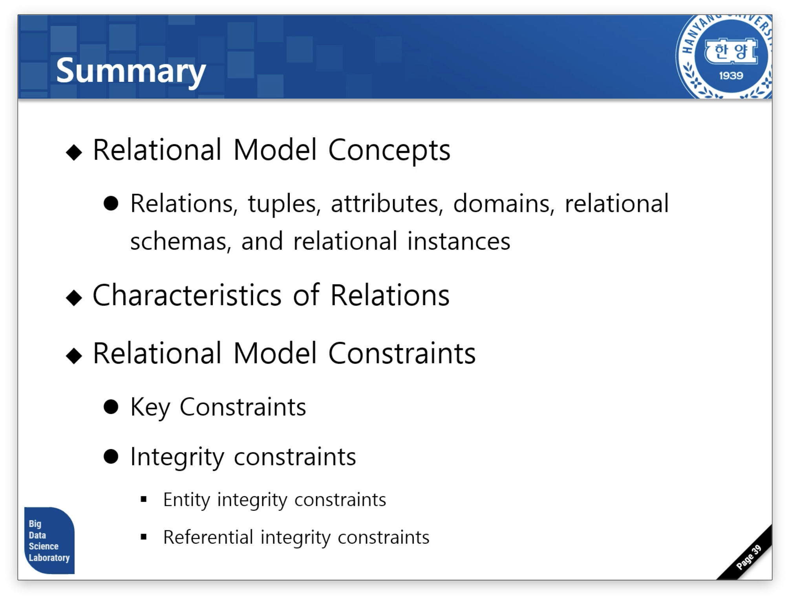
