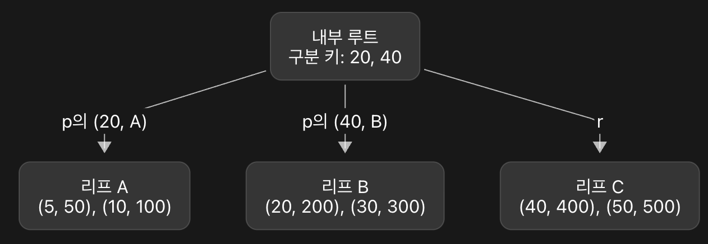
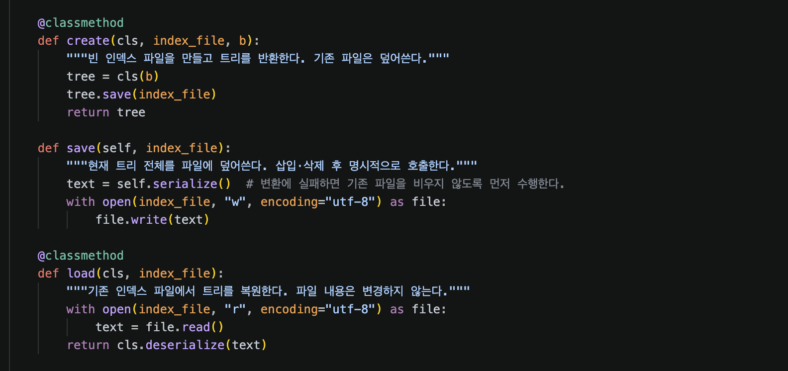

## B+ Tree

#### 1. 규칙 정리(명세 기반)

| 기호 | 내부 노드 | 리프 노드 |
| --- | --- | --- |
| m | 현재 키 갯수 | 현재 키 갯수 |
| p / p_ | (키, 왼쪽 자식) 배열 | (키, 값) 배열 |
| r | 가장 오른쪽 자식(자식 노드) | 바로 오른쪽 리프(형제 노드) |



- 루트 노드
    1. m = 2
    2. p =  \[(20,A), (40,B)\]

        → 키 값이 20 \< key 이면 A 노드로, 20 ≤ key \< 40 이면 B 노드, 40 ≤ key 이면 C 노드로..
    3. r = C
- 리프 노드(A)
    1. m = 2
    2. p = \[(5,50), (10,100)\]
    3. r = B

#### 2. 기본 뼈대 설정

- 사용할 클래스

```javascript
class LeafNode:
    def __init__(self):
        self.p_ = []  # (key, value) 쌍을 키 오름차순으로 보관한다.
        self.r = None  # 오른쪽 형제 리프. 마지막 리프이면 None.

    @property
    def m(self):
        return len(self.p_)


class InternalNode:
    def __init__(self):
        self.p = []  # (구분 키, 그 키의 왼쪽 자식 노드) 쌍.
        self.r = None  # 가장 오른쪽 자식. 노드 구성 시 연결한다.

    @property
    def m(self):
        return len(self.p)


class BPlusTree:
    def __init__(self, b):
        self.b = b  # 노드의 최대 자식 수.
        self.root = LeafNode()  # 빈 트리도 루트 리프 하나를 갖는다.
```

| 클래스 | 역할 | 주요 속성 |
| --- | --- | --- |
| LeafNode | 실제 키와 값을 보관 | p_ , r |
| InternalNode | 아래쪽 자식들을 연결 | p , r |
| BPlusTree | 트리 전체를 관리 | b , root |

```javascript
tree = BPlusTree(4)
// __init__이 실행되어 b = 4를 저장, 빈 LeafNode를 루트로 설정.

tree.root.p_ // []
tree.root.m // 0
tree.root.r // None

//이 코드를 통해 m이 자동으로 설정되도록 함.
@property
	def m(self):
		return len(self.p_)
```

```javascript
             루트 [20 | 40]
              /     |     \
             A      B      C

리프 연결:   A ──→ B ──→ C ──→ None

a,b,c = LeafNode(), LeafNode(), LeafNode() 
// a,b,c를 각각 리프 노드로 설정

a,p_ = [(5,50), (10,100)]
b.p_ = [(20,200), (30,300)]
c.p_ = [(40,400), (50, 500)]

a.r = b
b.r = c

root = InternalNode() // root를 우선 내부 노드로 설정
root.p = [(20,a),(40,b)]
root.r = c

tree.root = root //내부 노드 중 하나였던 root를 root 노드로 설정.
```

#### 3. InternalNode의 자식 선택

```javascript
class InternalNode:
    def __init__(self):
        self.p = []  # (구분 키, 그 키의 왼쪽 자식 노드) 쌍.
        self.r = None  # 가장 오른쪽 자식. 노드 구성 시 연결한다.

    @property
    def m(self):
        return len(self.p)

    def choose_child(self, key):
		    //여기서 separator는 리프 노드끼리의 seperator인 20, 40과 같은 값들을 말한다.
        for separator, left_child in self.p: //self.p의 모든 value를 검사
            if key < separator:
                return left_child
        return self.r
   //for separator, left_child in self.p는
	 // (20,a) 와 (40,b)를 검사함.
```

#### 4. 리프 탐색

→ 3단계까지는 choose_child를 통해 하나의 자식을 검색했다.

→ 이 단계를 통해 루트부터 리프까지 이동 후 원하는 리프 노드를 탐색하는 알고리즘은 완성할 것.

- 리프 노드 탐색

```javascript
def find_leaf(self, key):
	node = self.root //현재 위치한 노드니까 처음에는 root
	path = []
	
	//내부 노드 인지 검사 + 리프에 도착하면 종료
	while isinstance(node, InternalNode):
		keys = []
		for seperator, left_child in node.p:
			keys.append(separator)
		path.append(keys)
	
		node = node.choose_child(key)
		
	return node, path
```

- 리프 도착 후 검색

```javascript
def search(self,key):
	leaf, path = self.find_leaf(key)
	
	for stored_key, value in leaf.p_:
		if stored_key == key:
			return value, path
			
	return None, path
```

- search 결과 출력

```javascript
def print_search(self, key):
	value, path = self.search(key)
	
	for keys in path:
		print(*keys, sep=",")
		
	if value is None:
		print("NOT FOUND")
	else:
		print(value)
		

/*
print(keys)            # [20, 40] → 리스트 자체를 출력
print(*keys)           # 20 40    → 펼쳐 출력, 기본 구분자는 공백
print(*keys, sep=",")  # 20,40    → 펼쳐 출력, 구분자는 쉼표
*/
```

#### 5. 리프 삽입(기존 separator를 기준으로 새 리프 노드 생성없이 삽입하는 방법)

```javascript
def insert(self, key, value):
	// Python에서 "_"는 값을 받지 않겠다는 의미.
	// 즉 leaf 값만 받겠다는 의미. 
	leaf, _ = self.find_leaf(key)
	// index -> 배열에서의 index를 의미
	index = 0
	// 배열에서의 위치가 m보다 클 수 없으니.
	while index < leaf.m and leaf.p_[index][0] < key:
		index += 1
	
	if index < leaf.m and leaf.p_[index][0] == key:
		return False
		
	if leaf.m >= self.b - 1:
		raise NotImplementedError("리프 분할은 아직 구현하지 않았습니다.")
		
	leaf.p_.insert(index, (key, value))
	return True
	

```

#### 6. 루트 리프의 분할

```python
leaf.p_.insert(index, (key, value))

if leaf.m > self.b - 1:
	self._split_root_leaf()
```

- m을 넘으면 분할해서 저장한다.

```python
left = self.root
mid = left.m // 2 # 4 // 2 = 2

right = LeafNode()
right.p_ = left.p_[mid:]
left.p_ = left.p_[:mid]
```

- 기존 root 리프는 left로 재사용
- right라는 리프 노드를 새로 만든다.
- 슬라이싱 사용
    - mid: → mid부터 끝까지
    - :mid → 처음부터 mid까지
- m은 어짜피 자동 계산이니까 수정 안해도 됨.

```python
separator = right.p_[0][0]

new_root = InternalNode()
new_root.p = [(separator, left)]
new_root.r = right

self.root = new_root
```

- 새 루트 생성

#### 7. 리프 분할 결과를 부모에 반영

→ 키값의 변화 등을 리프 노드의 분할이 필요할 때 리프 분할 후 부모노드에도 변경 사항을 전달 및 저장해야한다.

```python
def _insert_in_parent(self, parent, left, separator, right):
	for index, (old_separator, child) in enumerate(parent.p):
		# 좌측리프 분할 시
		if child is left:
			# index의 위치에 (70,D)를 대입 separator가 70이니까 old_sep
			parent.p[index] = (old_separator, right)
			# 같은 index에 새로운 separator를 가진 B를 넣음(70,D)는 한칸 밀림
			parent.p.insert(index, (separator, left))
			return
		
	#최우측 리프 분할 시
	parent.p.appent((separator, left))
	parent.r = right
```

#### 8. 내부 노드 분할

```python
 # 수정 전
         [20 | 40 | 60 | 80]
          /    |    |    |    \
         A     B    C    D     E
 # 수정 후
                  [60]
                 /    \
         [20 | 40]     [80]
          /   |   \    /  \
         A    B    C   D    E
```

- 이 단계에서는 tree가 3층 이상 구조인 경우를 위한 분할임.
- 리프 전 내부 노드의 분할을 위함

```python
def _split_internal(self, left):
	mid = left.m // 2 # //은 내림 나눗셈. 5 // 2 == 2
	separator, left_right_child = left.p[mid]
	
	right = InternalNode()
	right.p = left.p[mid + 1:]
	right.r = left.r
	
	left.p = left.p[:mid]
	left.r = left_right_child
	
	return separator, right
```

#### 9. 연쇄 분할 및 루트 분할

→ 리프 노드 분할 시 부모 노드 적용할 때 부모 노드도 분할해야 한다면 연쇄적으로 분할 할 수 있도록..

```python
#기존 insert 함수에서 수정
ancestors = [] # 이것을 통해 리프까지 내려온 경로를 기억
while isinstance(leaf, InternalNode):
	ancestors.append(leaf)
	leaf = leaf.choose_child(key)

node = leaf
while node.m > self.b - 1: # b(최대 자식수) - 1이 최대 키 수
	if isinstance(node, LeafNode): # node가 leaf라면
		separator, right = self._split_leaf(node)
	else: #node가 internal이라면
		separator, right = self._split_internal(node)

	#분할하고 나서 부모로 거슬러 올라가야함
	parent = ancestor.pop() # ancestor에는 루트 -> 부모 순으로 저장되니까
													# pop 하면 부모 먼저 나옴
	self._insert_in_parent(parent, node, separator, right)
	node = parent

	if not ancestors: # ancestors가 비었다 -> 루트다.
		new_root = InternalNode()
		new_root.p = [(separator, node)]
		new_root.r = right
		self.root = new_root
		break
```

#### 10. 범위 검색

```python
def range_search(self, start_key, end_key):
	result = []
	if start_key > end_key:
		return result
		
	leaf, _ = self.find_leaf(start_key)
	while leaf is not None:
		for key, value in leaf.p_:
			if key < start_key:
				continue
			if key > end_key:
				return result
			result.append((key,value))
		leaf = leaf.r
	return result
	
	
def print_ragne_search(self, start_key, end_key):
	for key, value in self.range_search(start_key, end_key):
		print(f"{key},{value}")
```

#### 11. DELETE

```python
def delete(self, key):
	leaf, _ = self.find_leaf(key)
	index = 0
	while index < leaf.m and leaf.p_[index][0] < key:
		index += 1
	
	if index == leaf.m or leaf.p_[index][0] != key:
		return false
	
	if leaf is not self.root:
		min_leaf_keys = self.b // 2
	
	del leaf.p_[index]
	return True
```

#### 12. DELETE - key 갱신 기능

```python
삭제 전                       삭제 후
        [30]                          [40]
       /    \                        /    \
 [10,20] → [30,40,50]          [10,20] → [40,50]
 
 -> 구분키가 30 -> 40이 되어서 부모의 구분 키도 30 -> 40으로 변경되어야 함.
```

```python
leaf = self.root
# DELETE에서도 리프까지의 경로를 저장하여 부모 노드들의 키도 변경할 수 있도록 함.
ancestors = []

while isinstance(leaf,InternalNode):
	ancestors.append(leaf)
	leaf = leaf.choose_child(key)
	
del leaf.p_[index]
#구분 키인 index가 0인 시점에서만 아래 동작을 진행
#새롭게 설정할 구분 키가 존재하는지 확인
if index == 0 and leaf.m > 0:
	self._update_separator(leaf, ancestors, leaf.p_[0][0])
```

- **부모의 키 중 어떠한 키를 바꿔야 하는가**

```python
부모:          [30 | 60]
자식 위치:    0     1     2
             C0    C1    C2

parent.p = [(30, C0), (60, C1)]
parent.r = C2

-> 포인트는 구분 키는 오른쪽 자식 서브트리의 최솟값이라는 것.
-> 자식의 위치가 i라면 p[i-1]의 키를 바꿔야함.
```

```python
if childe_index > 0:
	_, left_child = parent.p[child_index - 1]
	parent.p[child.index - 1] = (new_min, left_child)
	return
```

```python
def _update_separator
```

#### 13. 리프 재분배 → 리프노드 중 키값이 부족한 경우(최소 키값 위배)

→ \<\<Database System Concepts\>\>의 B+ 트리 정의에서는 루트가 아닌 리프노드에 대해 최소 키값 갯수를 둠. 최소 ceil((b-1)/2)

```python
# 키 값이 부족해서 넘겨주는 형제노드도 최소 키 값 갯수를 만족해야함.
sibling.m > min_leaf_keys 
```

```python
def _delete_with_redistribution(self, leaf, index, ancestors):
	parent = ancestors[-1]
	# parent.p의 각 쌍에서 자식 노드만 꺼내 새 리스트로 만듦.
	# children = []
	# for seperator, child in parent.p:
	#  children.append(child)
	# 와 같은 코드임.
 	children = [child for _, child in parent.p] + [parent.r]
	
```

```python
b = 4 에서 delete(40) 실행 시
즉, 왼쪽에서 빌릴 때

삭제 전
          [40]
         /    \
[10,20,30] → [40,50]

40 삭제 직후
[10,20,30] → [50]       ← 오른쪽이 최소 2개보다 부족

왼쪽의 30을 빌린 후
          [30]
         /    \
   [10,20] → [30,50]
```

```python
del leaf.p_[index]
# left.p_.pop으로 나온 결과물은 현재 리프의 모든 키보다 작음.
leaf.p_.insert(0, left.p_.pop())
# 부모 구분 키도 update
self._update_separator(leaf, ancestors, leaf.p_[0][0])
```

```python
delete(10) 실행 시
즉, 오른쪽에서 빌릴 때
삭제 전
          [30]
         /    \
   [10,20] → [30,40,50]

10 삭제 직후
      [20] → [30,40,50]

오른쪽의 30을 빌린 후
          [40]
         /    \
   [20,30] → [40,50]
```

```python
del leaf.p_[index]
# right.p_.pop으로 나온 결과물은 현재 리프의 모든 키보다 큼.
leaf.p_.append(right.p_.pop(0))
# 부모의 구분 키도 update
parent.p[child_index] = (right.p_[0][0], leaf)
```

- 만약, 노드의 첫 키를 삭제했다면 현재 리프의 최소 키도 바뀔 수 있음

```python
if index == 0:
	self._update_separator(leaf,ancestors, leaf.p_[0][0])
```

```python
def _delete_with_redistribution(self, leaf, index, ancestors):
        """같은 부모의 형제에게 재분배를 시도하고, 빌릴 수 없으면 병합으로 넘긴다."""
        parent = ancestors[-1]
        children = [child for _, child in parent.p] + [parent.r]
        child_index = children.index(leaf)
        left = children[child_index - 1] if child_index > 0 else None
        right = children[child_index + 1] if child_index < parent.m else None
        min_leaf_keys = self.b // 2

        # 둘 다 빌려줄 수 있다면 왼쪽 형제를 먼저 선택한다.
        if left is not None and left.m > min_leaf_keys:
            del leaf.p_[index]
            leaf.p_.insert(0, left.p_.pop())  # 왼쪽의 가장 큰 키·값을 맨 앞에 넣는다.
            self._update_separator(leaf, ancestors, leaf.p_[0][0])
            return True

        if right is not None and right.m > min_leaf_keys:
            del leaf.p_[index]
            leaf.p_.append(right.p_.pop(0))  # 오른쪽의 가장 작은 키·값을 맨 뒤에 넣는다.
            # 오른쪽 형제의 최소 키가 바뀐다. 이 경계의 왼쪽 자식은 leaf다.
            parent.p[child_index] = (right.p_[0][0], leaf)
            if index == 0:
                self._update_separator(leaf, ancestors, leaf.p_[0][0])
            return True

        return self._delete_with_merge(leaf, index, ancestors)
```

#### 14. 리프 병합

→ 형제에게 받거나 줄 노드 수가 부족할 때 리프를 합치는 기능

```python
삭제 전
               [30 | 50]
              /    |    \
     A[10,20] → B[30,40] → C[50,60]

40 삭제 직후
     A[10,20] → B[30] → C[50,60]
     # B의 키 값 갯수가 부족함.
     
병합 후
               [50]
              /    \
     A[10,20,30] → C[50,60]
```

```python
children = [child for _, child in parent.p] + [parent.r]
child_index = children.index(leaf)

# 합칠 두 리프를 선택
separator_index = child_index - 1 if child_index > 0 else 0
left = children[separator_index]
right = childre[separator_index + 1]
# child_index == 0 이면 첫 자식(최좌단 리프)
# 첫 자식이든 아니든 왼쪽 노드는 유지하고 오른쪽 노드를 제거

del leaf.p_[index]
left.p_.extend(right.p_)
left.r = right.r

del parent.p[separator_index]
if separator_index < parent.m:
	separator, _ = parent.p[separator_index]
	parent.p[separator_index] = (separator, left)
else: # 리프가 2개인 상황에서 합칠 때
	parent.r = left

if left is leaf and index == 0:
	self._update_separator(left, ancestors, left.p_[0][0])
return True


```

#### 15. 내부 노드 재분배

→ 리프 노드 간 키 값 이동 시 반드시 각 리프 노드의 최소 키 혹은 최대 키 값이 바뀌기 때문에 부모 노드의 분할 키 값도 바뀌어야 한다.

```python
def _redistribute_internal(self, node, parent, donor):
	# node : 키가 부족한 노드
	# donor : 키를 빌려주는 형제
	# separator : 기존 부모 구분 키
	children = [child for _, child in parent.p] + [parent.r]
	# + 를 통해서 왼쪽 리스트와 오른쪽 리스트를 합친다.
	child_index = children.index(node)

	# 왼쪽에서 빌릴 때
	if child_index > 0 and children[child_index - 1] is donor:
		separator_index = child_index - 1
		separator, _ = parent.p[separator_index]
		# 왼쪽 형제의 키, 왼쪽 자식을 추출
		new_separator, new_right_child = donor.p.pop()
		# 왼쪽 형제의 r이 넘어오고, 기존 부모 키는 그 자식과 node 사이의 경계가 된다.
		node.p.insert(0, (separator, donor.r))
		donor.r = new_right_child
		parent.p[separator_index] = (new_separator, donor)
	else: # 오른쪽에서 빌릴 때
		separator_index = child_index
		separator, _ = parent.p[separator_index]
		new_separator, new_right_child = donor.p.pop(0)
		# 왼쪽 형제의 r이 넘어오고, 기존 부모 키는 그 자식과 node 사이의 경계가 됨.
		node.p.append((separator, node.r))
		node.r = moved_child
		parent.p[separator_index] = (new_separator, node)
```

→ Python에서 pop()

- pop() : 맨 뒤 꺼냄
- pop(0) : 맨 앞 꺼냄

#### 16. 내부 노드 병합

→ 두 내부 노드를 병합할 때, 부모의 구분 키도 내려 받고 부모의 구분키를 갱신함.

```python
 # 병합 전
              [70 | 130]
             /    |     \
        [30|50]  [90]  [150|170]
         / | \    / \
        A  B  C  D   E

 # 병합 후
                 [130]
               /     \
     [30 | 50 | 70 | 90]   [150|170]
       /    |    |    |  \
      A     B    C    D   E
```

```python
def _merge_internal(self, node, parent):
	children = [child for _, child in parent.p] + [parent.r]
	child_index = chilren.index(node)
	separator_index = child_index - 1 if child_index > 0 else 0
	left = children[separator_index]
	right = children[separator_index + 1]
	separator, _ = parent.p[separator_index]

	# 부모 키가 기존 left.r과 오른쪽 첫 자식 사이를 나누는 경계가 된다.
	left.p.append((separator, left.r))
	left.p.extend(right.p)
	left.r = right.r

	# 부모에서 경계를 제거하고, 합친 노드를 가리키도록 연결을 바꿈
	del parent.p[separator_index]
	if separator_index < parent.m:
		next_separator, _ = parent.p[separator_index]
		parent.p[separator_index] = (next_separator, left)
	else:
		parent.r = left
```

#### 17. 연쇄 복구 및 루트 축소

→ 핵심은 병합으로 인해 부모까지 부족해지면, 연쇄적으로 부모까지 복구 과정을 진행함.

```python
                  [50]
                /      \
             [30]      [70]
             /  \      /  \
        [10,20][30,40][50,60][70,80]

                  [50]
                /      \
              [ ]      [70]
               |       /  \
        [20,30,40] [50,60][70,80]

                  [ ]          ← 기존 루트: 키 0개
                   |
                [50,70]
               /   |   \
      [20,30,40][50,60][70,80]

                [50,70]        ← 새 루트
               /   |   \
      [20,30,40][50,60][70,80]
```

```python
def _rebalance_internal(self, node, ancestors):
	min_keys = (self.b + 1) // 2 - 1
	while node is not self.root:
		if node.m >= min_keys:
			return # 부모의 키 수는 변하지 않으니까 종료

		parent = ancestors.pop()
		donor = self._find_internal_donor(node, parent)
		if donor is not None:
			self._redistribute_internal(node, parent, donor)
			return # 재분배에서는 부모의 키 수를 줄이지 않음.

		self._merge_internal(node, parent)
		node = parent # 병합 시에는 부모 키를 하나 줄임 -> 다음 반복에서 부모 확인

	# 내부 루트는 키 하나라도 허용 but 0개면 r의 유일한 자식을 새 루트로 삼음
	if node.m == 0:
		self.root = node.r

```

- 내부 노드가 2개 일 때 예시

```python
                    R [50]                 ← 루트
                   /      \
             A [30]        B [70]          ← 내부 노드 두 개
              /  \          /  \
        [10,20] [30,40] [50,60] [70,80]    ← 리프

                    R [50]
                   /      \
              A [ ]        B [70]
                |           /  \
          [20,30,40]   [50,60] [70,80]

                    R [ ]             ← 50을 내려줘서 키 0개
                      |
                      r
                      ↓
                 A [50 | 70]          ← A와 B를 합친 노드
                  /    |    \
          [20,30,40] [50,60] [70,80]

                 A [50 | 70]          ← 새 루트
                  /    |    \
          [20,30,40] [50,60] [70,80]
```

#### 18. 트리 직렬화와 복원

- serialize() : 현재 트리를 JSON 문자열로 변환
- deserialize() : 그 문자열로부터 같은 구조의 새 트리를 생성

#### 19. 인덱스 생성과 변경 내용 저장



#### 20. -c, -i, -d, -s, -r와 csv 연결

- CSV를 읽고 정수로 변환

```python
def read_csv_rows(data_file, columns):
    """헤더 없는 CSV를 파일 순서대로 읽어 정수 튜플을 하나씩 반환한다."""
    with open(data_file, "r", encoding="utf-8-sig", newline="") as file:
        reader = csv.reader(file, strict=True)

        for row in reader:
            if not row:  # 빈 줄은 건너뛴다.
                continue

            if len(row) != columns:
                raise ValueError(
                    f"{data_file}:{reader.line_num}: {columns}개의 열이 필요합니다."
                )

            try:
                values = tuple(int(value) for value in row)
            except ValueError as error:
                raise ValueError(
                    f"{data_file}:{reader.line_num}: 키와 값은 정수여야 합니다."
                ) from error

            yield values
```

- 명령행 인자를 받아 생성, 삽입, 삭제를 실행

```python
def main(argv=None):
    """명령 하나를 실행한다. 성공은 0, 처리 오류는 1, 사용법 오류는 2를 반환한다."""
    if argv is None:
        argv = sys.argv[1:]  # 프로그램 파일 이름을 제외한 인자들.
    argument_counts = {"-c": 3, "-i": 3, "-d": 3, "-s": 3, "-r": 4}
    if not argv or len(argv) != argument_counts.get(argv[0]):
        print(
            "Usage:\n"
            "  python bptree.py -c index_file b\n"
            "  python bptree.py -i index_file data_file\n"
            "  python bptree.py -d index_file data_file\n"
            "  python bptree.py -s index_file key\n"
            "  python bptree.py -r index_file start_key end_key",
            file=sys.stderr,
        )
        return 2

    command, index_file, argument = argv[:3]
    try:
        if command == "-c":
            b = int(argument)
            if b < 3:
                raise ValueError("b는 3 이상의 정수여야 합니다.")
            BPlusTree.create(index_file, b)
        else:
            tree = BPlusTree.load(index_file)
            if command == "-i":
                for key, value in read_csv_rows(argument, 2):
                    tree.insert(key, value)
            elif command == "-d":
                for (key,) in read_csv_rows(argument, 1):
                    tree.delete(key)
            elif command == "-s":
                tree.print_search(int(argument))
            else:  # -r
                tree.print_range_search(int(argument), int(argv[3]))
            if command in ("-i", "-d"):
                tree.save(index_file)  # 변경 명령의 모든 행을 처리한 뒤 한 번만 저장한다.
    except (OSError, ValueError, csv.Error) as error:
        print(f"Error: {error}", file=sys.stderr)
        return 1
    return 0
```

#### 21.
