#### Feasibility Study

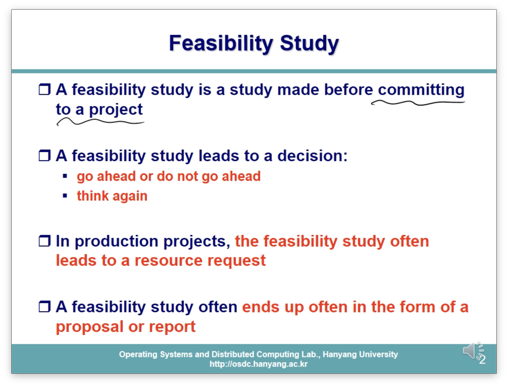

- 프로젝트를 시작하기에 앞서 프로젝트의 타당성을 검토하는 단계
- 프로젝트 기획 단계에서의 resource request가 발생하기도 함.
- 이 단계 완료 후 proposal(제안서)나 report 형태의 결과물이 나와야함.

#### 이 단계가 어려운 이유는 뭘까

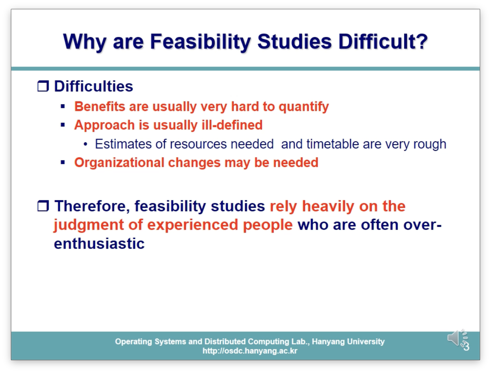

- 어떠한 프로젝트에 대한 benefit을 수량화하는 것이 애초에 어렵긴 함.

  → 결국 프로젝트 승인권을 가진 사람을 이익의 수치화를 통해 설득해야하기 때문

- 본격적인 프로젝트 시작 전 resource에 대한 정확한 Request 등이 어려움
- 신규 프로젝트를 위해 기존 구조를 변경해야 하는 어려움도 있음(회사 기준) → TF 생성 등

> 이러한 어려움 때문에 보통 경험이 많은 사람에 의해 진행되는 것이 타당하다.

#### Feasibility 판단의 근거(의사결정권자의 시점에서)

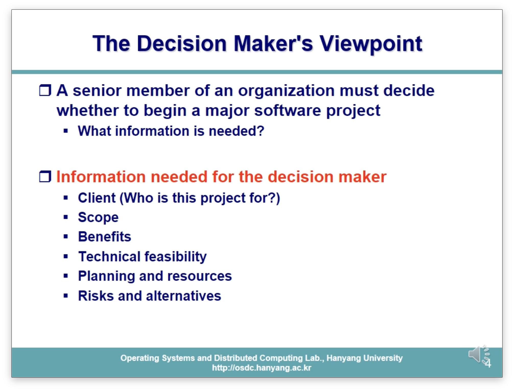

#### Scope

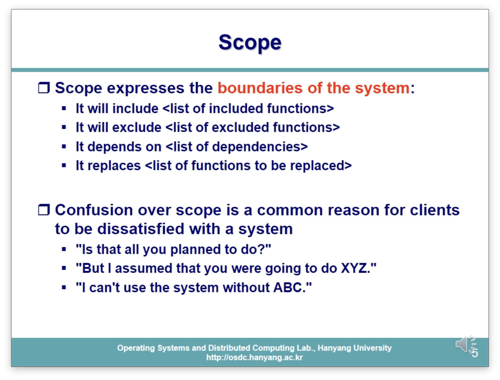

- 만들 소프트웨어의 기능적 범위(scope) → Client의 요구를 충족시키기 위해 필수
  - 포함 되는 기능 / 제외되는 기능 / 의존성 범위 / 기존 기능의 교체 등을 명확하게 설정해야 system의 명확한 boundary가 생성됨.

#### Benefit

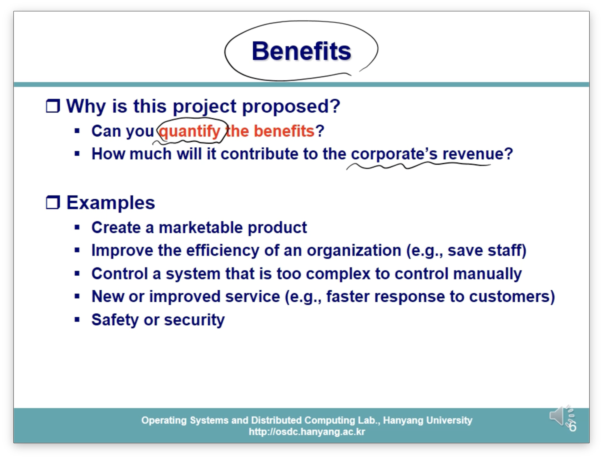

- 이 프로젝트를 통한 이득을 수량화 해야한다.

#### Technical Feasibility(POC..?)

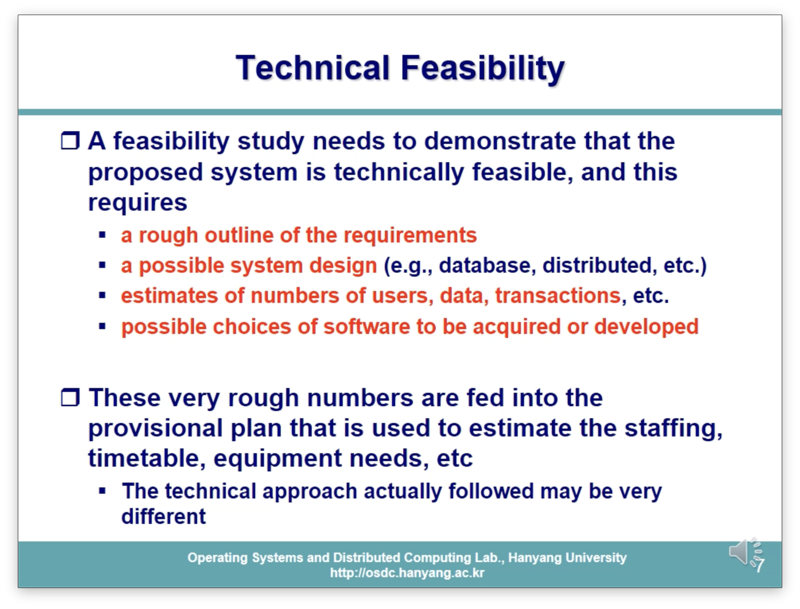

- 어떠한 기능을 어떠한 기술을 통해 구현 가능하다. → 혹은 가능한 기술들 중 어떤 것을 선택할 것인지
- 요구사항의 대략적인 윤곽이 있어야겠지.
- 이런 것들을 종합해서 이런 프로젝트의 feasibility를 검토

#### Planning and Resources

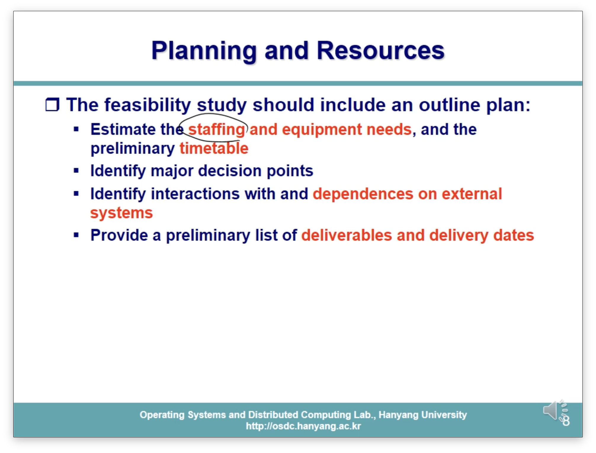

#### Risks and Alternatives

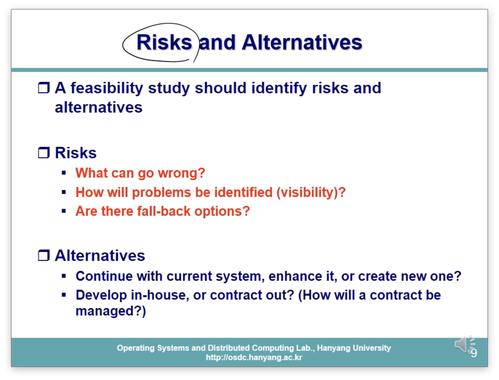

- 예상 Risk를 추측해보고 이러한 risk에 대한 해결 방안 등을 설계하는 단계

#### Feasibility Report

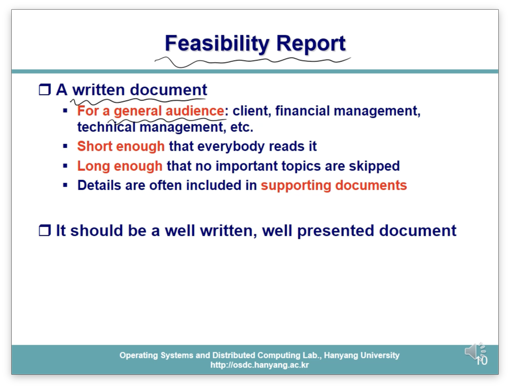

- 이 보고서는 일반인도 읽을 수 있도록(general audience) 작성
- 너무 길면 안됨. 단, 중요한 디테일은 모두 챙겨서 compact하게 작성해야함.

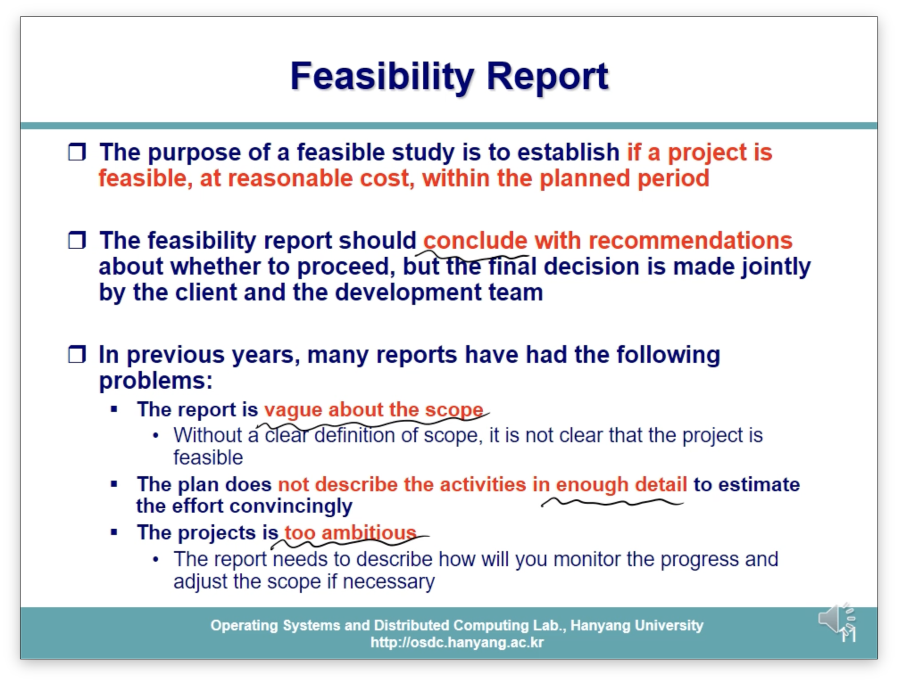

- 너무 과장하지 않고 최대한 객관적이고 합리적이게 작성해야함.

#### Feasibility Study 예시

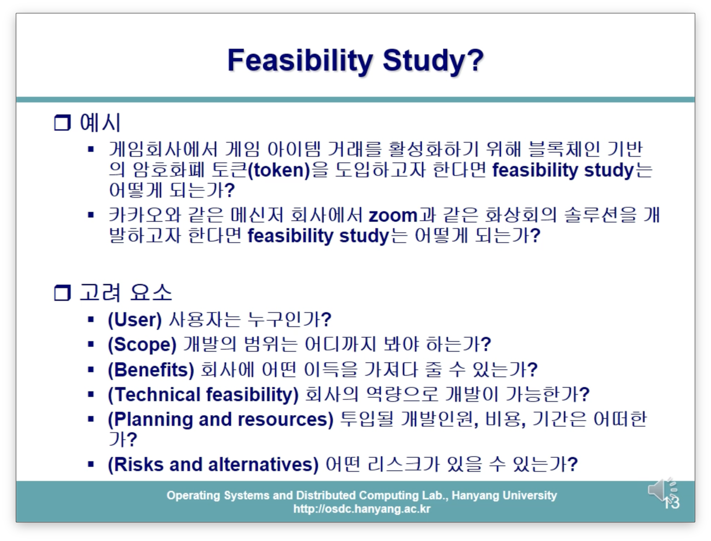
