#### Floating Point

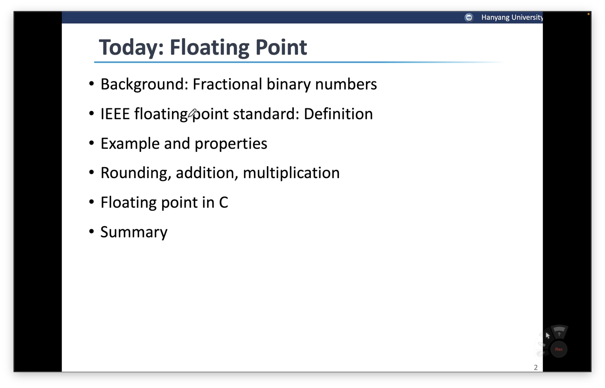

- 컴퓨터가 고정된 길이 내에서 실수를 표현하는 방법에 대해 학습할 예제

#### Fractional Binary Numbers

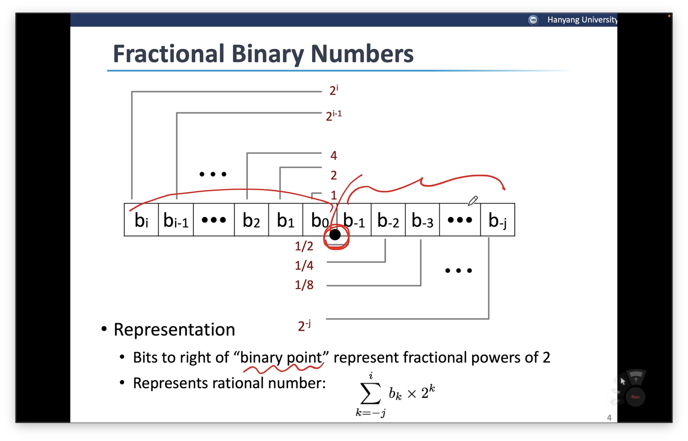

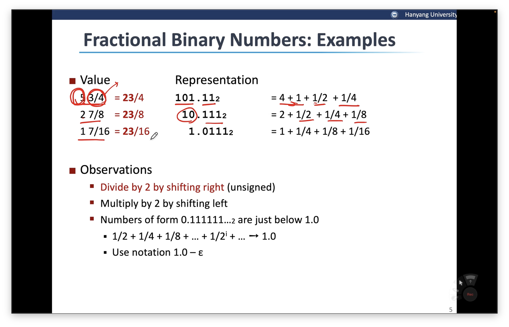

- 2로 나누는 나눗셈은 right shift로 처리
- 2로 곱하는 곱셈은 left shift로 처리
- 0.111111… → 0.99999 → 1.0에 한없이 가까운 숫자로 해석이 될 수 있다.

#### Representable Numbers

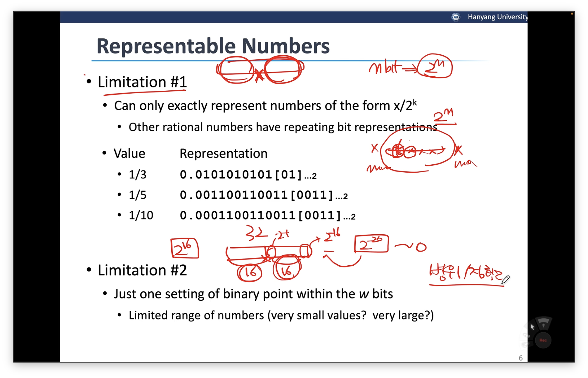

- 단점
    - Limitation 1 → 정확성
        1. 컴퓨터 내부 비트 수는 한계가 있음. → 표현할 수 있는 값의 범위는 한계가 있다.
        2. 실수에서는 최대, 최소의 범위를 준다고 해도 무한히 많이 있을 수 있다. → 범위 내의 숫자를 2\^n개라고 할 수 없음. → 정확한 숫자가 아닌 근사표현으로 한다..?
    - Limitation 2
        1. 소숫점의 binary point의 위치

#### IEEE floating point standard : Definition

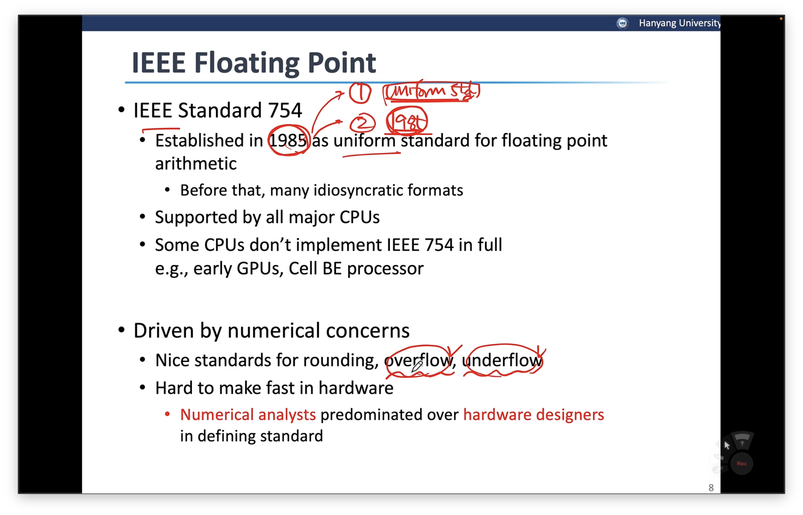

- IEEE Standard 754
    - 1985년 설립됨
        1. uniform standard → 오늘날의 컴퓨터들은 이 표준을 사용한다. → 이 표준이 엄청난 강점을 가지고 있기 때문
        2. 1985에 설립됨 → personal computer가 등장하고 훨씬 이후에 등장한 표준임
    - overflow, underflow를 고려하지 않고 작성할 수 있음 → 사용하기 용이함
    - 실제 사용하기에 적당한 범위의 실수 범위를 제공 + 정확성을 제공함.

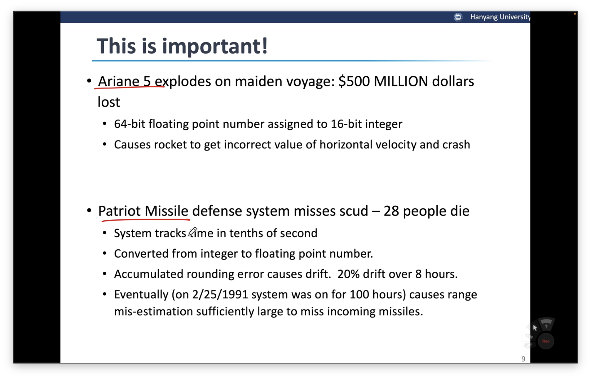

- 실수 표현에 대해 우리가 예상할 수 있는 범주 내에 표현할 수 있어야 함!

#### Floating Point Representation

→ IEEE는 그럼 어떤 식으로 실수 표현을 보장했는가

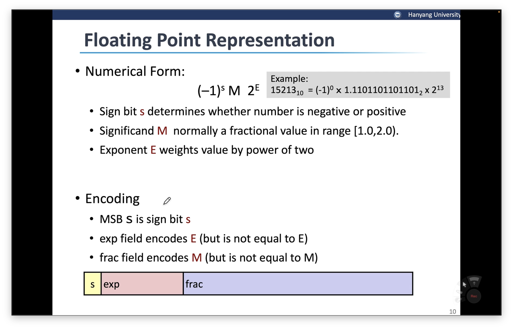

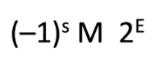

- s : sign bit(부호 비트)
- M : significand(유효 숫자)
- E : Exponent(order)
- Encoding
    - bit의 위치는 대소 비교에 가장 크게 영향을 미치는 순으로 들어간다고 생각하면 됨.
    - MSB에는 sign bit가 들어감 → 대소 비교에 가장 큰 영향을 미치는 bit
    - sign bit 이후에는 exponent(E)가 들어감 → 2\^13에서 13 중 bias를 뺀 숫자가 들어감
    - 이후 frac field에는 M이 들어감 → 단, M이랑 동일한 숫자가 들어가는 것은 아님.\
      → 유효 숫자를 정규화하지 않는다면 order를 가지고 비교하는 것이 불가능\
      → M을 정규화하는데 2진수에서는 1.xxxxx의 꼴이기 때문에\
      → frac field는 M을 정규화한 부분에서 fraction(소수 부분)만 대입

#### Precision Options

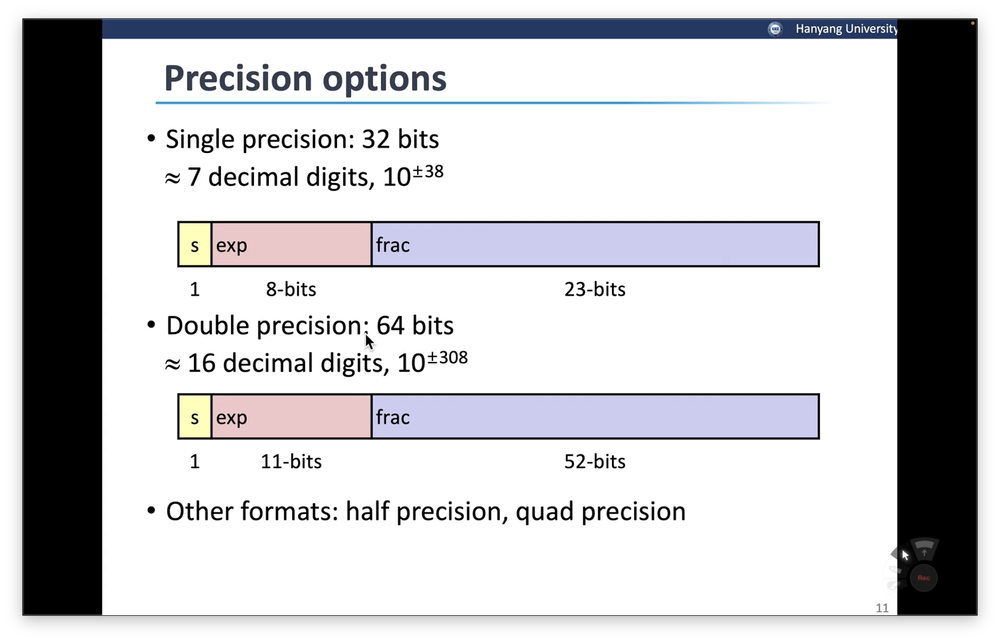

- 32 bit format → 대략 7자리 수의 10진수를 표현할 수 있음
    - sign bit : 1비트
    - exp : 8비트
    - frac : 23비트
- 64 bit format → 대략 16자리 수의 10진수를 표현할 수 있음
    - sign bit : 1비트
    - exp : 11비트
    - frac : 52비트
- half precision(16비트)
- quad precision(128비트)

#### Three “kinds” of floating poing numbers

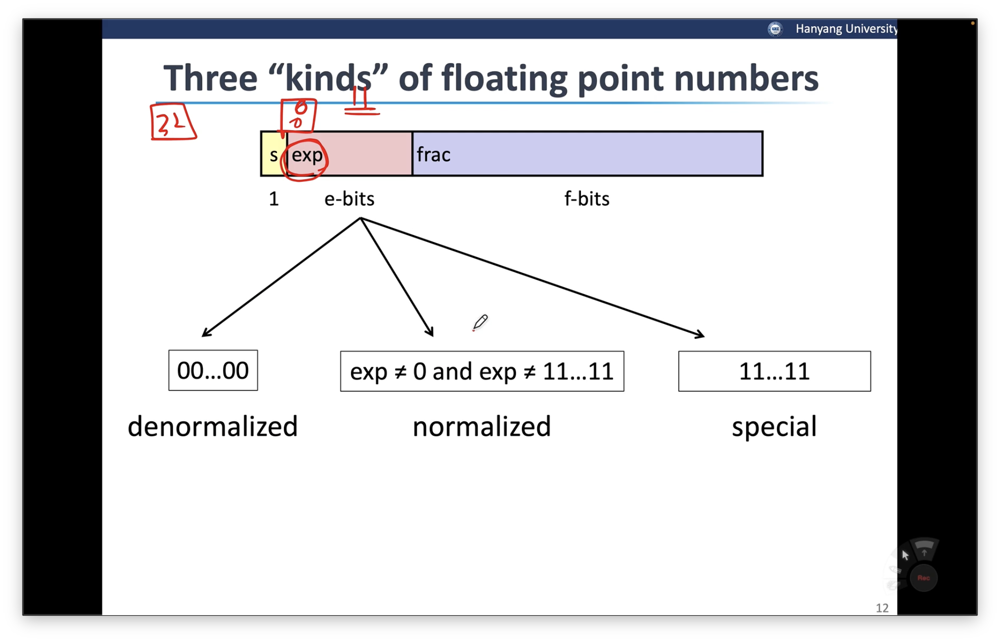

- 정규화 : 1011 → 1.011 \* 2\^3 / 0.1011 → 1.011 \* 2\^-1
- exp
    - 8개가 모두 0 → denormalized(숫자가 너무 작아서 정규화 시키지 못하는 상황)
    - 8개가 모두 1 → special(유효 숫자가 너무 커서 정규화 시키지 못하는 상황)
    - normalized

        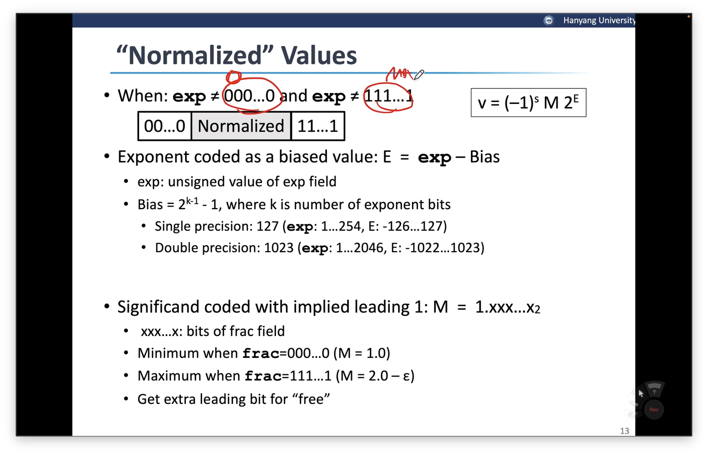

        1. Normalized Values

            → E = exp - Bias

            Bias

            - Single precision : 127
            - Double precision : 1023

#### IEEE 변경 예시

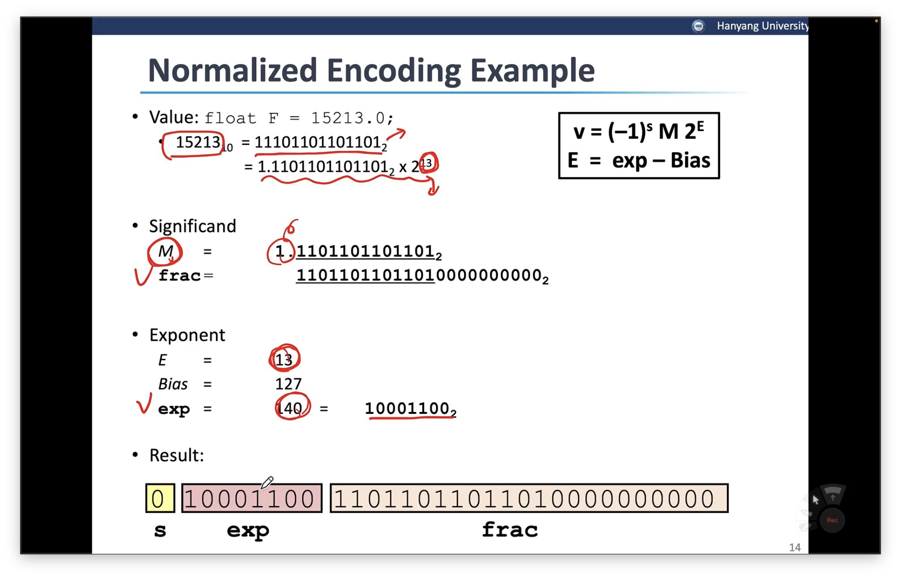

- 15213 → 2진수화
- 11101101101101 → 1.1101101101101 \* 2\^13
- s = 0, M = 110110110110100…, exp = 13 + 127 = 140 = 10001100

#### Denormalized Values

→ exp field가 000…0인 경우

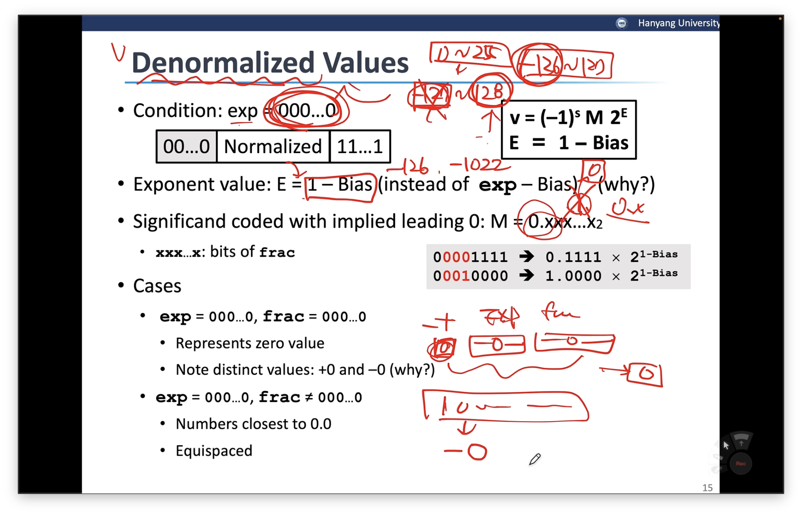

- 유효숫자 범위 → 0 \~ 255 → -127 \~ 128까지 표현 가능 → -127, 128은 따로 처리 → -126 \~ 127
- -127 → exp = 000…0
- Exponent Value : E = 1 - Bias(-126 or -1022)
- 기억해야 하는 부분
    1. exp 필드가 000…0이기 때문에 더 뺄 수가 없음 → normalize가 불가능한 영역
    2. normalize를 하지 못했기에 1.xxx가 아니라 0.xxxx를 나타냄
    3. sign, exp, frac이 모두 0인 경우 → 0을 나타냄(정수와 같이 IEEE 실수 표현에도 all 0은 0임)
    4. sign만 1이고 나머지 0이면 → - 0을 나타냄
    5. **IEEE에서는 0과 -0 2가지가 있음**

#### Special Values

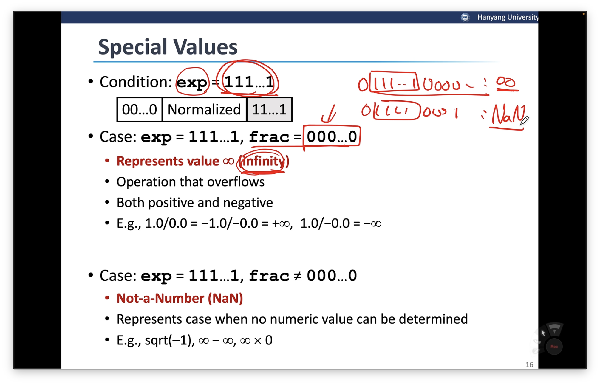

→ exp field가 111…1인 경우

- case 1 : exp field = 111…1 , frac field = 000…0 → infinity(upper bound)
    - infinity보다 1 비트라도 큰 경우 : NaN(Not a Number)로 처리
- case 2 : sqrt(-1), infinity 끼리의 연산 etc.. → NaN으로 처리

#### C float Decoding Example

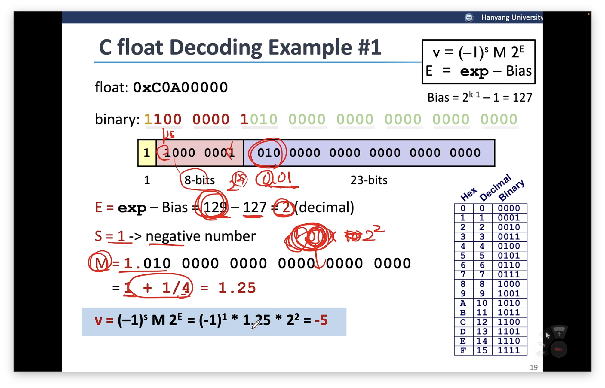

- 0xC0A00000 → 우선 binary로 표현
- 1100 0000 1010 0000 0000 0000 0000 0000
- sign bit : 1, exp : 1000 0001, frac : 010 0000 0000 0000 0000 0000
- E : exp - bias = 129 - 127 = 2
- S = 1 → 음수
- M = 1.010 0000 0000 0000 0000 0000 = 1 + 1/4 = 1.25
- v = (-1)\^1 \* 1.25 \* 2\^2 = -5

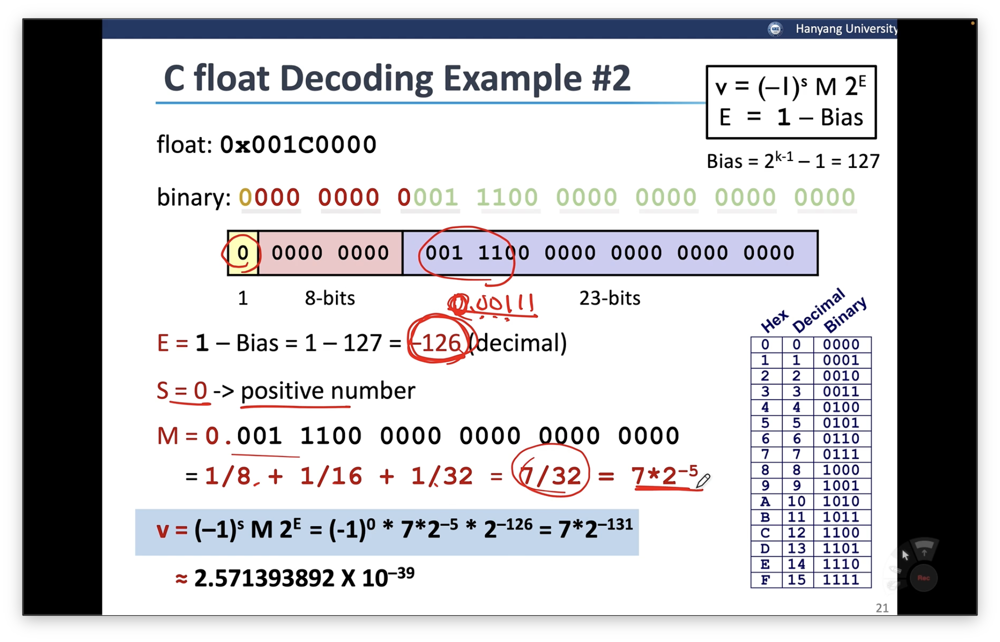

- 0x001C0000
- 0000 0000 0001 1100 0000 0000 0000 0000
- exp → denormalized
- E = -126
- S = 0
- M = 0.001 1100 0000 0000 0000 0000 = 1/8 + 1/16 + 1/32 = 7/32 = 7\*2\^-5
- v = (-1)\^0 \* 7\*2\^-5 \* 2\^-126 = 7 \* 2\^-131

#### 시각화

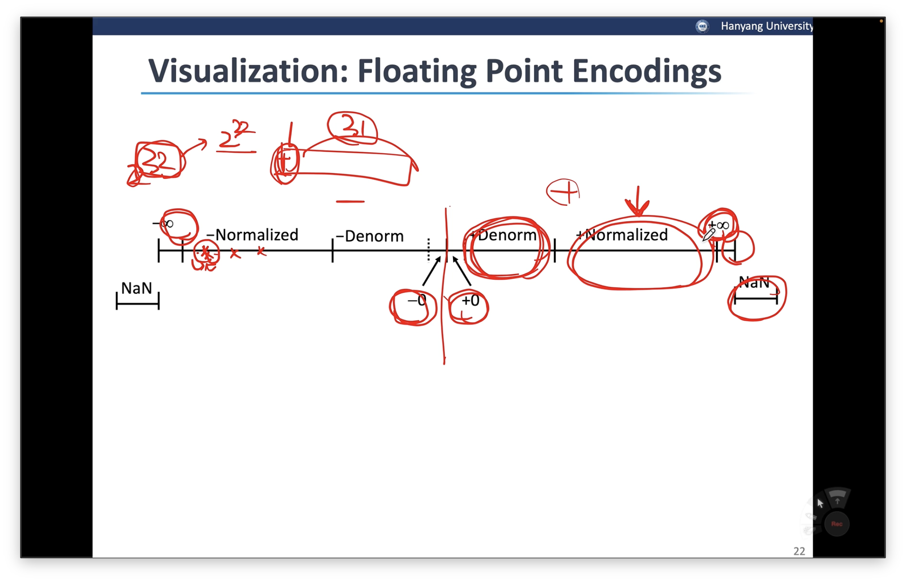

1. IEEE 비트 표현 → 1비트를 제외하고 31비트를 통해 양수와 음수를 동일한 갯수 표현 가능(0, -0 둘 다 있응께)
2. 양, 음수 모두 Denorm, Norm, infinity, NaN이 있음
