#### Floating Point

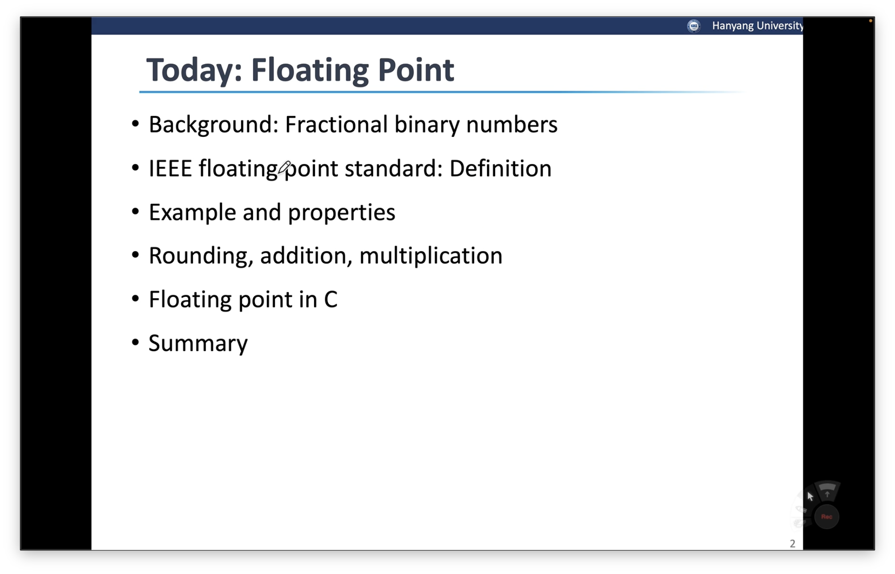

- 컴퓨터가 고정된 길이 내에서 실수를 표현하는 방법에 대해 학습할 예제

#### Fractional Binary Numbers

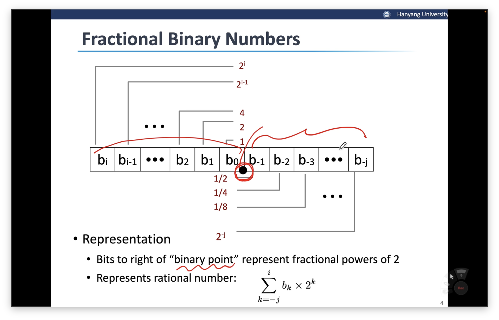

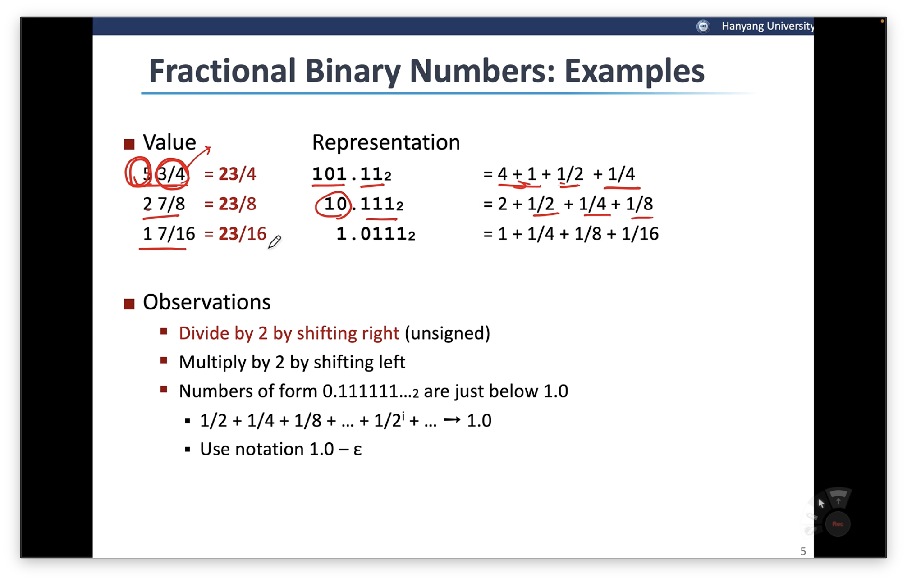

- 2로 나누는 나눗셈은 right shift로 처리
- 2로 곱하는 곱셈은 left shift로 처리
- 0.111111… → 0.99999 → 1.0에 한없이 가까운 숫자로 해석이 될 수 있다.

#### Representable Numbers

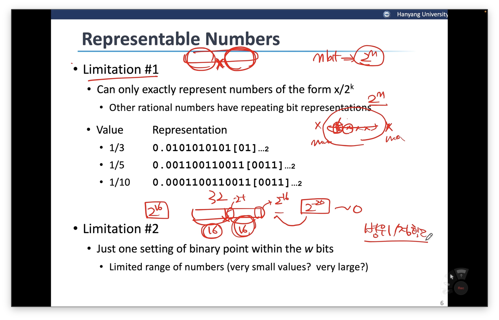

- 단점
    - Limitation 1 → 정확성
        1. 컴퓨터 내부 비트 수는 한계가 있음. → 표현할 수 있는 값의 범위는 한계가 있다.
        2. 실수에서는 최대, 최소의 범위를 준다고 해도 무한히 많이 있을 수 있다. → 범위 내의 숫자를 2\^n개라고 할 수 없음. → 정확한 숫자가 아닌 근사표현으로 한다..?
    - Limitation 2
        1. 소숫점의 binary point의 위치

#### IEEE floating point standard : Definition

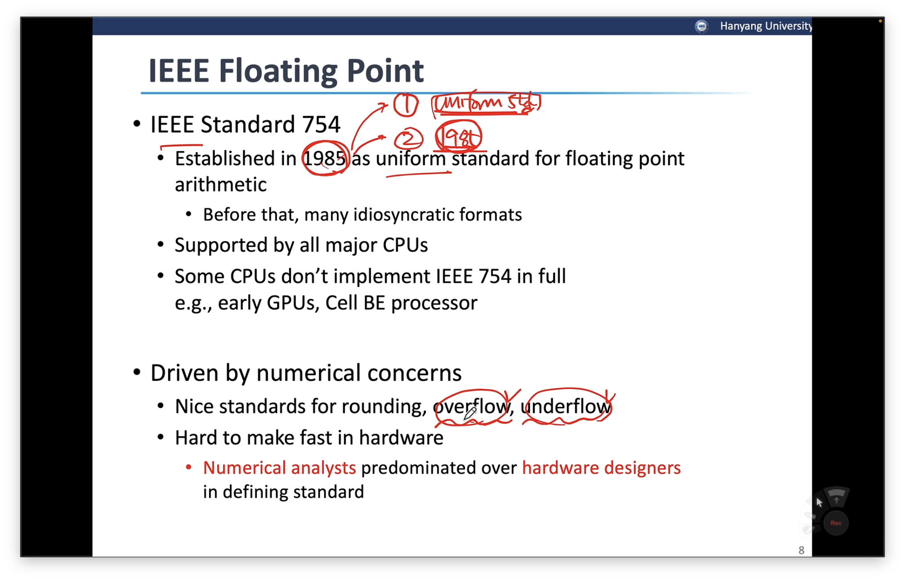

- IEEE Standard 754
    - 1985년 설립됨
        1. uniform standard → 오늘날의 컴퓨터들은 이 표준을 사용한다. → 이 표준이 엄청난 강점을 가지고 있기 때문
        2. 1985에 설립됨 → personal computer가 등장하고 훨씬 이후에 등장한 표준임
    - overflow, underflow를 고려하지 않고 작성할 수 있음 → 사용하기 용이함
    - 실제 사용하기에 적당한 범위의 실수 범위를 제공 + 정확성을 제공함.

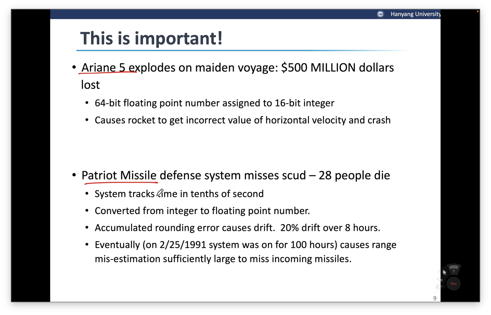

- 실수 표현에 대해 우리가 예상할 수 있는 범주 내에 표현할 수 있어야 함!

#### Floating Point Representation

→ IEEE는 그럼 어떤 식으로 실수 표현을 보장했는가

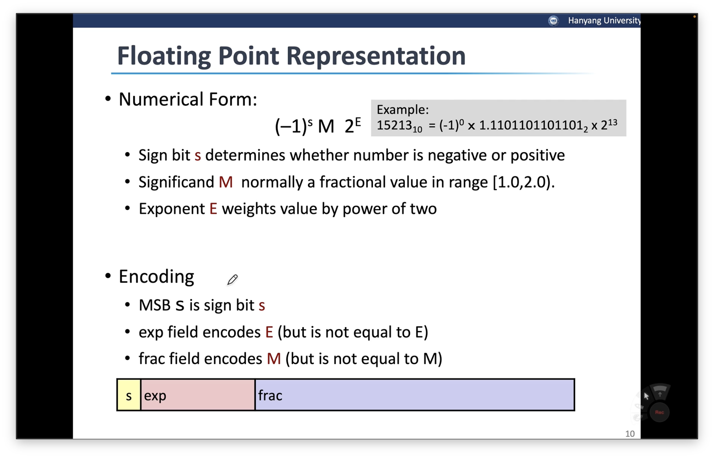

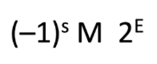

- s : sign bit(부호 비트)
- M : significand(유효 숫자)
- E : Exponent(order)
- Encoding
    - bit의 위치는 대소 비교에 가장 크게 영향을 미치는 순으로 들어간다고 생각하면 됨.
    - MSB에는 sign bit가 들어감 → 대소 비교에 가장 큰 영향을 미치는 bit
    - sign bit 이후에는 exponent(E)가 들어감 → 2\^13에서 13 중 bias를 뺀 숫자가 들어감
    - 이후 frac field에는 M이 들어감 → 단, M이랑 동일한 숫자가 들어가는 것은 아님.\
      → 유효 숫자를 정규화하지 않는다면 order를 가지고 비교하는 것이 불가능\
      → M을 정규화하는데 2진수에서는 1.xxxxx의 꼴이기 때문에\
      → frac field는 M을 정규화한 부분에서 fraction(소수 부분)만 대입

#### Precision Options

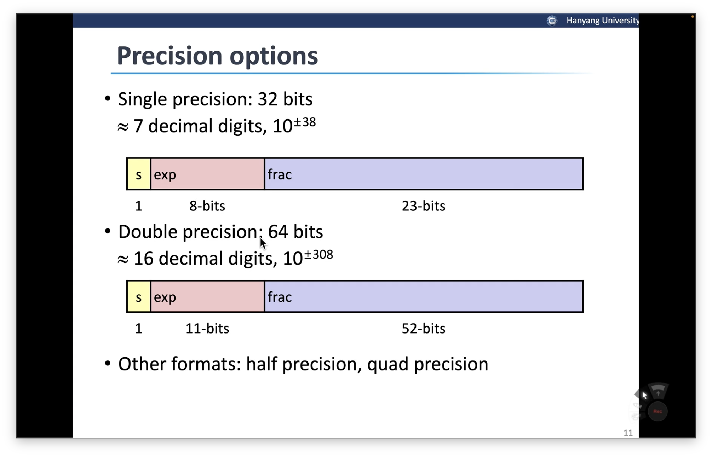

- 32 bit format → 대략 7자리 수의 10진수를 표현할 수 있음
    - sign bit : 1비트
    - exp : 8비트
    - frac : 23비트
- 64 bit format → 대략 16자리 수의 10진수를 표현할 수 있음
    - sign bit : 1비트
    - exp : 11비트
    - frac : 52비트
- half precision(16비트)
- quad precision(128비트)

#### Three “kinds” of floating poing numbers

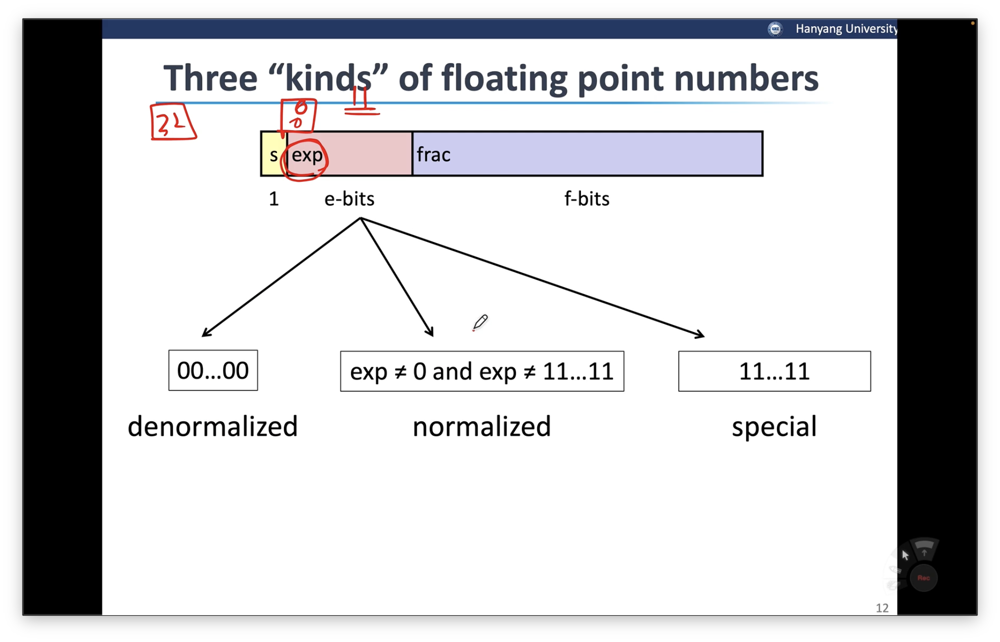

- 정규화 : 1011 → 1.011 \* 2\^3 / 0.1011 → 1.011 \* 2\^-1
- exp
    - 8개가 모두 0 → denormalized(숫자가 너무 작아서 정규화 시키지 못하는 상황)
    - 8개가 모두 1 → special(유효 숫자가 너무 커서 정규화 시키지 못하는 상황)
    - normalized

        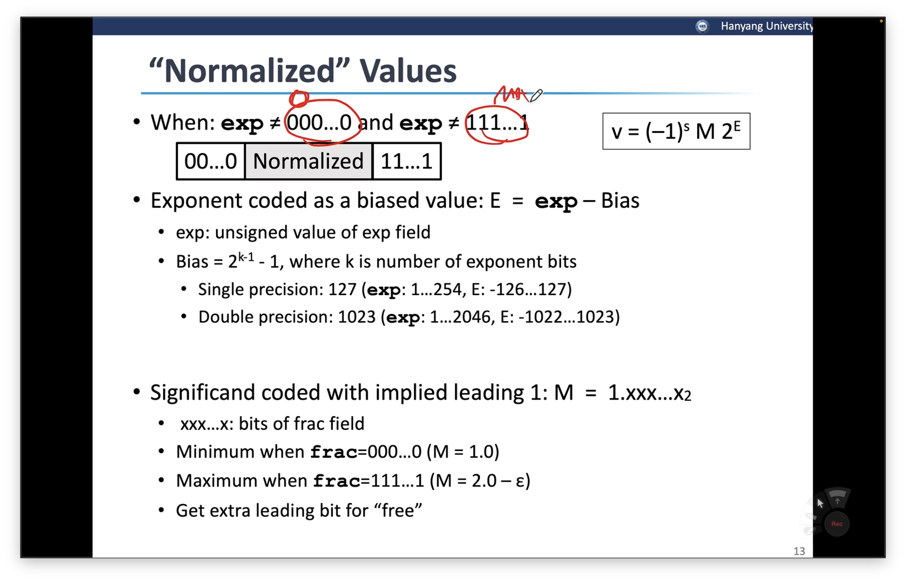

        1. Normalized Values

            → E = exp - Bias

            Bias

            - Single precision : 127
            - Double precision : 1023

#### IEEE 변경 예시

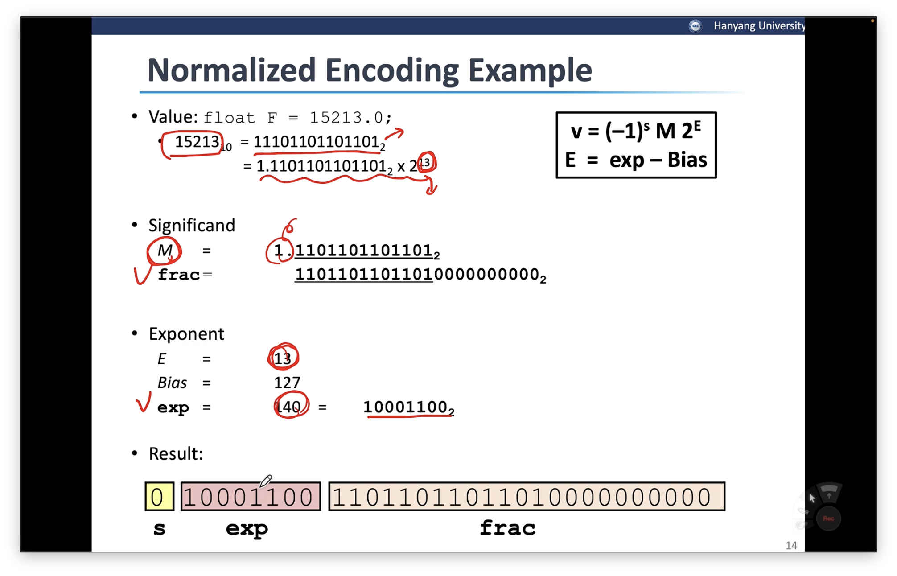

- 15213 → 2진수화
- 11101101101101 → 1.1101101101101 \* 2\^13
- s = 0, M = 110110110110100…, exp = 13 + 127 = 140 = 10001100

#### Denormalized Values

→ exp field가 000…0인 경우

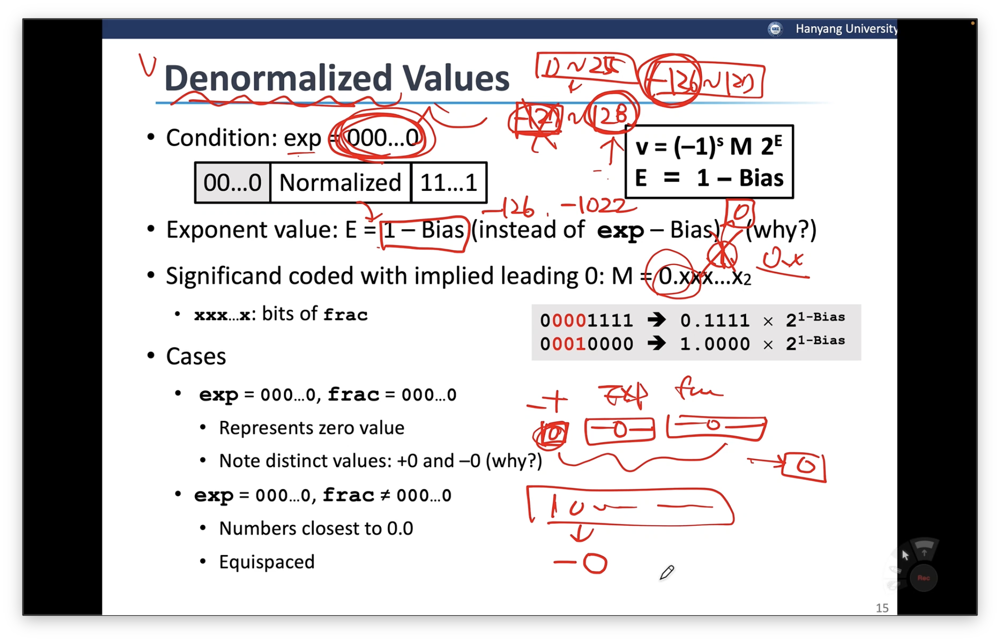

- 유효숫자 범위 → 0 \~ 255 → -127 \~ 128까지 표현 가능 → -127, 128은 따로 처리 → -126 \~ 127
- -127 → exp = 000…0
- Exponent Value : E = 1 - Bias(-126 or -1022)
- 기억해야 하는 부분
    1. exp 필드가 000…0이기 때문에 더 뺄 수가 없음 → normalize가 불가능한 영역
    2. normalize를 하지 못했기에 1.xxx가 아니라 0.xxxx를 나타냄
    3. sign, exp, frac이 모두 0인 경우 → 0을 나타냄(정수와 같이 IEEE 실수 표현에도 all 0은 0임)
    4. sign만 1이고 나머지 0이면 → - 0을 나타냄
    5. **IEEE에서는 0과 -0 2가지가 있음**

#### Special Values

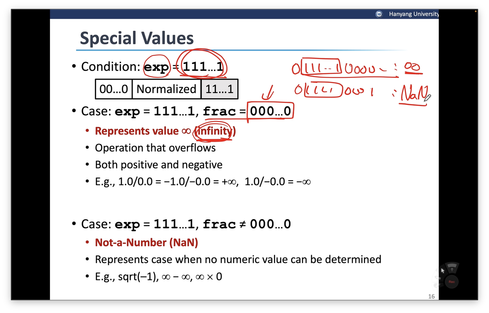

→ exp field가 111…1인 경우

- case 1 : exp field = 111…1 , frac field = 000…0 → infinity(upper bound)
    - infinity보다 1 비트라도 큰 경우 : NaN(Not a Number)로 처리
- case 2 : sqrt(-1), infinity 끼리의 연산 etc.. → NaN으로 처리

#### C float Decoding Example

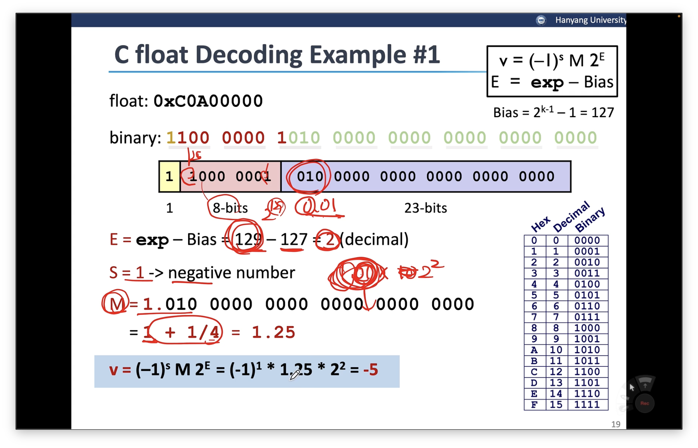

- 0xC0A00000 → 우선 binary로 표현
- 1100 0000 1010 0000 0000 0000 0000 0000
- sign bit : 1, exp : 1000 0001, frac : 010 0000 0000 0000 0000 0000
- E : exp - bias = 129 - 127 = 2
- S = 1 → 음수
- M = 1.010 0000 0000 0000 0000 0000 = 1 + 1/4 = 1.25
- v = (-1)\^1 \* 1.25 \* 2\^2 = -5

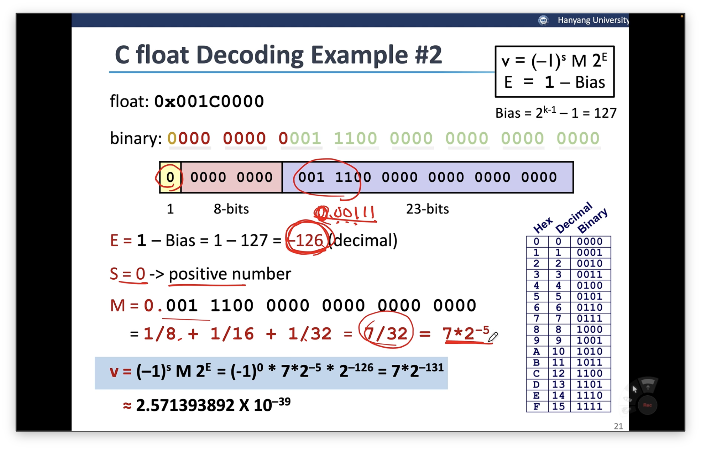

- 0x001C0000
- 0000 0000 0001 1100 0000 0000 0000 0000
- exp → denormalized
- E = -126
- S = 0
- M = 0.001 1100 0000 0000 0000 0000 = 1/8 + 1/16 + 1/32 = 7/32 = 7\*2\^-5
- v = (-1)\^0 \* 7\*2\^-5 \* 2\^-126 = 7 \* 2\^-131

#### 시각화

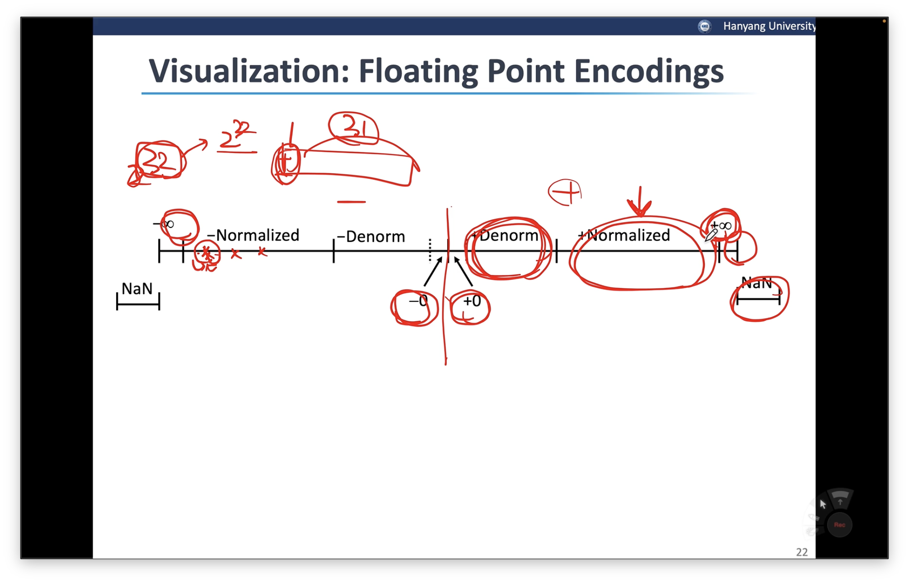

1. IEEE 비트 표현 → 1비트를 제외하고 31비트를 통해 양수와 음수를 동일한 갯수 표현 가능(0, -0 둘 다 있응께)
2. 양, 음수 모두 Denorm, Norm, infinity, NaN이 있음

#### Tiny Floating Point Example

→ 실제 IEEE 보다 간소화된 8비트 encoding으로 실수 표현해본다.

- IEEE는 32비트 혹은 64비트로 실수를 표현하고 있고 half인 16비트도 추가됨
- 8bit 표현은 실제로는 없는 format임

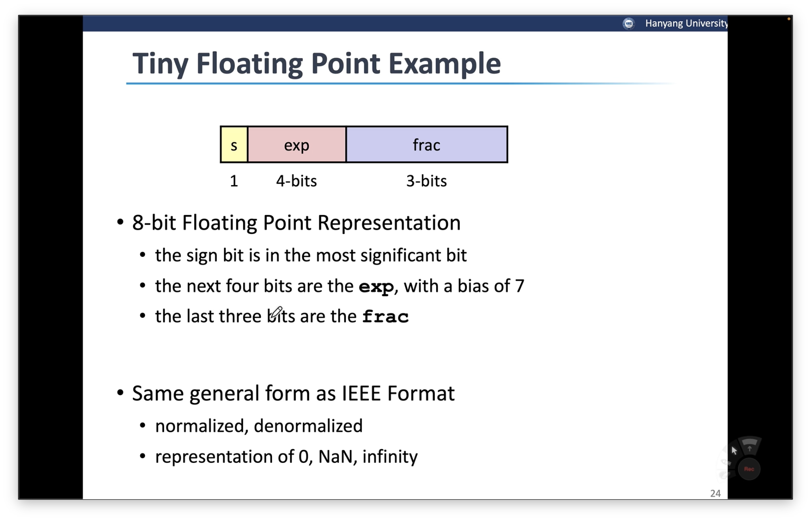

- s → 1비트
- exp → 4비트 / 8bit에서는 bias가 7
- frac → 3비트
- IEEE와 동일하게 normalized, denormalized, special 영역 모두 표현

#### Dynamic Range

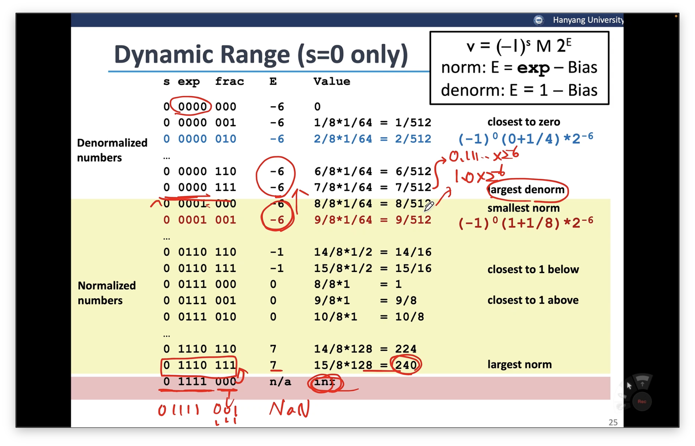

- 0 1111 000이 infinity이므로 그 하나 아래인 0 1110 111이 최댓값 / 0 1111 001은 NaN
- exp가 all 0인 영역에서 0 0000 000부터 0 0000 111까지가 denormalized 범위
- Denormalized 영역에서는 Exponent값(E)이 -6이고, Normalized 범위의 초반부도 -6임

#### Distribution of Values

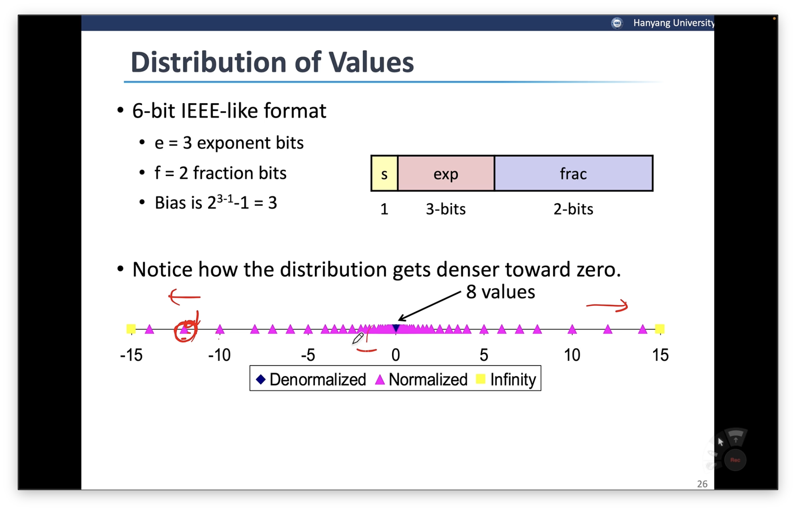

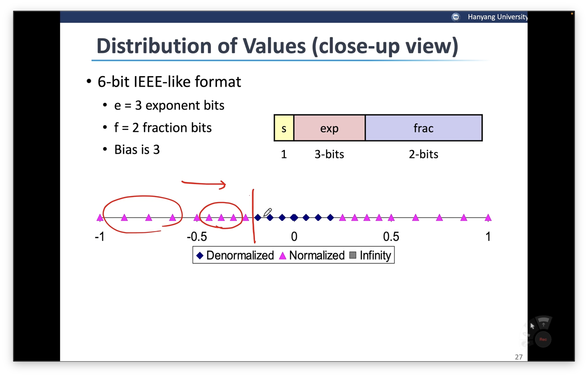

- exponent가 0에 가까울 수록 density가 높고 exponent가 최댓값, 최솟값에 가까워질 수록 density가 점점 낮아짐
- 기본적으로 0으로 갈 수록 exponent 값이 작아지기 때문에 점과 점 사이의 간격이 촘촘해진다

    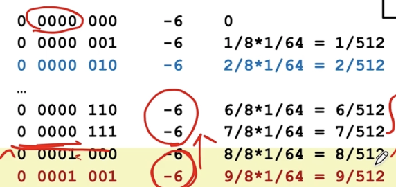

    - value의 차이가 1/512로 동일하기 때문에 수직선 상에서도 점과 점 사이의 거리가 일정함.

#### Special Properties of the IEEE Encoding

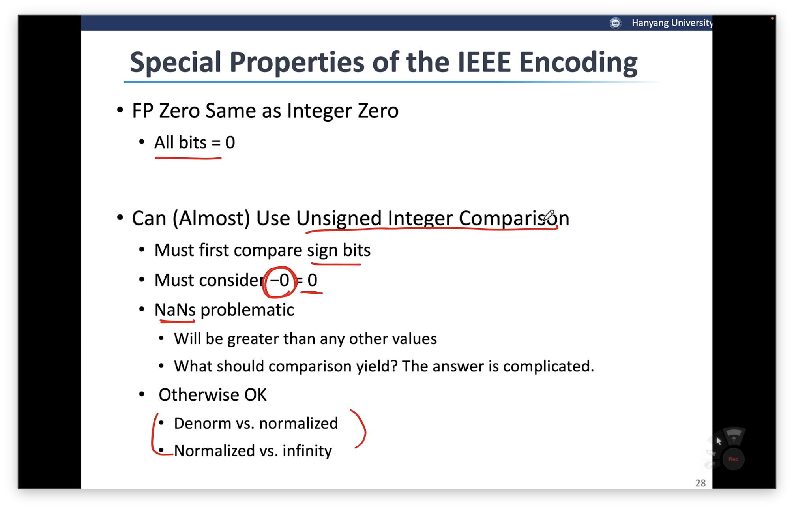

- Integer 든 FP든 ALL 0은 0을 가리킴
- Sign bit 반드시 확인
- FP는 -0의 표현이 있지만 0으로 처리
- NaN
- Integer에서의 unsigned integer와 동일한 하드웨어를 사용해서 처리

#### Floating Point Operations : Basic Idea

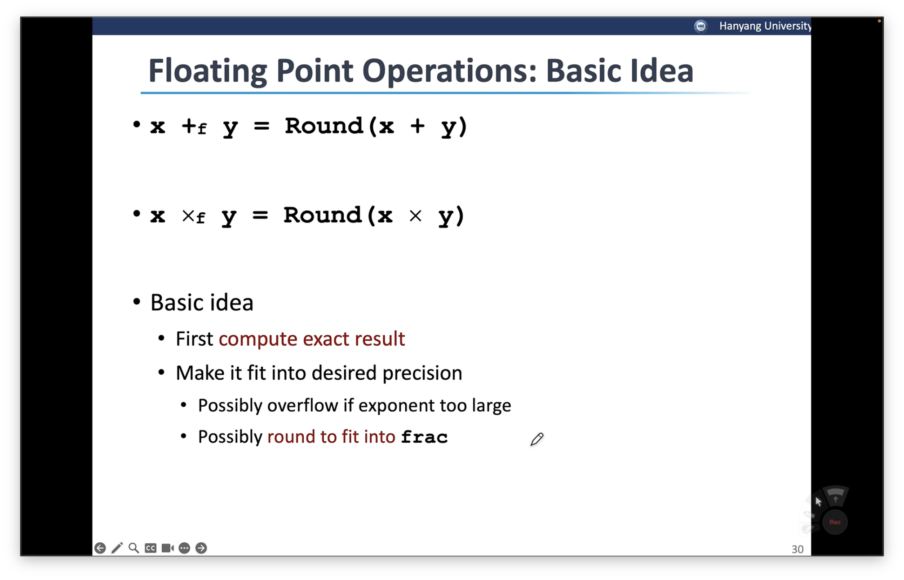

- IEEE 부동 소수(FP) 덧셈 혹은 곱셈에 대해서는 Round 처리가 들어감.(근삿값 처리)
- Integer와 FP에 대해서 덧셈 또는 곱셈 연산이 다르게 적용될 수 있음. → 다른 하드웨어가 사용됨
- FP 연산에는 overflow, underflow가 없음 → 대소비교는 바뀌지 않지만 round로 인해 결과값은 다를 수 있음

#### Rounding

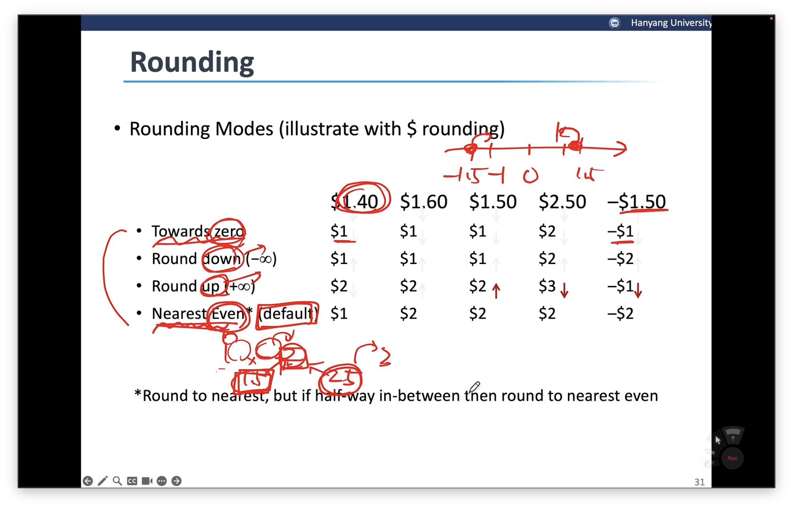

- Towards Zero(절댓값을 기준으로 내림)
- Round down(내림)
- Round up(올림)
- Nearest Even(기본적으로 사용됨) → 반올림이지만 우리가 사용하는 반올림과는 조금 다름
    - 두 수의 딱 중간 ex) 1.5 → 두 수 중 짝수 쪽으로 이동한다. ⇒ -1.50 → -2 / 2.50 → 2
    - 1.50 → 2 / 2.50 → 2 / 1.50과 2.50의 평균은 2가 됨 ⇒ 우리가 알고 있던 반올림과는 조금 다름.

#### Closer Look at Round-To-Even → 10진수 예시

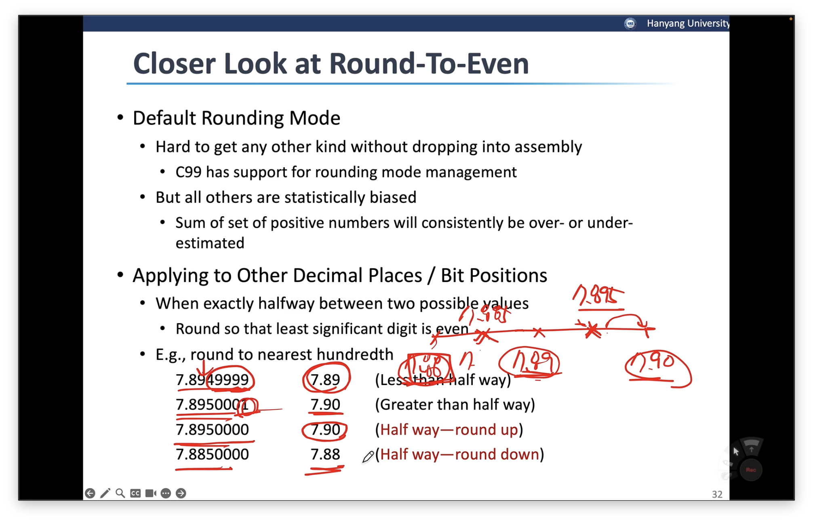

- 포인트는 7.8950000일 때 7.89 와 7.90 중 짝수인 7.90으로 간다는걸 보면 될 듯

#### Rounding Binary Numbers

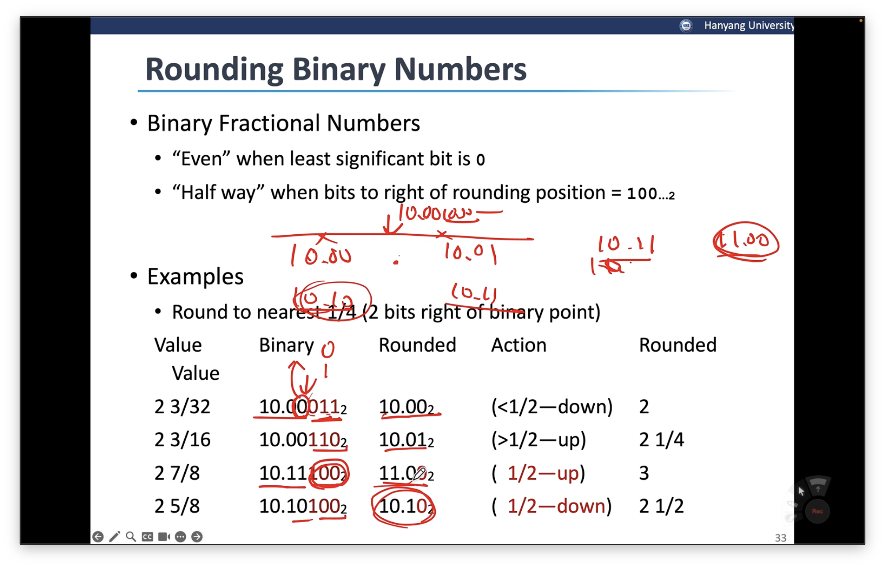

- 2진수 FP에서 “EVEN” → LSB가 0이면 짝수임 ex) 1.10 → 1 + 0.50
- 10.00110 ⇒ 10.00101 과 10.01 중
- 10.11100 ⇒ 10.11과 11.00 중 짝수인 11.00으로 올림

#### Rounding

→ HardWare 표현

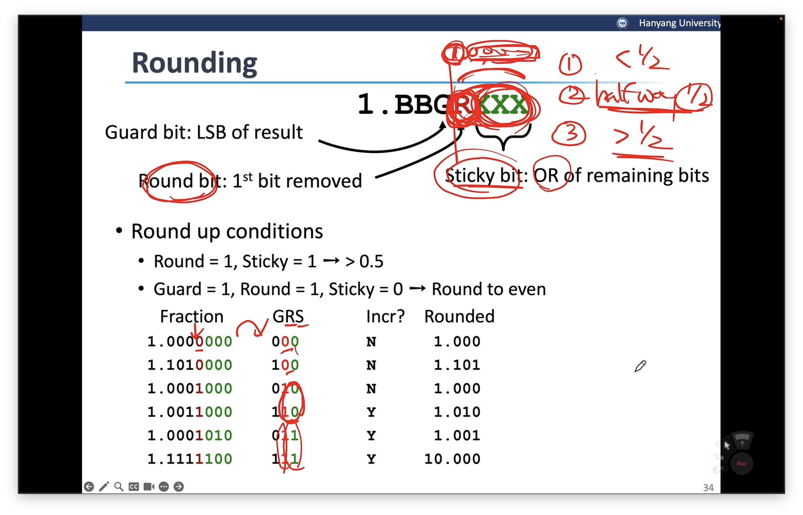

- Hardware에서 rounding을 사용하려면 비트를 임시로 저장할 수 있는 추가 저장 공간이 필요함. → 1\~2bit보다는 더 많은 bit가 필요함 → 더 많은 bit = 값이 더 나감
- 하지만, 컴퓨터에서는 단 2개의 bit만 사용해서 Rounding을 하는 trick을 사용함
- 위 사진에서 빨간색 R 비트와 X 비트를 사용
- HalfWay → R이 1이고 나머지 X가 모두 0일 때
- Incr? → 올림 or 내림
- 3번째와 4번째 2진수는 둘 다 halfway 이것보다 작으면 무조건 내림 크면 무조건 올림 / halfway에서는 Nearest Even

#### FP Multiplication

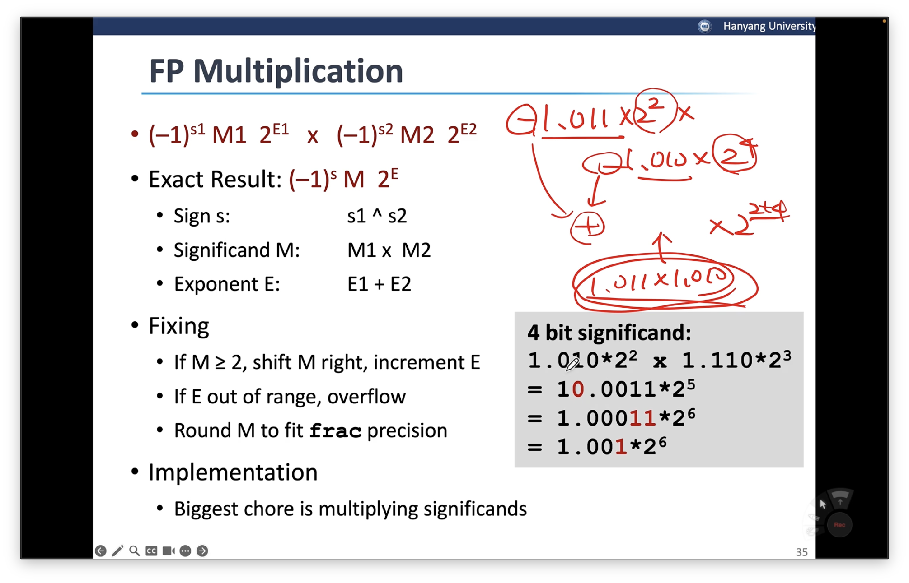

- E의 경우 M 연산 후 다시 normalized 하면 E에 변화가 생길 수 있음.
- 1.00011 \* 2\^6 에서 4비트 연산이니까 Rounding 진행 → 11은 Halfway보다 크니까 올림\
  → 1.001 \* 2\^6

#### Floating Point Addition

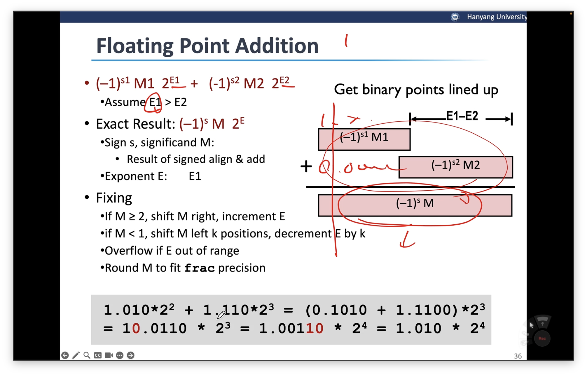

-  곱셈과 달리 Exponent에 따라서 order가 다르니 연산 시작 전 자릿수 조정이 필요함
- 피연산자들 중 exponent 값이 큰 값에 맞춰서 조정
- 이후는 정수와 동덧
- 덧셈 자체는 가벼운 연산이지만 연산 전 추가적인 작업이 상당히 무거울 수 있음. 물론 그럼에도 곱셈의 연산이 훨씬 무거움

#### FP 덧셈의 수학적인 특징

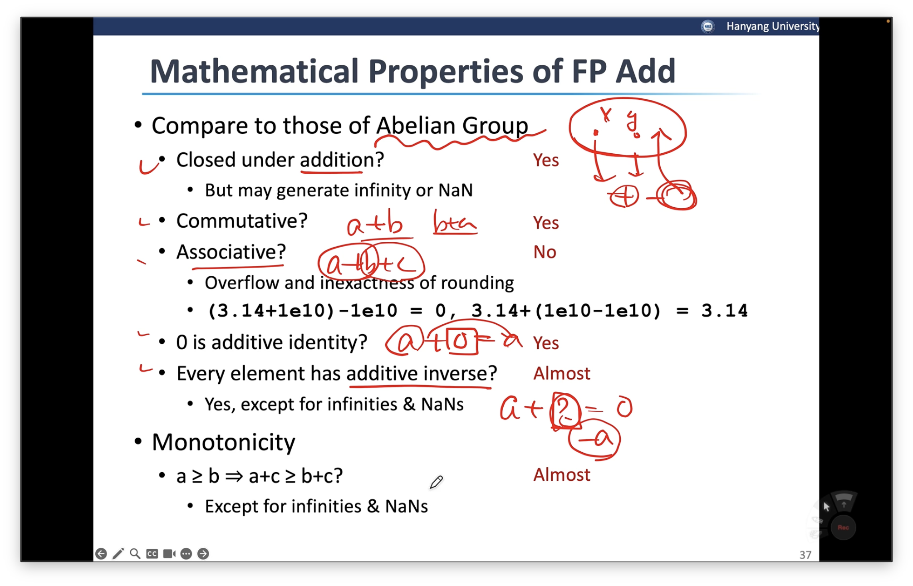

- 우리가 알고 있는 기본적인 덧셈 특징에 대해서 FP도 이러한 특징을 만족하는가? 에 대한 슬라이드
- 결합법칙이 허용되지 않음 → round 연산을 진행하기 때문에 연산 순서에 따라 다른 값이 나올 수 있음
- additive inverse → 덧셈의 역

#### FP 곱셈의 수학적인 특징

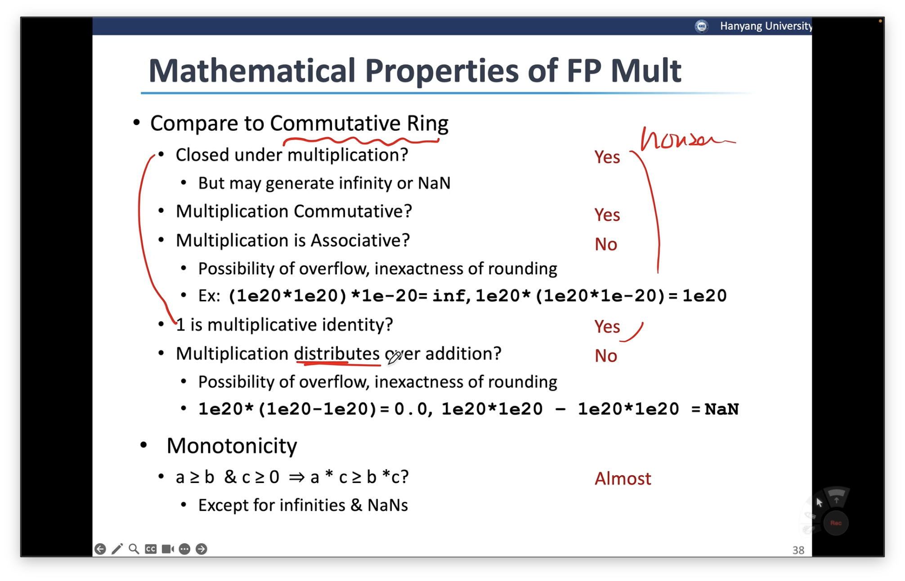

→ 0이 아닌 연산에 대한 특징들

- 결합법칙을 만족하지 않음 → 덧셈과 동일한 이유
- 분배법칙을 만족하지 않음

#### C언어에서의 FP 사용 시 주의점

- C언어에서는 float와 double 2개의 타입으로 실수를 표현함
- Type Casting
    - double/float → int
        1. 표현 범위가 줄기 때문에 truncate가 일어날 수 있음.(ex 소숫점 부분)
        2. truncate는 toward zero와 비슷한 연산으로 생각할 수 있음
    - int → double
        1. 표현 범위가 늘기 때문에 truncate와 같은 문제가 생기지는 않음
        2. double이 64비트이고 int가 32비트라면 fraction 안에 그대로 표현 가능함
    - int → flaot
        1. single fraction이면 32비트 내에 fraction이 23비트인데 23비트로 int가 표현이 된다면 문제가 없지만 그 이상이 나온다면 rounding이 들어감

#### Floating Point Puzzles

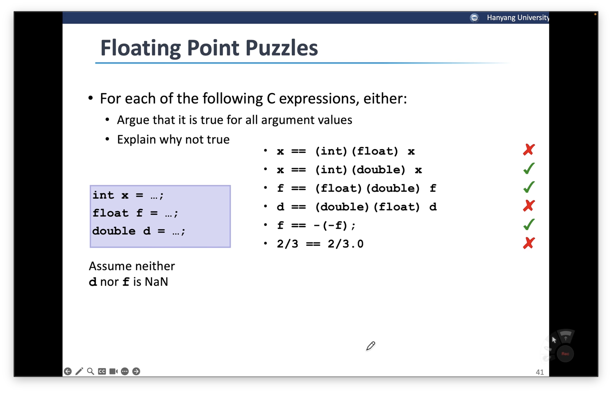

→ 직접 해보기

#### Summary

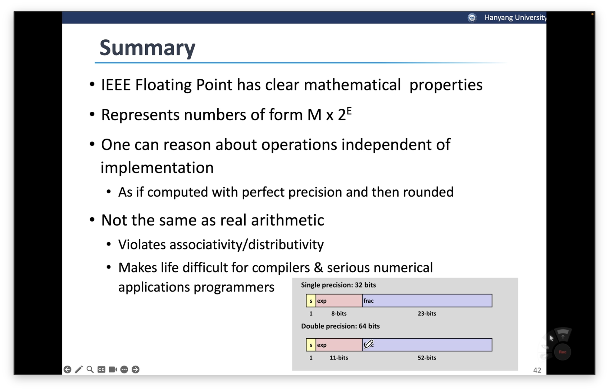
