## Machine-Basic

→ 컴퓨터의 관점에서 프로그램이 어떤 식으로 실행되는지 확인해볼 것임.

→ 컴퓨터에게 줄 명령어를 작성하는 것에도 유의해야 할게 있음

1. 하나의 소스 코드에 대한 머신 코드는 여러 개 존재 할 수 있음 →  성능이 각각 다를 수 있음
2. 같은 소스 코드에 대해서 좋은 성능의 머신 코드를 얻기 위해서는 컴퓨터에서 명령어들이 실행되는 원리를 알 필요가 있음

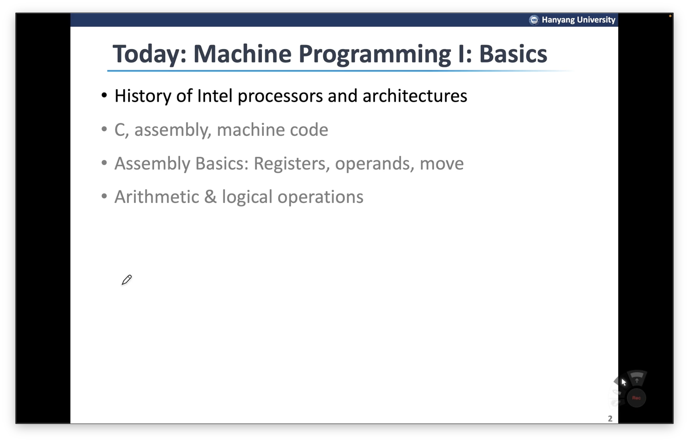

- Intel Architecture x86을 활용해서 수업 나갈 예정
- C언어 기준으로 설명할 것.
    - C 명령 → Compiler → 실행 코드로 변환
- 어셈블리 코드
- 컴퓨터에서 사용되는 연산은 어셈블리에서 어떻게 표현되는가

#### Intel x86 Processor의 역사

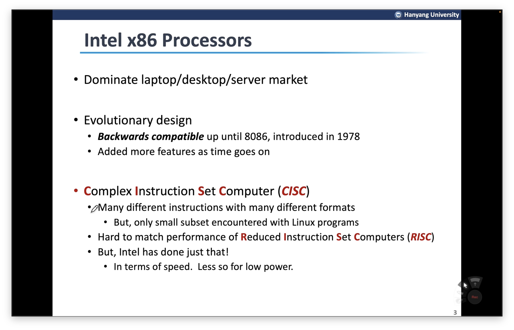

- Intel Processor는 70년대 중반에 등장 → 50년 동안 컴퓨터 시장을 지배함 → 어떠한 이유가 있겠지? → Backward Compatibility(하위호환) 때문임
- Backward Compactability
    - 무어의 법칙 → 1.5\~2년 주기마다 컴퓨터는 2배 좋아진다라는 법칙이 있었음
    - 좋아지는건 좋은데 너무 비싸짐 → 하위 소프트웨어와의 호환성을 보장하는 장점이 있음
- Complec Instruction Set Computer(CISC)

    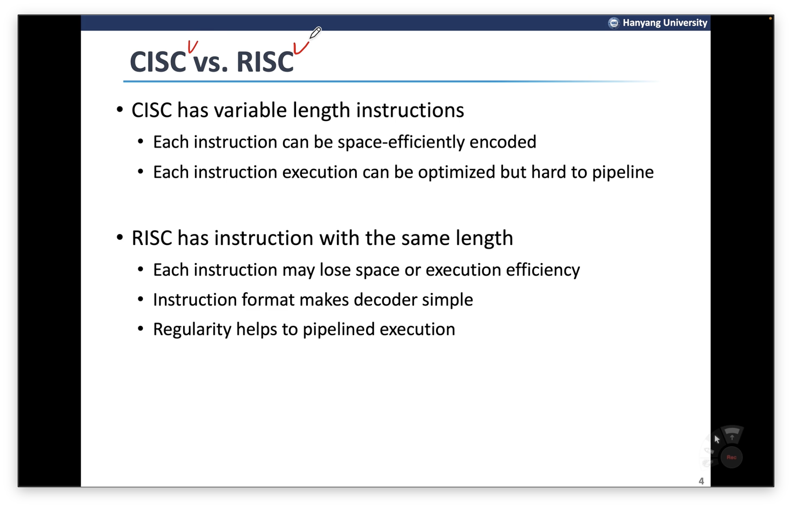

    - ↔ RISC(Reduced \~\~) → Complex or Reduced의 차이
    - CISC는 필요한 경우 명령어를 등록해서 사용할 수 있음 → 복잡한 연산을 적은 수의 명령어로 사용 가능
    - RISC는 복잡한 연산도 기존에 제공하는 기본 연산을 복합 사용해야함.

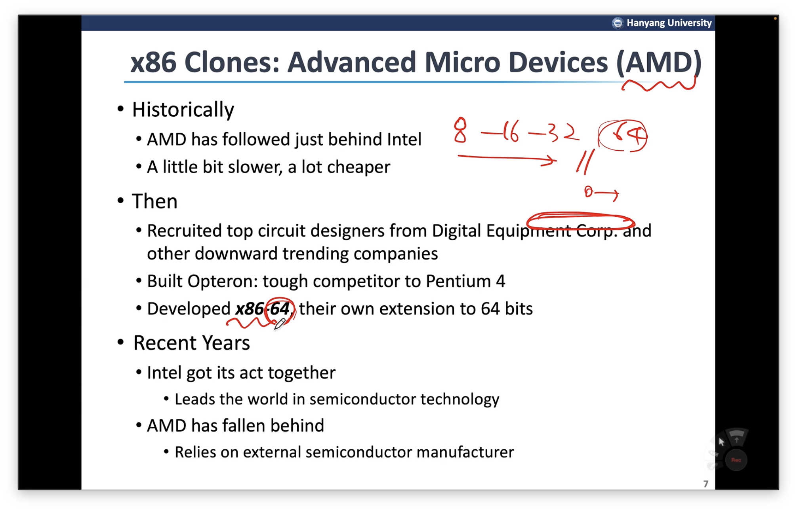

- 하위 호환은 기술 개발에 있어서 상당한 부담이 됨 → 당연하지..
- 그에 대해 고민하던 Intel도 여러 시도를 했지만 실패 → AMD 때문..
- AMD는 Intel 호환 processor에서 실행하는 프로그램을 그대로 실행할 수 있으면서 가격은 더 저렴하게 제공함 → 가성비 야르
- Intel은 8비트 → 16비트 → 32비트로 넘어온 후 64비트로 넘어갈 때는 하위호환을 정리하고 64비트에서 다시 출발하려 했음 → 이때 AMD가 32비트 호환이 가능한 64비트 architecture를 공개함(x86-64)

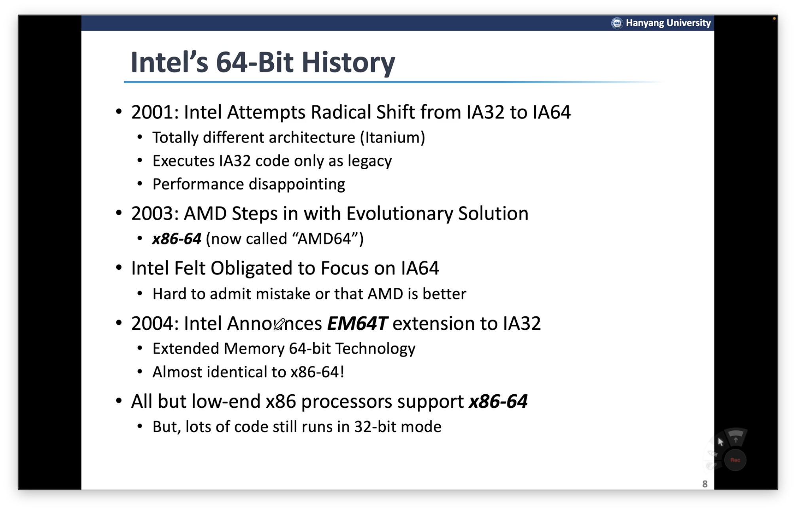

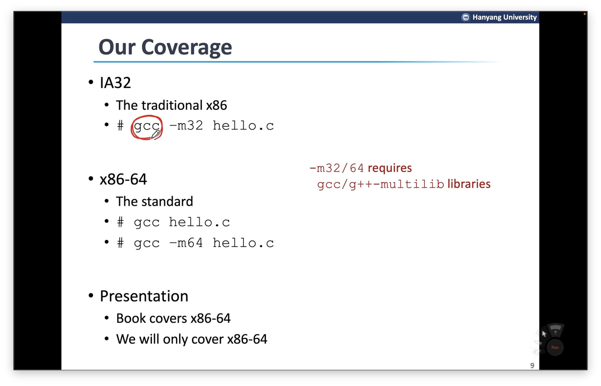

- gcc는 cross compile이 가능함. → 현재 컴파일러를 실행하고 있는 대상 시스템 외에 다른 대상 시스템을 지정해서 그 시스템에 동작할 수 있는 실행 파일을 만들 수 잇음.
- ex) intel 환경에서 amd 환경에서 실행 가능한 실행 파일을 만들 수 있다.
- “-m32” : 32비트 명령어로 만든다는 의미
- “-m64” : 64비트 명령어
- 근데 요즘 굳이 작성하지 않아도 내 환경에 맞는 비트 수를 확인 후 컴파일

####  C, assembly, machine code

→ 프로그램 소스 코드가 실행 파일로 바뀌는 과정

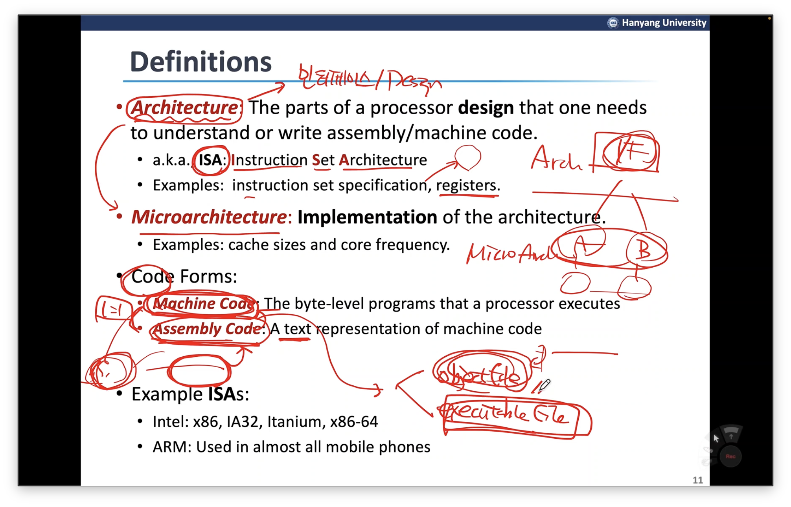

- Architecture → Instruction Set Architecture가 풀네임(ISA) : 컴퓨터(하드웨어)를 동작시키기 위한 명령어 set을 말함.
    - Interface / Design 이라고 볼 수 있음.
- Microarchitecture : architecture를 interface / design이라고 한다면 이를 위한 내부 구현을 말함.
    - ex ) 라이브러리 함수에 사용된 내부 알고리즘 및 지역 변수들. 라이브러리를 실행하는 입장에서는 알 필요 없지만 개발자 및 관리자는 최적화 등을 위해 알아야함.
    - Interface는 동일할 수 있지만 내부 코드의 스키마는 다를 수 있고 이에 따라 성능의 차이가 생길 수 있음
- Code Forms
    - Machine Code : 실제 프로세서에게 전달되어 프로세서가 실행하는 코드 → 줄바꿈 없이 byte의 배열 형태로 나타나져 있음 → 사람이 해석하기는 어려움
        1. Object file  → 컴퓨터가 해석은 할 수 있지만 아직은 실행할 수 없는 중간 단계의 코드
        2. Executable file → 우리가 알고 있는 머신코드의 형태
    - Assembly Code : Machine Code 를 조금 더 사람이 해석하기 편하게 표현함
    - Machine Code와 Assembly Code의 관게는 거의 1 : 1임.

#### Assembly / Machine Code View

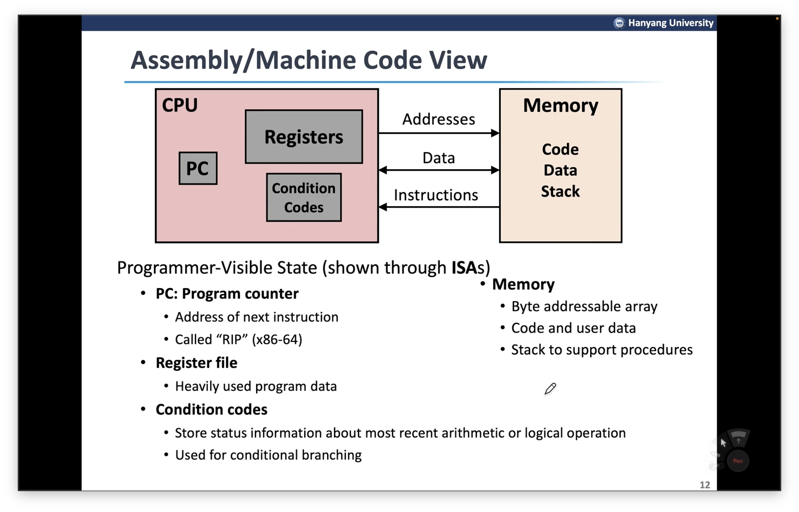

- 기본적으로는 CPU에서 어떤 주소를 통해 메모리에 접근하여 Data를 받고 register를 불러와서 연산을 진행
- Memory에는 Code, Data, Stack 등이 존재함.
- Register
    - PC → 다음 instruction이 저장된 주소를 가리킴
    - Condition Code → 다음에 살펴볼 예정

#### C 소스 파일이 실행 파일로 변환되는 과정

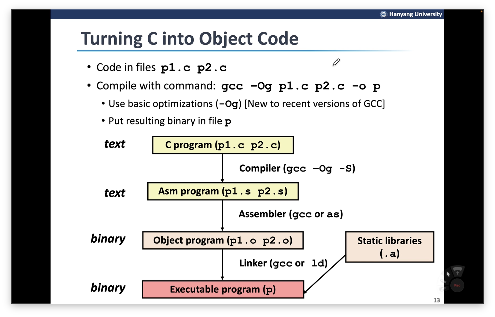

- Linker는 Object 파일이 위치한 주소를 쭉 받아서 실행 가능한 프로그램으로 바꿔줌.

#### Assembly 코드에 표현되는 내용

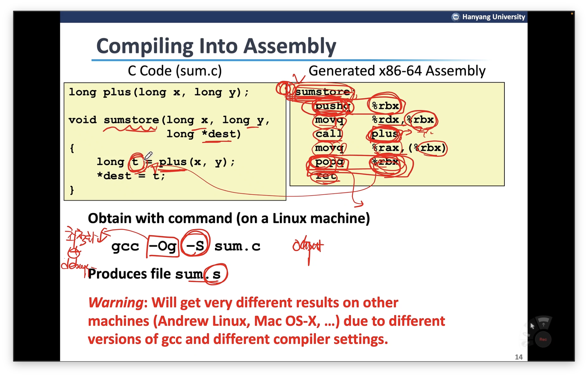

- “-S” : 만들어지는 outputfile이 실행 파일이 아니라 .s로 끝나는 어셈블러 파일이 생성됨
- “-Og” : 컴파일러 최적화(옵션을 최소화) + 디버깅 옵션이 추가되게 하는 명령어
- 우측 Assembly 박스
    - sumstore → label
    - call plus → plus 함수를 호출 (실제 실행파일에서는 plus가 아니라 주소로 표현되어야 함.)
    - format → 명령어의 종류 \| 레지스터 이름
- Assembly 코드들은 후에 Byte sequences의 형태로 나타낼 것이다.

#### Assembly 특징

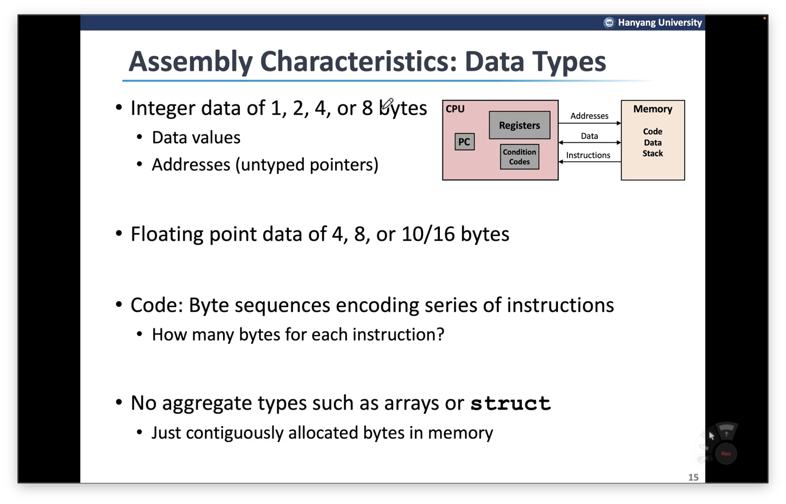

- 정수 데이터와 실수 데이터에 대한 register가 따로 있음. → 철저하게 구분되어 있다.
- 이전 페이지의 Assembly코드에서의 각각의 명령어들은 몇 바이트로 encoding이 될까? → Intel은 CISC를 사용하기에 각 명령어들에 대해 가변으로 표현함 → 각 명령어에 맞게 각기 다른 바이트로 표현됨.
- Array나 Sturct를 Assembly에서는 표현되지 않는다.

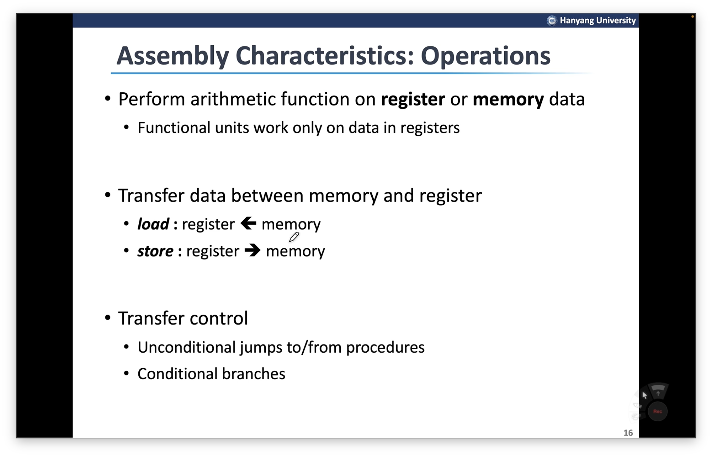

- 어셈블리에서의 연산 → 기본적으로 register 또는 memory에 저장된 동작을 토대로 동작함.
    - 프로세서 내부에 탑재된 덧셈 혹은 곱셈을 실제 수행하는 계산 장치는 register에 저장되어 있는 data를 기준으로 동작하도록 되어 있음.
    - memory에 있는 data를 직접 계산 장치에서 사용할 수 없으니 Memory에 있는 Data를 register에 옮겨 와서 이후 계산을 진행.
    - 즉, Memory ↔ Register로 데이터를 옮기는 별도의 연산이 필요함
        1. laod : register ← memory
        2. store : register → memory
- Transfer control → 다음에 자세히 살펴볼 예정

#### Object Code

→ 어셈블러 코드를 통해서 얻어지는 컴퓨터에서의 실행을 위한 코드

→ Executable Code와 구분할 필요 있음.

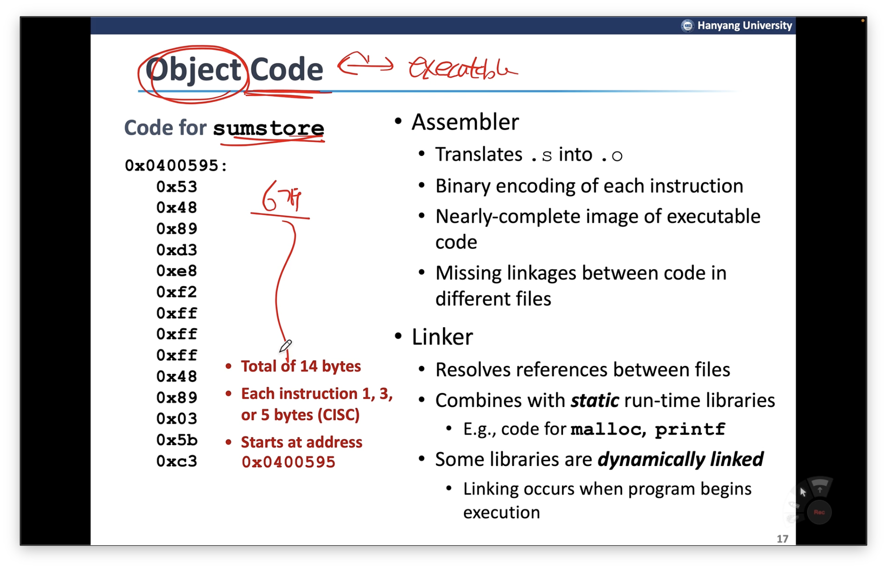

- 앞 슬라이드의 Assembly 코드를 변경하면 이렇게 됨
- Linker → 중간고사 이후에 할 예정

#### Source 코드 → Machine 코드로 변환되는 과정

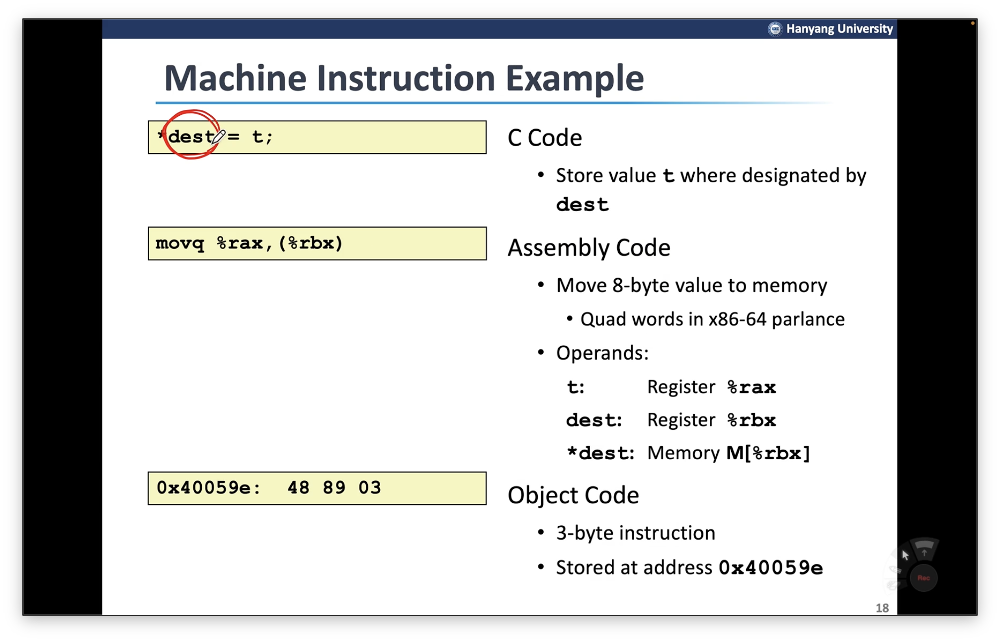

- movq
    - mov → 대입
    - q → 64비트를 의미
    - t → %rax
    - \*dest → (%rbx)

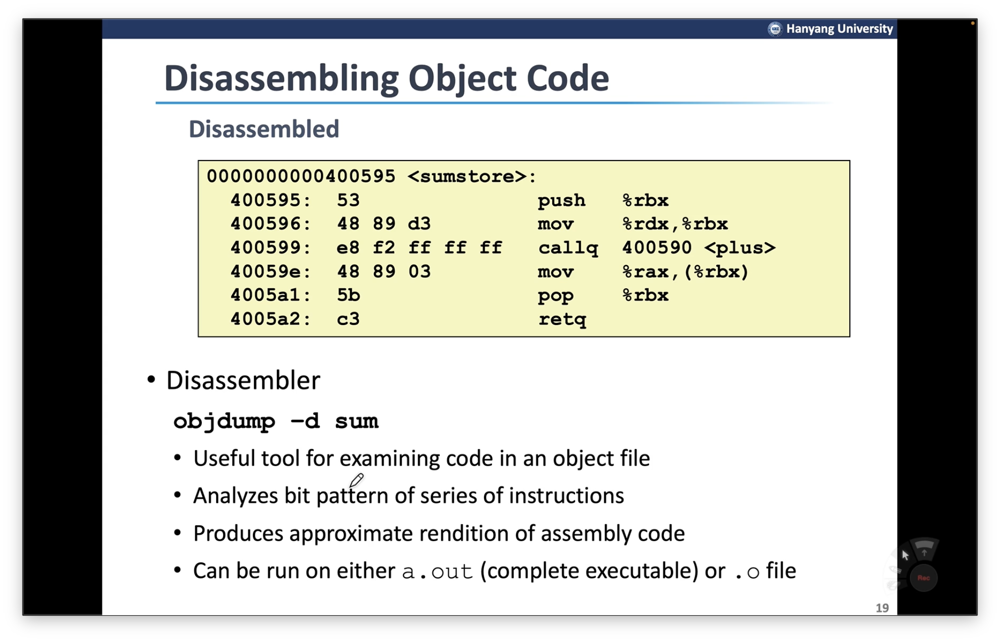

- “-d” : disassemble에 대한 옵션 → 어셈블리 코드가 해석이 되어서 object file로 출력됨.

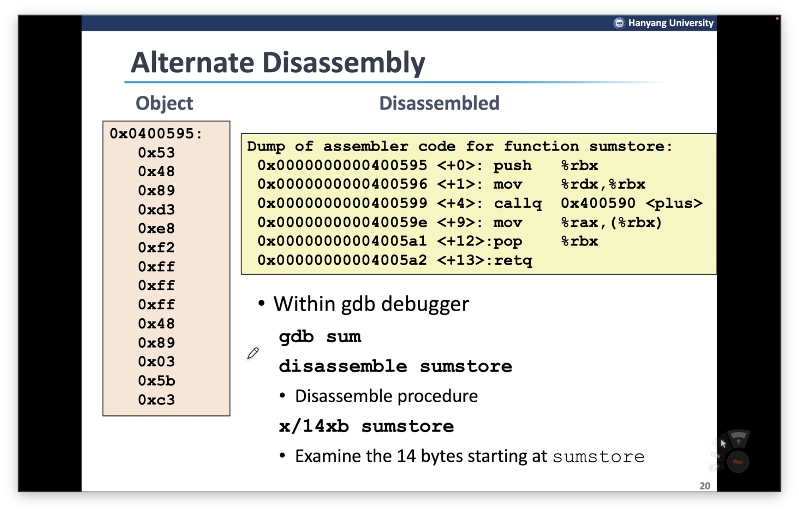

- 프로그램 실행 과정에 어셈블리 코드를 확인하고 싶다면 → debugger를 활용할 수 있음.
- 현재 실행하고 있는 부분 혹은 특정 함수에 대한 어셈블러 코드를 실행 도중 확인할 수 있음.

#### x86-64 Integer Registers

→ intel에서는 sufix / prefix를 사용하여 register의 크기를 구분함

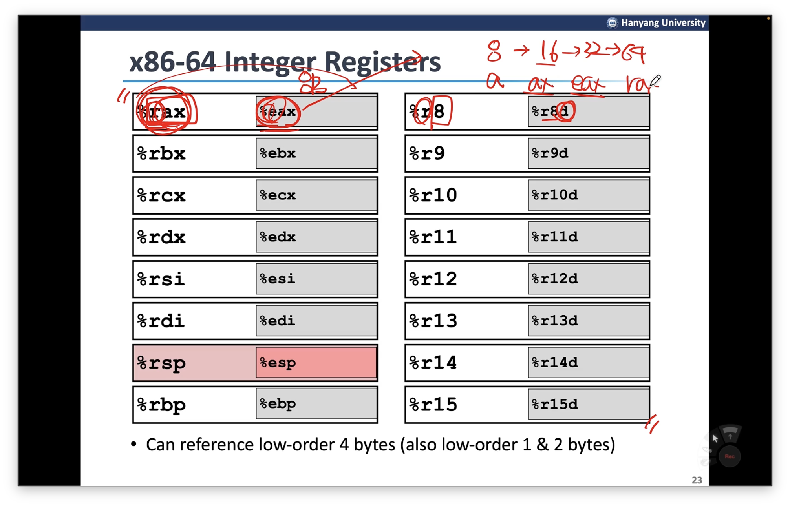

- 16개의 register가 존재
- 16개로 충분함 → 더 많아도 좋지만 가격 등의 손해가 발생할 수 있음
- r로 시작하는 이름의 register는 8byte를 사용함
- e로 시작하는 이름의 register는 4byte를 사용함(이름에 숫자를 사용하는 register에 경우 숫자 뒤에 d를 붙임)
- 꽤나 헷갈린다 → backward compatability 때문에 이렇게 되어 있다고 함. 비트수가 늘어나도 이전에 사용하던 register 이름을 가져 가면서 발전했기 때문에 그럼

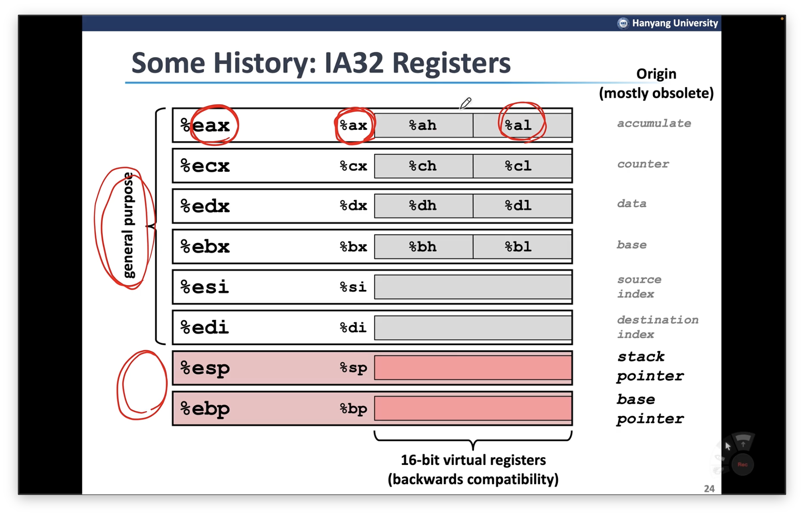

- eax → 4바이트만 사용하는 register
- ax → 2 바이트
- ah(igh) / a(low) → 1 바이트
- esp(stack pointer)와 ebp(base pointer) 2개의 레지스터의 경우 특별한 경우에만 사용된다.
- 우측에 origin

    → 과거에는 각 레지스터에 각각의 역할이 부여되어 있었음(지금은 거의 사라짐)

#### Moving Data : movq

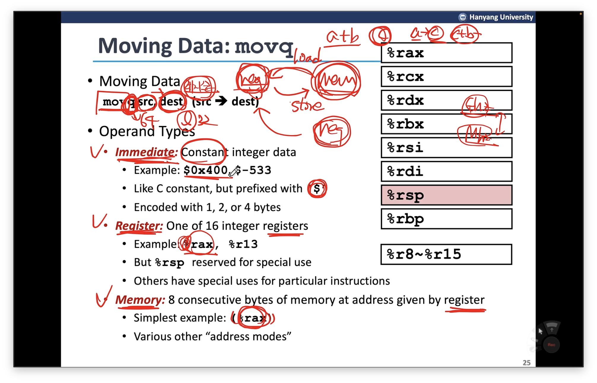

- 실제 레지스터에는 data가 저장되어 있는게 아니라 data가 존재하는 memory에서 data를 가져오는 연산이 필요함(register ↔ register에 대한 연산도 이뤄짐)
- load : memory → register
- store : register → memory
- architecture에 따라서 load / store를 구분하기도 intel에서는 mov 명령어 하나로 처리함
- movq → q는 suffix로서 64비트에 표현된 명령어라는 의미임.(참고로 l은 32비트)
    - movq src dest 의 양식(source → destination)
- a + b의 연산 결과를 c에 저장하고 싶다
    - a를 c에 저장하고
    - c + b의 연산을 진행함
- Immediate → 연산에 레지스터가 아닌 상수를 사용할 때
    - memory에서 register로 data를 가져오는 것은 시간이 오래 걸림
    - immediate를 통해서 자주 사용하는 상수는 따로 저장해둬서 시간 단축 시킴
    - “\$” 표시를 사용해서 표현

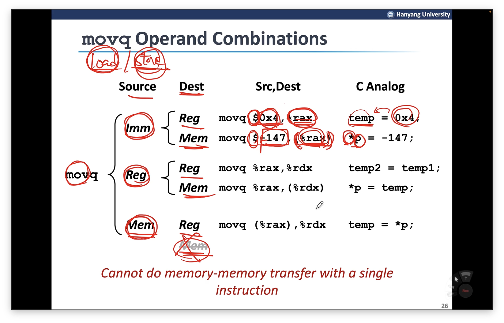

- Src가 Mem인 경우에는 Dest가 Mem일 이유가 없음 ㅇㅇ

#### Simple Memory Addressing Modes

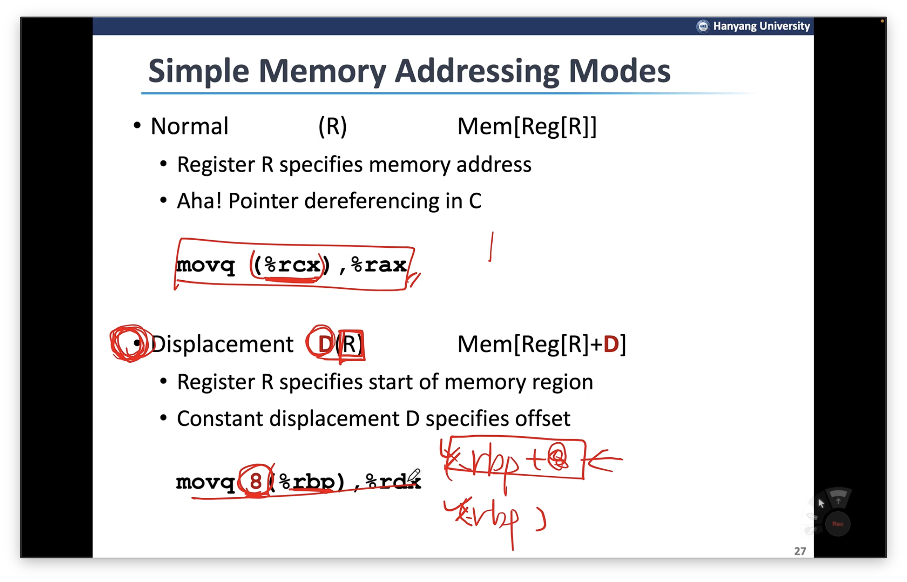

- 레지스터의 이름에 괄호를 통해서 해당 레지스터의 주소로 접근하는 방법 → C 언어 기준 포인터의 주소 연산과 비슷함
- **D**(R) : 주어진 Register에서 D 만큼 떨어진 주소를 의미(displacement)
    - movq 8(%rbp), %rdx → rbp에서 8바이트 떨어진 곳을 addressing 하라는 의미
    - %rbp + 8을 계산 후 다시 %rbp에 이것을 저장하는 추가적인 연산이 필요함.

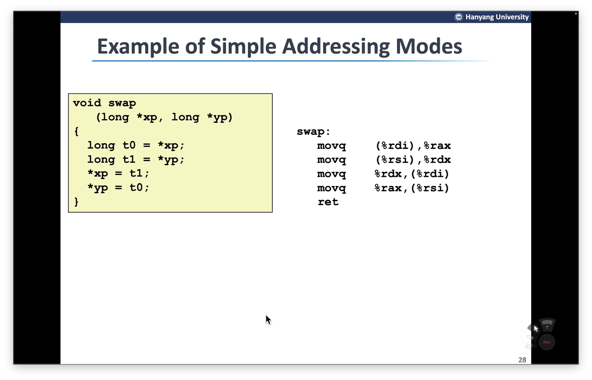

- C언어 swap 함수에 따른 assembly 코드
- 4개의 변수 사용(2개의 포인터 변수, 2개의 지역 변수) → 최소 4개 이상의 register 필요
- ret → return

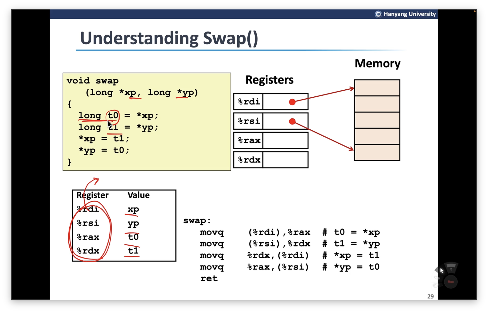

- rdi, rsi는 포인터 레지스터로 사용되기 때문에 data가 저장된 memory의 주소를 가리키고 있음.

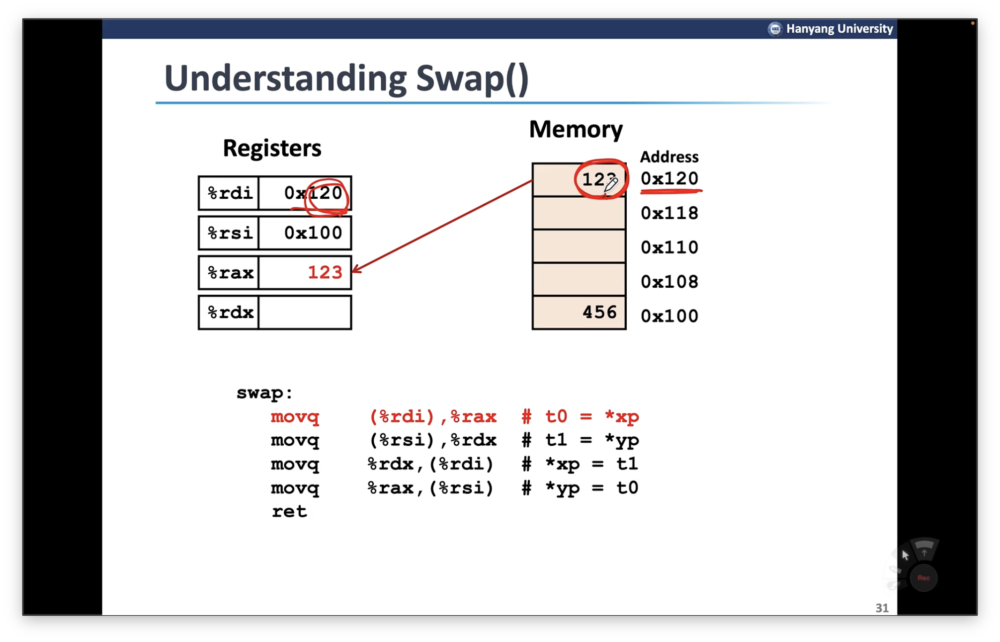

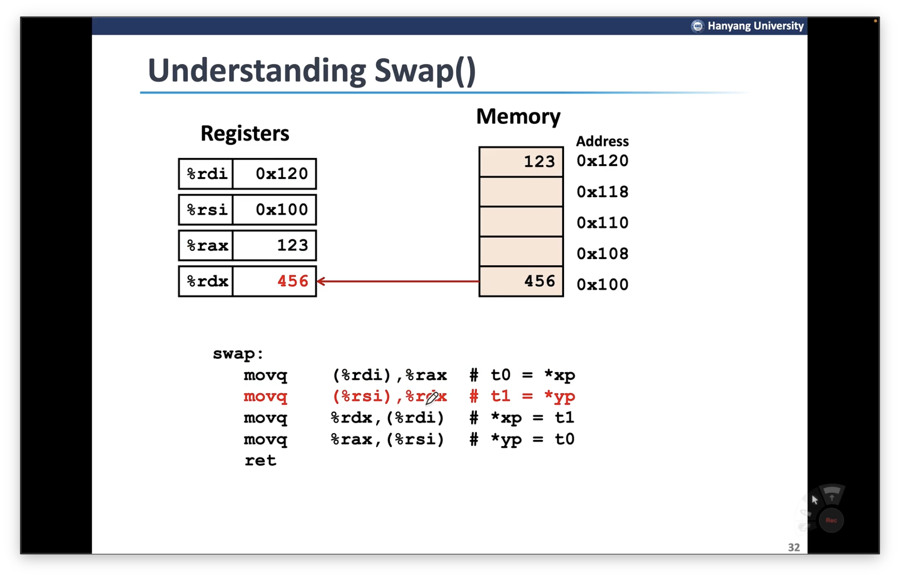

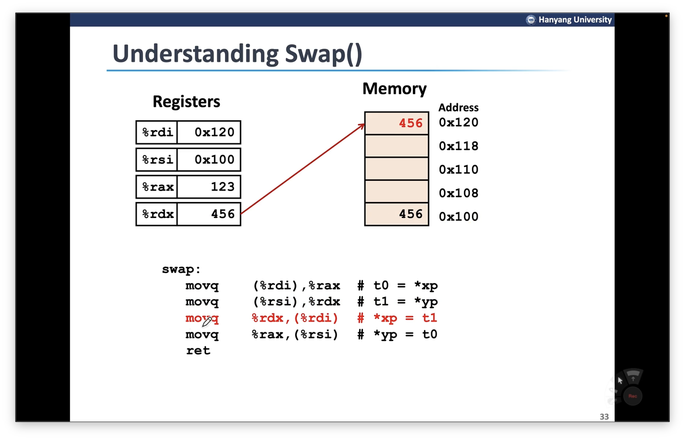

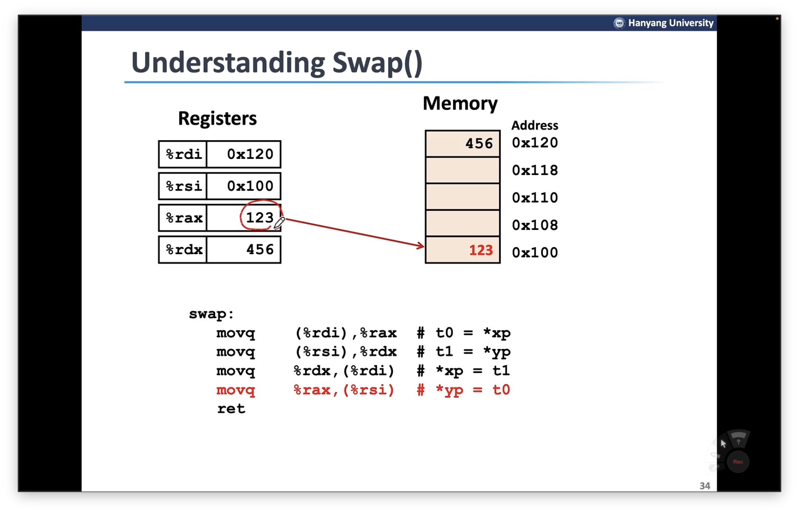

#### Complete Memory Addressing Modes

→ x86에서는 괄호를 사용하는 것 이외에 추가적인 방법으로의 Addressing mode를 제공함

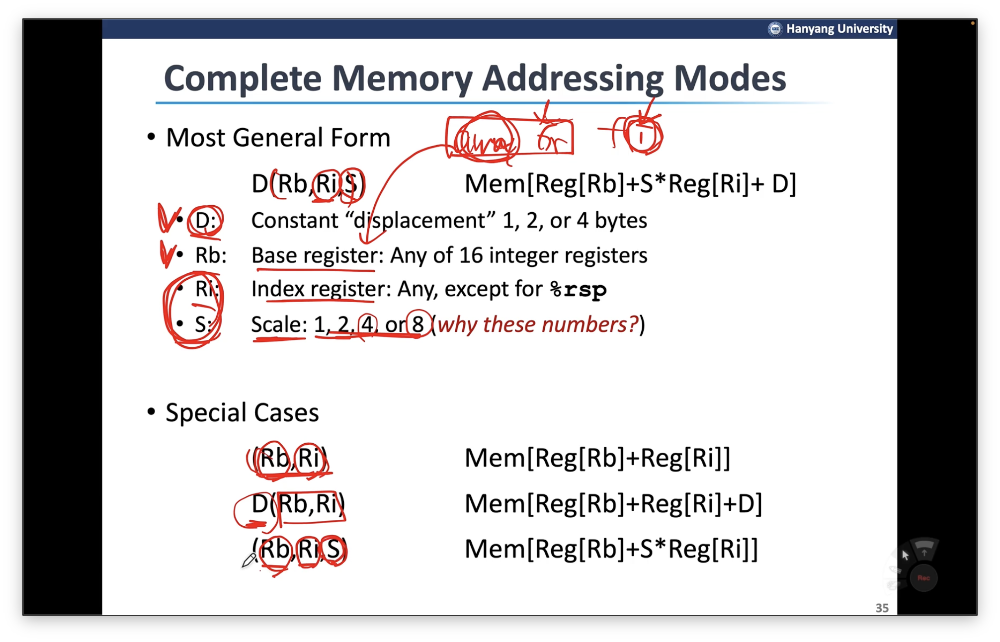

- D : displacement(이동)
- Rb : Base Reigster
- Ri : Index Register → C에서 배열을 사용할 때 base를 기준으로 몇 번쨰 index 확인
- S : scale → index 당 주소 증가량을 나타내기 위해 필요함

#### Examples

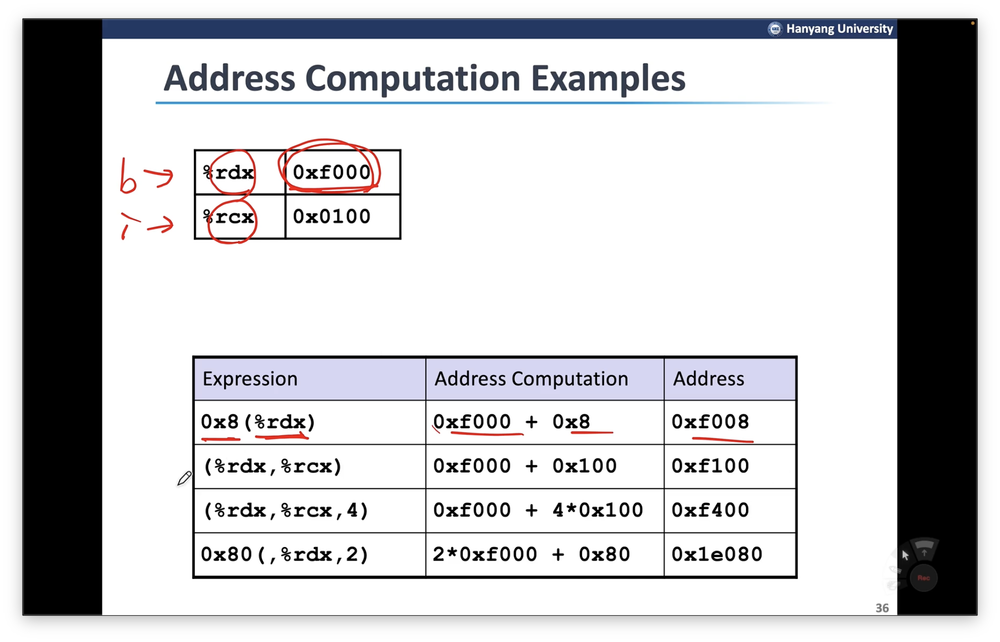

- rdx → base / rcx → index
- 0x80( , %rdx, 2) → base에 대한 위치가 비어있으니 base 주소값은 0에서 시작한다고 생각하면 됨.

#### Address Computation Instruction

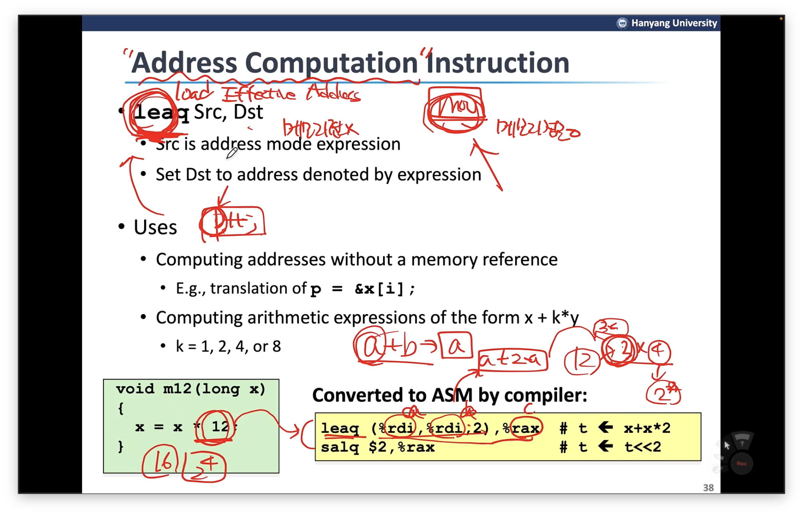

- LEA → Load Effective Address
    - leqa (%rdi, %rdi, 2), %rax → src, dest 존재 → mov와 상당히 비슷
    - 왜 lea와 mov를 구별했을까?
        1. move의 경우 계산된 주소의 메모리에 직접 접근해서 저장된 값을 읽어옴
        2. lea는 계산된 주소 자체를 레지스터에 저장 → 메모리에 접근 x
- 곱셈의 경우
    - 2의 제곱의 형태라면 shift 연산으로 처리 가능
    - 2의 제곱이 아니라면 나눠서 처리
        1. 4 x 3 → 4는 shift / 3은 x + x\*2로 처리

#### Some Arithmetic Operations

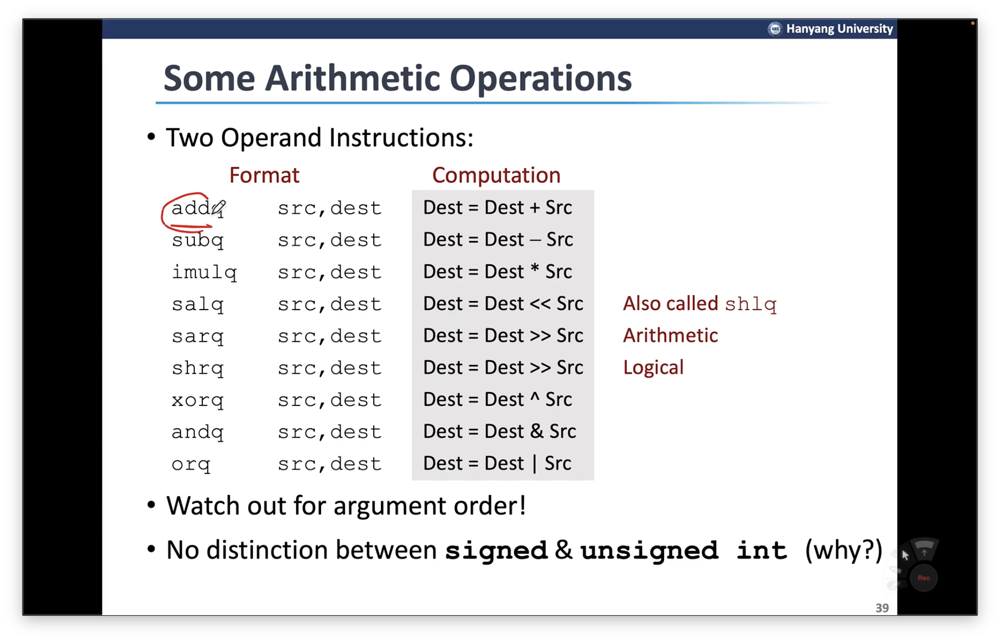

→ 누산기의 형태

- src와 dest의 연산 결과를 dest에 저장하는 형태.
- 누산기의 이점 → 사실 64비트로 넘어온 현재에서는 큰 장점이 아님(하위호환을 위해 남겨둠)
    - 레지스터 갯수 부족할 때 사용 가능
    - 레지스터가 적으니 실행 파일 size를 줄일 수 있음
- signed & unsigned를 프로세서 입장에서 구별하고 있지 않음 → 레지스터에 저장된 데이터의 signed / unsigned 유무를 신경 쓰지 않음 → 그냥 비트 패턴에 대해서 주어진 연산 규칙을 적용해서 연산 결과를 기계적으로 생성함.

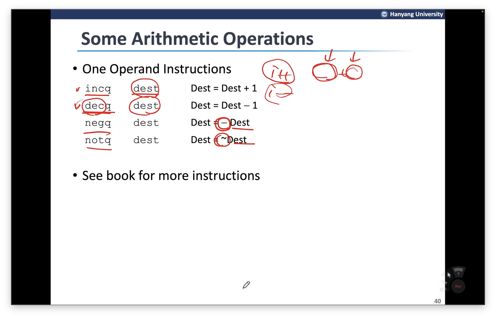

→ 한개의 피연산자를 갖는 format도 제공

#### 실제 코드에서의 예시

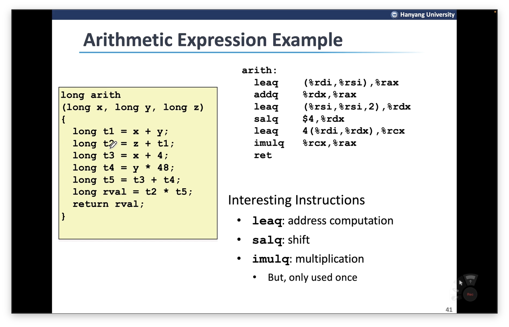

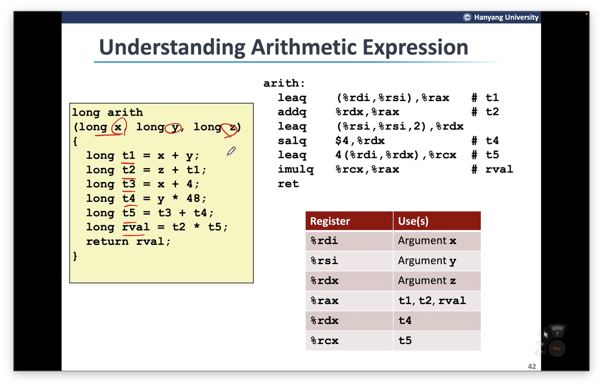

- 변수가 총 9개니까 9개의 register가 필요한 상황이지만 다양한 전략으로 6개의 register 만으로 assembly code를 구성함.
- 공부할 때 스스로 분석하자.

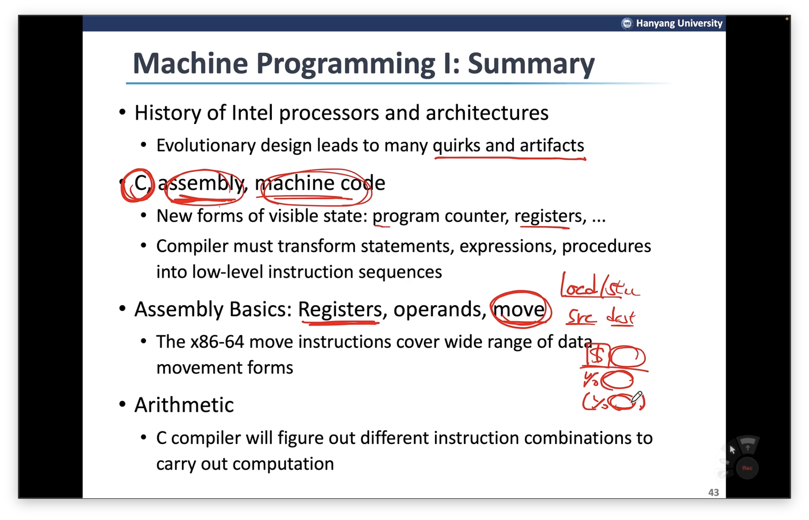
