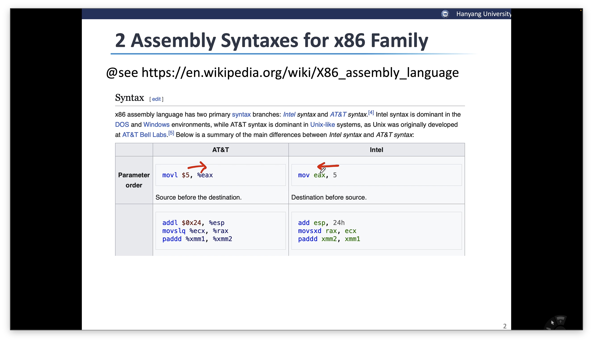

- x86의 Assembly Syntax가 2가지 있음.
    - AT&T → Linux에서는 AT&T 방식을 많이 선호함. → 우리는 Unix니까 AT&T 방식을 사용할 예정.
    - Intel → x86은 Intel기반이기 때문에 이걸 사용함.
- 2가지는 표현에 차이가 있다.
    - AT&T : Instruction src dest 의 구조
    - Intel : Instruction dest src 의 구조

    → 아마 컴구 먼저 들어서 헷갈렸던게 이거 때문일듯. AT&T는 dest의 위치가 뒤에 있음.

    - AT&T : Register 앞에 % / 숫자 앞에 \$

#### Backward Compatability

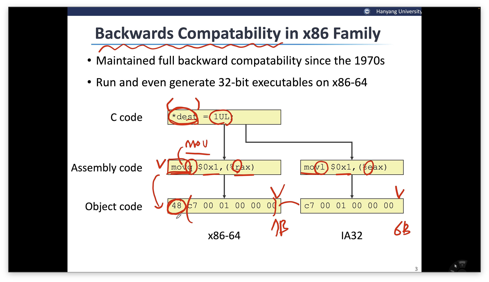

- Intel Architecture는 CISC 임. (Instruction의 길이가 가변적으로 표현될 수 있음.)
- RISC → 간단한 instruction의 조합으로 표현 / CISC → 복잡한 연산을 하나의 instrcution으로 표현을 지향
    - RISC는 CISC보다 훨씬 나중에 나옴 → 성능을 논할 때 RISC가 더 우수함.
- Intel도 내부적으로는 RISC를 사용하고 있지만 하위 호환을 위해서 외부적으로 CISC를 사용하는 것처럼 하는 것 뿐
- 64비트
    - Instruction에 “q” 라는 suffix를 붙여서 표현.
    - Register 표현에 있어서 “r” 로 시작하여 표현.
    - ( ) 를 사용해서 포인터를 표현
    - 7byte로 표현
- 32비트
    - Instruction에 “L”이라는 suffix를 붙여서 표현
    - Register 표현에 있어서 “e”로 시작하여 표현.
    - 6byte로 표현
- 64비트와 32비트를 Object code로 표현하는 것에 있어서 맨 앞 빼고는 동일하네..? → immediate라 그런가.

#### 실습

- 64비트 vs 32비트

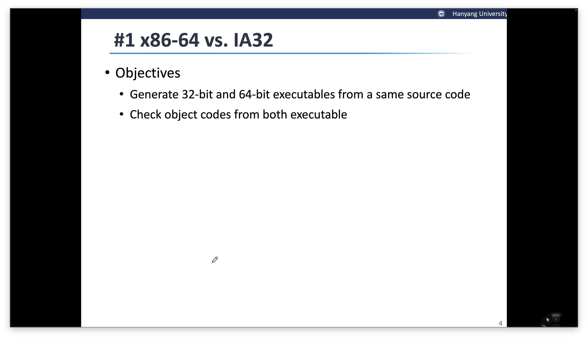

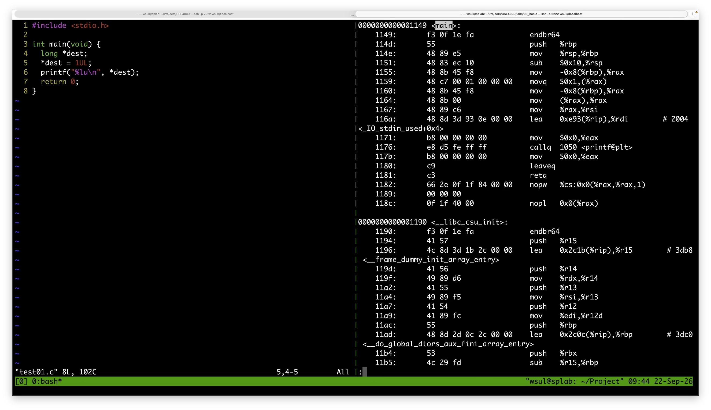

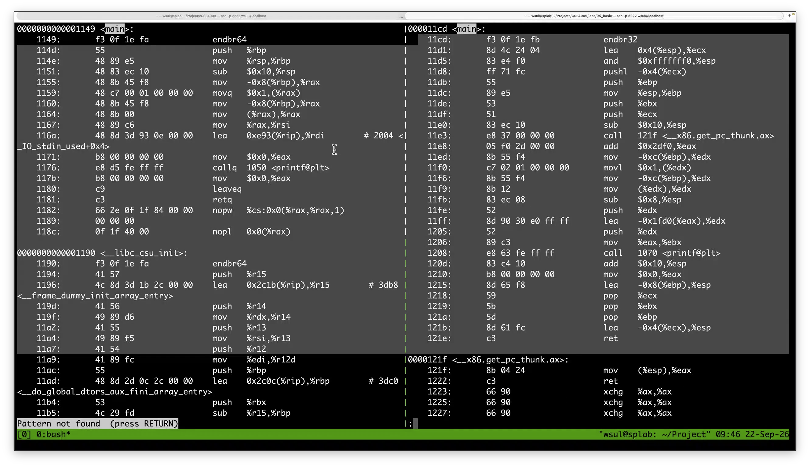

```c
#include <stdio.h>

int main(void) {
	long *dest;
	*dest = 1UL;
	printf("%lu\n", *dest);
	return 0;
}

// compile
gcc test01.c -o test01

// object dump를 사용해서 어셈블리 코드를 얻을 수 있음
// -d -> deassemble
objdump -d test01

// 32비트 compile
gcc test01.c -m32 -o test01.32 //끝의 .32는 32비트의 명령어로 구성하라는 것

objdump -d test01.32
```

```c
// 64비트
*dest = 1UL; // assembly에서는 mov를 사용하겠지?

//assembly
movq $0x1,(%rax)

//object code
48 c7 00 01 00 00 00

//32비트
*dest = 1UL;

//assembly
movl $0x1,(%edx)

//object code
c7 02 01 00 00 00  // 02 -> 이게 reg에 대한 표현 아래 01 ~ 은 immediate 표현
```

- Machine-level Execution

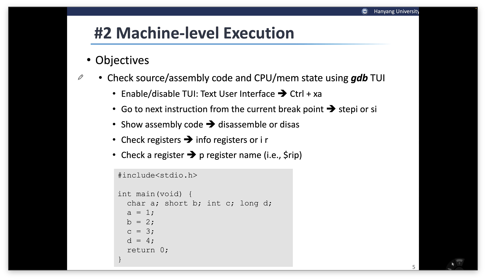

- 각 문장에 따른 명령 / 각 type에 따른 reg 종류

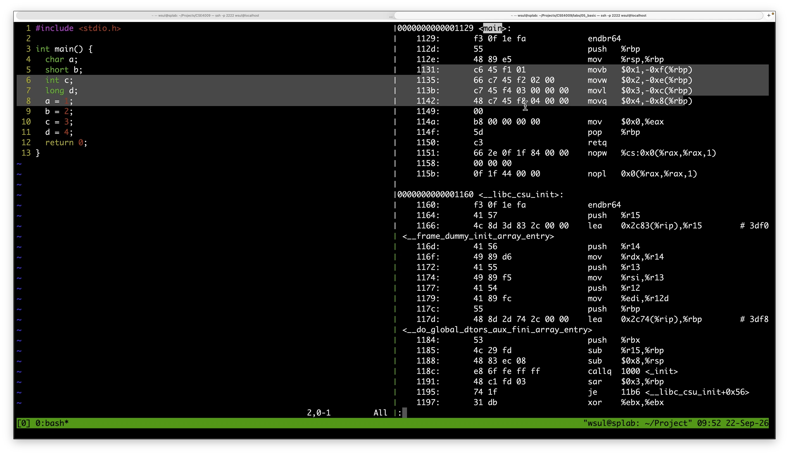

```c
#include <stdio.h>

int main() {
	char a;
	short b;
	int c;
	long d;
	a = 1;
	b = 2;
	c = 3;
	d = 4;
	return 0;
}


gcc test02.c -o test02

objdump -d test02


// assembly
// 1 바이트
mov

// 2 바이트
movb

// 3 바이트
movw

// 4 바이트
movl

// 8 바이트
movq

// reg
(%rbq)

-> 변수가 4개인데 사용하는 reg는 1개임 
-> addressing을 통해서 사용하는 reg의 갯수를 최소화
-0xf(%rbp)
-0xe(%rbp)
-0xc(%rbp)
-0x8(%rbp)
```

- Debugging tool을 잘 활용 해서 메모리의 주소를 시각적으로 볼 수도 있음

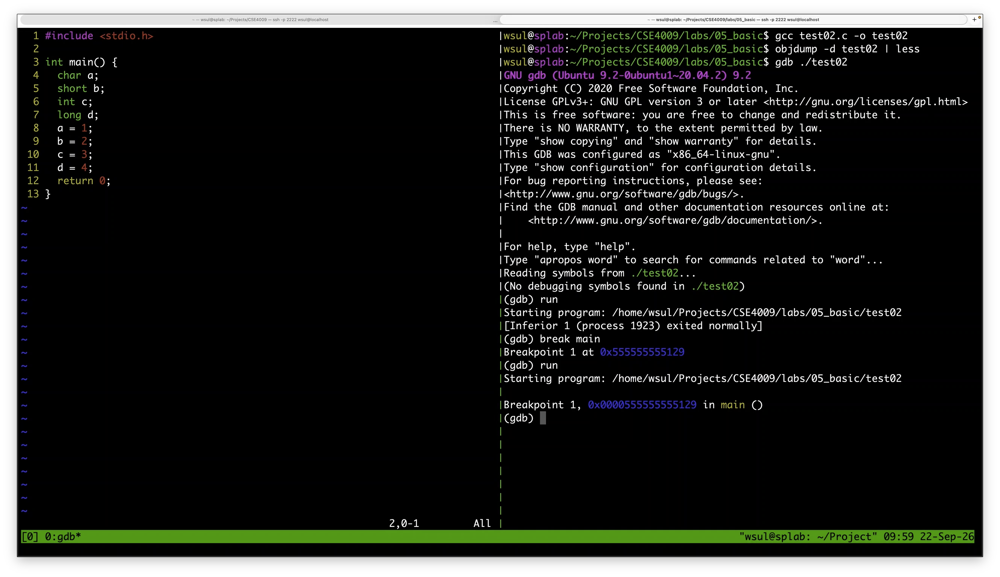

```c
gdb ./(실행파일명)

// 사용하면 아래처럼 또다른 터미널 환경으로 들어감
// (gdb) ...

gdb를 사용하면 프로그램을 중간에 중단시킬 수 있음 -> break 사용

(gdb) run -> 올바르게 실행
(gdb) break main -> main 실행 직전에 중단
```

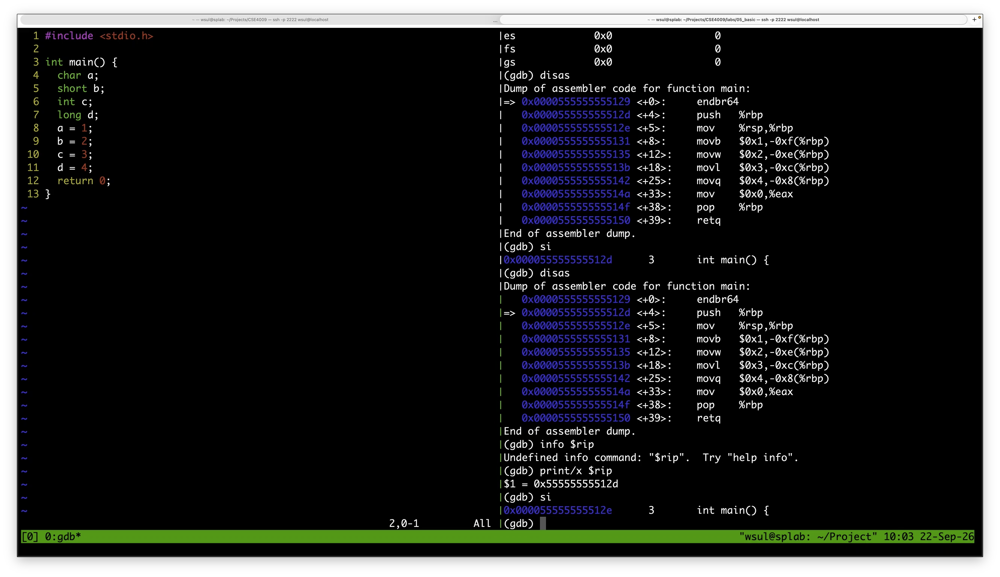

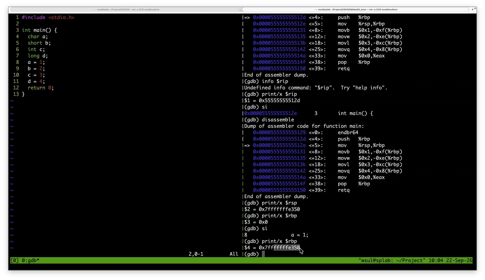

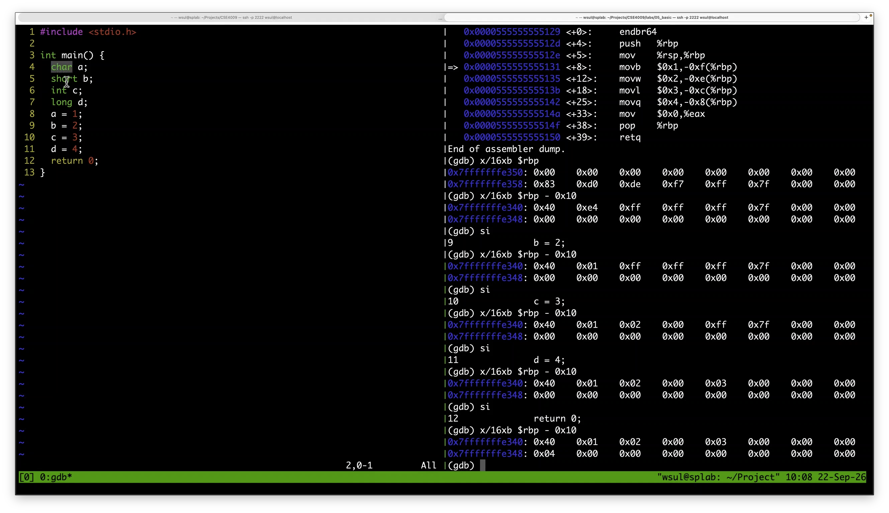

```c
// -g라는 옵션을 통해서 소스코드의 정보를 실행파일에 추가할 수 있음.
gcc test02.c -g -o test02

(gdb) b main

(gdb) list


si -> 다음 명령어 실행

disas -> assembly code 와 현 명령어 실행 위치 표현

// Little Endian을 사용하기 때문에 주소의 왼쪽부터 저장됨.
```

#### Memory Addressing Modes in x86

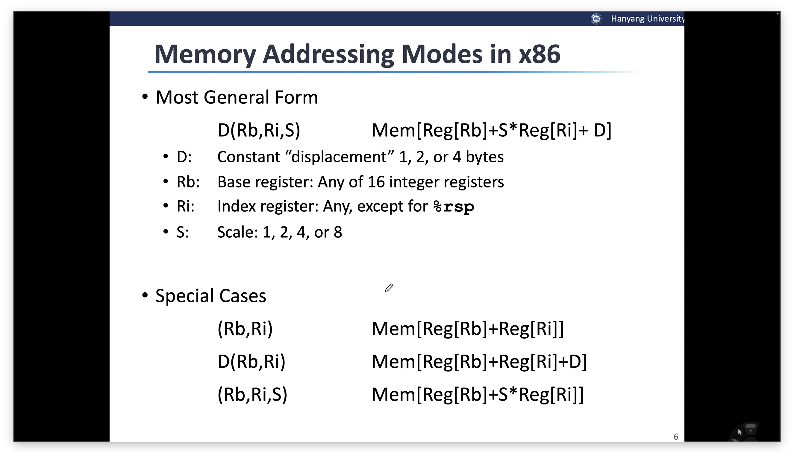

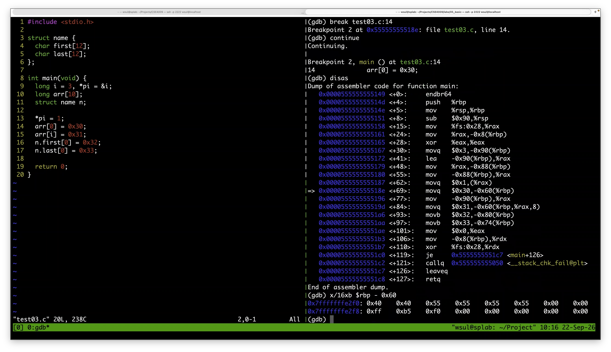

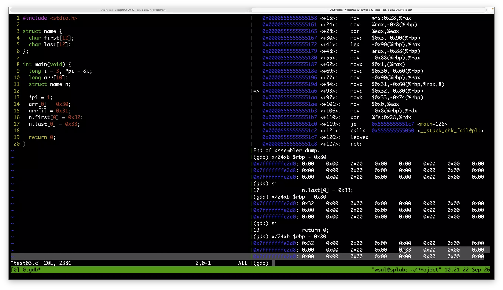

```c
#include <stdio.h>

struct name {
	char first[12];
	char last[12];
};

int main(void) {
	long i = 3, *pi = &i;
	long arr[10];
	struct name n;
	
	*pi = 1;
	arr[0] = 0x30;
	arr[i] = 0x31;
	n.first[0] = 0x32;
	n.last[0] = 0x33;
	
	return 0;
}


gcc test03.c -o test03
gdb ./test03

(gdb) break test03:14 // 소스코드 기준 14번째 줄 직전에 break
(gdb) c // 하나하나 si가 아니라 breakpoing 전까지 한번에 이동 가능


```

