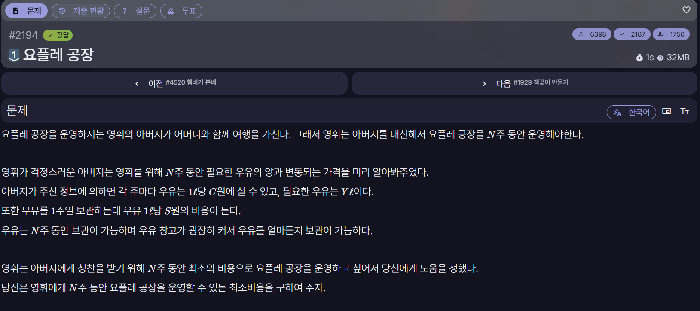

[문제 링크](https://jungol.co.kr/problem/2194)

## 문제

N주 동안 요플레 공장을 운영하는 데 필요한 우유를 최소 비용으로 구매하는 문제이다.

각 주에는 우유 1L의 가격 C와 필요한 우유의 양 Y가 주어진다. 우유를 미리 구매해 두었다가 이후에 사용할 수 있지만, 우유 1L를 1주 보관할 때마다 S원의 비용이 든다.

보관 공간에는 제한이 없으며, 우유는 운영 기간 동안 보관할 수 있다. 매주 필요한 우유를 모두 확보하면서 구매 비용과 보관 비용의 합을 최소화해야 한다.

## 입력

첫 줄의 입력은 공백으로 구분한 `N S`이다.

- `1 ≤ N ≤ 100,000`
- `1 ≤ S ≤ 100`

둘째 줄부터 N+1번째 줄까지는 `C[i] Y[i]`를 입력받는다. 주별 데이터는 1주 차부터 시간 순서대로 주어진다.

- `1 ≤ C[i] ≤ 5,000`
- `0 ≤ Y[i] ≤ 10,000`

## 출력

N주 동안 요플레 공장을 운영할 수 있는 최소비용을 출력한다. 답이 매우 클 수 있으니 유의하여라.

## 풀이

사용 언어: C++

```cpp
#include <iostream>
#include <vector>

using namespace std;

#define FASTIO ios::sync_with_stdio(false); cin.tie(NULL); cout.tie(NULL);

int n, s, best;
long long result = 0L;
vector<int> c;
vector<int> y;

int main(){
    FASTIO

    cin >> n >> s;
    c.resize(n);
    y.resize(n);

    for(int i=0; i<n; i++){
        cin >> c[i] >> y[i];
    }

    result += c[0] * y[0];
    best = c[0];

    for(int i=1; i<n; i++){

        best = min(best + s, c[i]);

        result += best * y[i];
    }

    cout << result;

    return 0;
}
```
