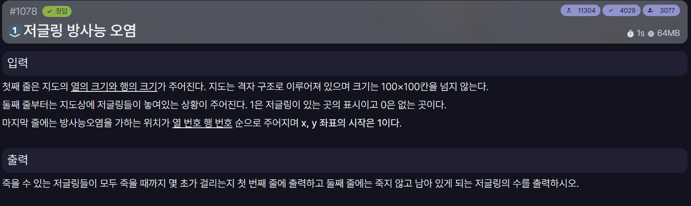

[문제 링크](https://jungol.co.kr/problem/1078)

## 문제

격자 지도에서 한 저글링에게 방사능 오염 공격을 가하면 방사능이 1초마다 상하좌우의 저글링에게 퍼진다. 방사능에 오염된 저글링은 3초 후에 죽는다.

지도와 최초 공격 위치가 주어질 때, 공격 지점에서 오염될 수 있는 저글링들이 모두 죽는 데 걸리는 시간과 오염되지 않아 살아남는 저글링의 수를 구한다.

## 입력

첫째 줄에 지도의 열 크기와 행 크기가 주어진다. 지도는 최대 `100×100` 크기의 격자이다.

둘째 줄부터 지도에서 저글링이 놓인 상태가 주어진다.

- `1`: 저글링이 있는 칸
- `0`: 저글링이 없는 칸

마지막 줄에는 방사능 오염 공격을 가하는 위치가 열 번호와 행 번호 순서로 주어진다. 좌표는 1부터 시작한다.

## 출력

첫째 줄에 오염될 수 있는 저글링들이 모두 죽을 때까지 걸리는 시간을 출력한다.

둘째 줄에 죽지 않고 살아남는 저글링의 수를 출력한다.

## 풀이

사용 언어: C++

```cpp
#include <iostream>
#include <vector>
#include <string>
#include <queue>
using namespace std;

#define FASTIO ios::sync_with_stdio(false); cin.tie(NULL); cout.tie(NULL);

int col, row, sCol, sRow, remain;
int maxTime = 3;

int xDir[4] = {0, 1, 0, -1};
int yDir[4] = {-1, 0, 1, 0};

vector<vector<int>> map;
vector<vector<bool>> isVisited;

void bfs(int startCol, int startRow){

    queue<pair<pair<int,int>, int>> q;

    q.push({{startCol, startRow}, 3});

    isVisited[startRow][startCol] = true;
    remain--;

    while(!q.empty()){

        int curCol = q.front().first.first;
        int curRow = q.front().first.second;
        int curTime = q.front().second;
        q.pop();

        maxTime = max(maxTime, curTime);

        for(int i = 0; i < 4; i++){

            int nextCol = curCol + xDir[i];
            int nextRow = curRow + yDir[i];

            if(nextCol >= col || nextCol < 0 ||
               nextRow >= row || nextRow < 0)
                continue;

            if(!map[nextRow][nextCol])
                continue;

            if(isVisited[nextRow][nextCol])
                continue;

            isVisited[nextRow][nextCol] = true;
            remain--;

            q.push({{nextCol, nextRow}, curTime + 1});
        }
    }
}

int main(){

    FASTIO

    cin >> col >> row;

    map.resize(row, vector<int>(col));
    isVisited.resize(row, vector<bool>(col));

    for(int i = 0; i < row; i++){

        string s;
        cin >> s;

        for(int j = 0; j < col; j++){

            map[i][j] = s[j] - '0';

            if(!map[i][j])
                isVisited[i][j] = true;
            else
                remain++;
        }
    }

    cin >> sCol >> sRow;

    bfs(sCol-1, sRow-1);

    cout << maxTime << "\n" << remain;
    
    return 0;
}
```

## 알아둬야 하는 내용

지도 입력은 `0010000`처럼 숫자가 띄어쓰기 없이 한 줄로 이어져 들어온다. 이 값을 한 자리씩 확인하기 위해 `string`으로 입력받는다.

```cpp
string s;
cin >> s;

for(int j = 0; j < col; j++){
    map[i][j] = s[j] - '0';
}
```

`string`은 문자열의 각 문자를 인덱스로 확인할 수 있으므로 `s[j]`를 사용하면 숫자를 한 자리씩 볼 수 있다. 이때 `s[j]`는 숫자가 아니라 문자이기 때문에 `'0'`을 빼서 정수로 변환한다.

```cpp
'0' - '0' == 0
'1' - '0' == 1
```
