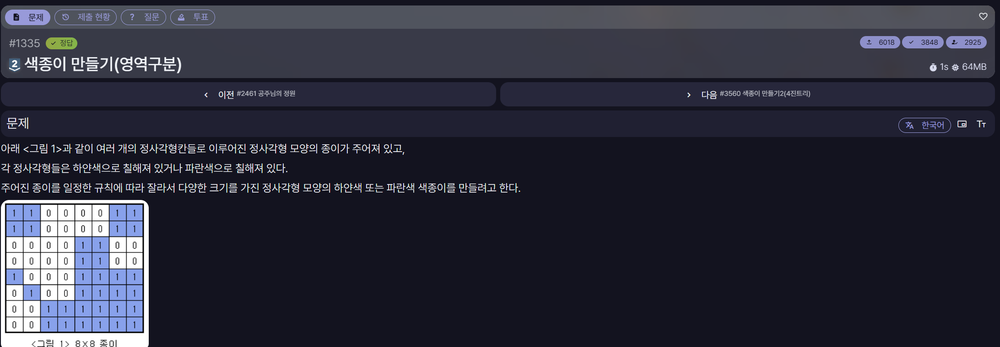

[문제 링크](https://jungol.co.kr/problem/1335)

## 문제

여러 개의 정사각형 칸으로 이루어진 정사각형 종이가 주어지고, 각 칸은 하얀색 또는 파란색으로 칠해져 있다.

종이의 모든 칸이 같은 색이 아니라면 가로와 세로의 중간 부분을 잘라 크기가 같은 네 개의 정사각형으로 나눈다. 나누어진 각각의 종이에도 같은 규칙을 적용하여, 하나의 정사각형 안에 있는 모든 칸이 같은 색이 될 때까지 반복한다.

잘라진 하얀색 색종이와 파란색 색종이의 개수를 구한다.

## 입력

첫째 줄에 전체 종이 한 변의 길이 `N`이 주어진다. `N`은 `2`, `4`, `8`, `16`, `32`, `64`, `128` 중 하나이다.

둘째 줄부터 N개의 줄에 종이의 각 칸을 나타내는 숫자가 주어진다.

- `0`: 하얀색 칸
- `1`: 파란색 칸

## 출력

첫째 줄에 잘라진 하얀색 색종이의 개수를 출력한다.

둘째 줄에 잘라진 파란색 색종이의 개수를 출력한다.

## 풀이

사용 언어: C++

```cpp
#include <iostream>
#include <vector>
using namespace std;

#define FASTIO ios::sync_with_stdio(false); cin.tie(NULL); cout.tie(NULL);

int n;
int wCnt = 0;
int bCnt = 0;
vector<vector<int>> tile;

void division_tile(int size, int start_row, int start_col){
    if(size == 1){
        if(tile[start_row][start_col])
            bCnt++;
        else
            wCnt++;
        return;
    }

    int color = tile[start_row][start_col];

    for(int row = start_row; row < start_row + size; row++){
        for(int col = start_col; col < start_col + size; col++){
            if(tile[row][col] != color){
                division_tile(size/2, start_row, start_col);
                division_tile(size/2, start_row, start_col + size/2);
                division_tile(size/2, start_row + size/2, start_col);
                division_tile(size/2 , start_row + size/2, start_col + size/2);
                return;
            }
        }
    }

    if(color)
        bCnt++;
    else
        wCnt++;

    return;
}

int main(){
    FASTIO

    cin >> n;

    tile.resize(n,vector<int>(n));

    for(int i=0; i<n; i++){
        for(int j=0; j<n; j++){
            cin >> tile[i][j];
        }
    }

    division_tile(n, 0, 0);

    cout << wCnt << "\n" << bCnt;

    return 0;
}
```
