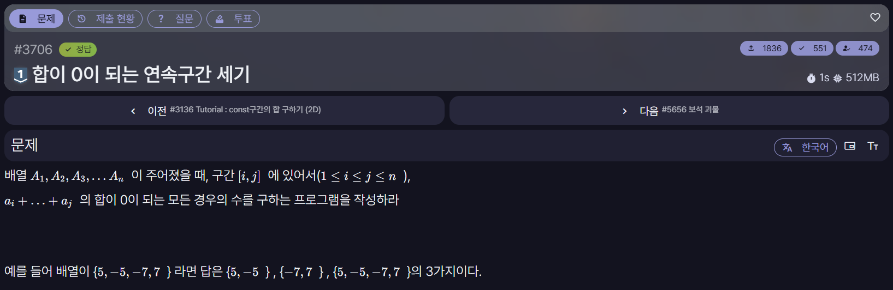

[문제 링크](https://jungol.co.kr/problem/3706)

## 문제

배열 `A₁, A₂, A₃, ..., Aₙ`이 주어질 때, 연속된 구간 `[i, j]`의 원소 합이 `0`이 되는 모든 경우의 수를 구한다.

## 입력

첫째 줄에 배열의 원소 수 `n`이 주어진다.

- `1 ≤ n ≤ 100,000`

둘째 줄에 공백으로 구분된 `n`개의 배열 원소가 순서대로 주어진다.

- `-100 ≤ Aᵢ ≤ 100`

## 출력

연속구간의 합이 `0`이 되는 모든 구간의 개수를 출력한다.

## 풀이

사용 언어: C++

```cpp
#include <iostream>
#include <vector>
#include <unordered_map>
using namespace std;

#define FASTIO ios::sync_with_stdio(false); cin.tie(NULL); cout.tie(NULL);

vector<int> arr;
int result = 0;

int main(){
    FASTIO

    int n;
    cin >> n;

    long long sum = 0;
    long long result = 0;

    unordered_map<long long, long long> cnt;        // Java의 hashmap과 같음(key, value)
    cnt[0] = 1;

    for(int i=0; i<n; i++){
        int x;
        cin >> x;

        sum += x;

        result += cnt[sum];

        cnt[sum]++;
    }

    cout << result;

    return 0;
}
```

## 알아둬야 하는 내용

`unordered_map`은 데이터를 `key-value` 형태로 저장하는 C++의 해시 테이블이다. Java의 `HashMap`과 같은 용도로 사용하며, 키를 이용한 검색·삽입·삭제는 평균적으로 `O(1)`에 처리된다. 원소가 저장되는 순서는 보장되지 않는다.

사용하려면 다음 헤더를 포함한다.

```cpp
#include <unordered_map>
```

이 문제에서 `cnt`의 키는 **누적 합**, 값은 **해당 누적 합이 지금까지 나온 횟수**이다.

```cpp
unordered_map<long long, long long> cnt;
```

C++의 `cnt[key]`는 키가 없으면 기본값 `0`을 가진 원소를 생성한다. 따라서 다음과 같이 바로 값을 증가시킬 수 있다.

```cpp
cnt[key]++;
```
