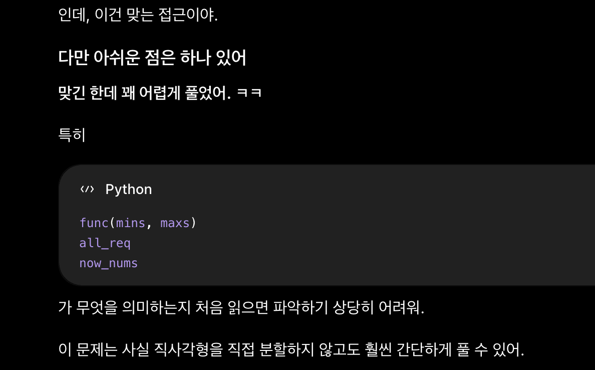

[문제 링크](https://jungol.co.kr/problem/18567)

## 문제
변의 길이가 정수인 직사각형을 생각하자. 직사각형의 정사각형 타일 채우기란, 변이 직사각형의 변과 평행한 서로 겹치지 않는 정사각형들로 전체 영역을 덮는 것이다. 정사각형 타일 채우기에서 어떤 정사각형도 직사각형의 경계 밖으로 튀어나가서는 안 된다.

변의 길이가 2의 거듭제곱인 정사각형들이 주어진다. 가능한 한 적은 개수의 정사각형을 사용해 직사각형을 정사각형 타일로 채우는 방법을 찾거나, 불가능함을 판정하라.

## 입력
입력의 첫 줄에는 세 정수 $W$, $H$와 $N$이 주어진다 $(1 \leq W, H \leq 2^{50},\ 1 \leq N \leq 51)$. 여기서 $W$와 $H$는 직사각형의 크기를 나타낸다. 다음 줄에는 $N$개의 정수 $a_0, a_1, \ldots, a_{N-1}$이 주어진다. $a_i$ $(0 \leq a_i \leq 2^{51})$는 가지고 있는 $2^i \times 2^i$ 정사각형의 개수이다.

## 출력
가지고 있는 정사각형들을 사용해 $W \times H$ 직사각형을 정사각형 타일로 채울 수 있다면, 그러한 타일 채우기에 필요한 정사각형의 최소 개수를 출력한다. 가지고 있는 정사각형들로 직사각형을 정사각형 타일로 채울 수 없다면 $-1$을 출력한다.

## 1차 풀이 (정답)
- 정답 / Python3 / 111ms / 10.5MB

초기 아이디어를 너무 어렵게 생각했다.

```
1. w x h 안에 넣을 수 있는 가장 큰 2제곱수 너비의 정사각형을 먼저 하나 넣고

.......
XX.....
XX.....

2. 그 2제곱수 너비를 /2 씩 줄여 가며, 너비와 높이 중 좁은 부분을 먼저 채운다. 

&......  &&.....
XX.....  XX.....
XX.....  XX.....

3. 한 면을 채웠으니, 너비와 높이 중 넓은 부분에 이를 복사한다.

&&&&...  $$$$$$.
XXXX...  XXXXXX.
XXXX...  XXXXXX.

4. 남은 부분의 너비 or 높이는 
(넓은 부분 길이 % 초기 2제곱수, 좁은 부분 길이) 가 된다. 
이를 1번부터 반복한다.

```

아래는 1차 풀이 때 사용한 코드이다.

```py
# 18567 : 직사각형 타일 채우기
import sys
input = sys.stdin.readline

w, h, n = map(int, input().rstrip().split())
arr = list(map(int, input().rstrip().split()))

# 1. w, h 중 작은 것에서 그보다 작거나 같은 2제곱수를 얻는다
# 2. 작은 수에서 2제곱수를 한번 뺀다
# 3. 빼고 남은 작은 수가 1 이상이면 (현재 2제곱수 >> 1) 을 또 뺀다 (반복) 
#    이 때, 필요한 개수는 *2가 되어야 함
# 4. 큰 수 % 2제곱수, 작은 수, required(요구하는 사각형 배열) 을 반환하고 작은 수가 0이 될 때까지 반복

# 5. required 배열을 얻었다
# 6. required 보다 arr 이 부족하면, required가 부족한 만큼 아래로 *4 해서 추가한다
# 7. 0번째 요소까지 갔을 때도 부족하면 -1

def func(mins, maxs):
    cnt = 0
    now_mins = mins
    while now_mins > 1:
        now_mins = (now_mins >> 1)
        cnt += 1

    pow2 = (1 << cnt)
    now_pow2 = pow2
    required = [0 for _ in range(52)]
    now_mins = mins
    now_nums = 1

    while now_pow2 > 0:
        if now_mins >= now_pow2:
            now_mins = now_mins - now_pow2
            required[cnt] += now_nums
        now_pow2 = (now_pow2 >> 1)
        cnt -= 1
        now_nums = (now_nums << 1)

    muls = maxs // pow2
    for i in range(52): required[i] = required[i] * muls

    return maxs % pow2, mins, required
    

mins = min(w, h)
maxs = max(w, h)

all_req = [0 for _ in range(52)]
while mins > 0 and maxs > 0:
    mins, maxs, req = func(mins, maxs)
    for i in range(52): all_req[i] += req[i]

done = True
for i in range(51, -1, -1):
    if i >= n:
        all_req[i-1] += all_req[i] * 4
        all_req[i] = 0
    elif all_req[i] > arr[i]:
        if i == 0: 
            done = False
            break
        all_req[i-1] += (all_req[i] - arr[i]) * 4
        all_req[i] = arr[i]


print(sum(all_req) if done else -1)
```

## 2차 풀이 



분석을 읽어보니 다른 관점을 얻을 수 있었다.

```
1. 크기가 2^i인 칸이 직사각형 안에 들어갈 수 있는 개수는
(w // (1 << i)) * (h // (1 << i))

2. 일단 먼저 큰 2제곱수 정사각형 칸으로 최대한 채워본다.
.......              .......
.......  ->  XX  ->  XXXXXX.
.......      XX      XXXXXX. 총 3개

3. 크기가 /2 작은 2제곱수 정사각형 칸으로 채운다.
.......              @@@@@@@
.......  ->   @  ->  @@@@@@@
.......              @@@@@@@ 총 21개

4. 이때, 이전의 큰 정사각형 크기에서 채웠던 칸이 있을 것이다.

@@@@@@@
XXXXXX@
XXXXXX@

그때 채웠던 개수 * 4 만큼 빼면, 이전 큰 칸에서 채웠던 영역을 빼고 
"현재 남은 칸에서 채운 개수"만 얻어낼 수 있다.

@는 총 21 - (3 * 4) = 9개 필요
```

아~ 줴줴이야~  
코드는 1562B -> 463B 로 단축했고 시간은 111ms -> 50ms로 단축

- 정답 / Python3 / 50ms / 10.3MB

```py
# 18567 : 직사각형 타일 채우기
import sys
input = sys.stdin.readline

w, h, n = map(int, input().rstrip().split())
arr = list(map(int, input().rstrip().split()))

used = 0
already = 0
for i in range(51, -1, -1):
    # 이전 크기에 사용했던 칸들은 *4 개수가 되어야
    # 현재 칸 크기로 채울 수 있다.
    already *= 4

    # 현재 크기로 채울 수 있는 최대 개수
    need = (w // (1 << i)) * (h // (1 << i))
    # 이전에 채웠던 칸 빼고, 남은 칸에서 채운 개수
    possible = need - already

    # 내가 가진 칸
    now_have = arr[i] if i < n else 0
    # 내가 "진짜 쓴 칸 개수"
    now_taken = min(possible, now_have)

    used += now_taken
    already += now_taken

# 만약 다 채워진다면 : 이후엔 1x1 칸들로 w*h 개 만큼 만들어지기에
#                 already 가 w*h가 된다.
# 만약 다 안 채워진다면 : 다른 칸이 부족해서 w * h 개 만큼 채워지지 못함
print(used if already == w * h else -1)
```

