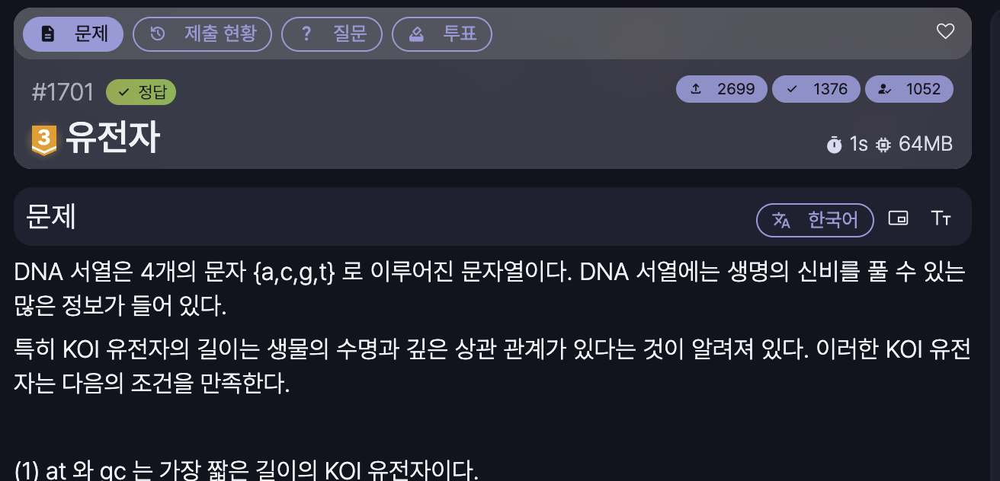

[문제 링크](https://jungol.co.kr/problem/1701)

## 문제
DNA 서열은 4개의 문자 {a,c,g,t} 로 이루어진 문자열이다. DNA 서열에는 생명의 신비를 풀 수 있는 많은 정보가 들어 있다. 
특히 KOI 유전자의 길이는 생물의 수명과 깊은 상관 관계가 있다는 것이 알려져 있다. 이러한 KOI 유전자는 다음의 조건을 만족한다.

(1) at 와 gc 는 가장 짧은 길이의 KOI 유전자이다.
(2) 어떤 X가 KOI 유전자라면, aXt와 gXc도 KOI 유전자이다. 예를 들어, agct 와 gaattc는 KOI 유전자이나, tgca 와 cgattc는 KOI 유전자가 아니다.
(3) 어떤 X와 Y가 KOI 유전자라면, 이 둘을 연결한 XY도 KOI 유전자이다.  예를 들면, aattgc 또는 atat는 KOI 유전자이나 atcg 또는 tata는 KOI 유전자가 아니다.

KOI 유전자는 DNA 서열 중에서 부분 서열로 구성되어 있다. 부분 서열이란 주어진 서열에서 임의의 위치에 있는 0개 이상의 문자들을 삭제해서 얻어지는 서열이다. 
예를 들면, DNA 서열 acattgatcg에서 두 번째 문자 c와 마지막 문자 g를 삭제하여 생긴 부분 서열aattgatc는 길이가 8인 KOI 유전자이다. 
그러나 마지막 문자 g를 삭제하여 만들어진 부분 서열 acattgatc는 KOI 유전자가 아니다.

문제는 주어진 DNA 서열의 부분 서열들 중에서 길이가 최대가 되는 KOI 유전자를 찾아 그 길이를 출력하는 것이다.

## 입력
첫째 줄에는 분석하고자 하는 DNA 서열이 주어진다.
DNA 서열의 길이는 최대 500이다.

## 출력
입력 DNA 서열로부터 계산된 가장 긴 KOI 유전자의 길이를 첫 번째 줄에 출력한다.
단, KOI 유전자가 없는 경우에는 0을 출력한다.

## 풀이
- 정답 / PyPy3 / 577ms / 77.5MB

사고 과정은 다음과 같다.
```
# 1. at gc 를 먼저 찾기
# 2. at, gc 가 발견되면, (start, end) 에서 
#    0개 이상 문자를 삭제했을 때 KOI 길이가 2
#    즉 dp[start][end] = 2
# 3. 이때, aXt도 같이 고려하자. 만약 발견시
#    dp[start][end] = dp[start+1][end-1] + 2
# 4. 그럼 XY는 어떻게 고려할 수 있을까?
#    이건 linear하게 좌우를 합치면 될 듯

# 즉, 정리하면
# 사이즈 2부터 시작해서 슬라이딩 윈도우식으로 at, gc 쌍 찾기
#   사이즈 2에서는 dp[start][end] = 2
# 사이즈 3 이상부터, 쌍 찾을 시 dp[start][end] = dp[start+1][end-1] + 2
# 사이즈 4 이상부터, at, gc 쌍이 아니여도 좌측 2개부터 시작해서 분할 및 XY 찾기
#   dp[start][end] = dp[ls][le] + dp[rs][re]

# dp[0][n-1] : 주어진 DNA 서열의 부분 서열 중 길이가 최대가 되는 KOI 유전자
```

아래는 풀이 때 사용한 코드이다.

```py
# 1701 : 유전자

import sys
input = sys.stdin.readline

string = input().rstrip()
n = len(string)

dp = [[0 for _ in range(n)] for _ in range(n)]

for size in range(2, n+1):
    for i in range(n-size+1):
        start = i
        end = i + size - 1

        # 앞 뒤에서 한 글자씩 뺐을 경우
        dp[start][end] = max(dp[start+1][end], dp[start][end-1])

        # 앞 뒤가 at, gc 일 경우
        if (string[start]+string[end]) in ['at', 'gc']:
            dp[start][end] = max(dp[start][end], dp[start+1][end-1] + 2)

        # XY 찾기
        for mid in range(start+2, end):
            dp[start][end] = max(dp[start][end], dp[start][mid-1] + dp[mid][end]) 


print(dp[0][n-1])
```
