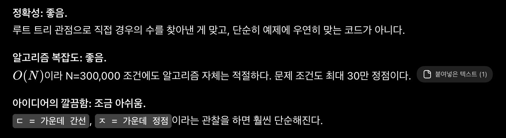

[문제 링크](https://jungol.co.kr/problem/19385)

## 문제
어느 날, 트리를 물끄러미 보고 있던 동현이는 엄청난 사실을 하나 발견했다. 바로 정점이 네 개인 트리는 ‘ㄷ’과 ‘ㅈ’ 의 두 종류밖에 없다는 사실이다! 정점이 네 개 이상 있는 임의의 트리에 대해, 그 트리에서 정점 네 개로 이루어진 집합을 고르자. 전체 트리의 간선들 중 집합에 속한 두 정점을 잇는 간선만을 남겼을 때, 네 개의 정점이 하나의 트리 형태로 이어지게 된다면 ‘ㄷ’ 모양 이거나 ‘ㅈ’ 모양일 것이다. 트리에서 ‘ㄷ’의 개수와 ‘ㅈ’의 개수를 각각 트리에서 ‘ㄷ’ 모양, ‘ㅈ’ 모양을 이루는 정점 네 개짜리 집합의 개수라고 하자. 이제, 동현이는 세상의 모든 트리를 다음과 같은 세 종류로 나누었다.

- D-트리 : ‘ㄷ’이 ‘ㅈ’의 3배보다 많은 트리
- G-트리 : ‘ㄷ’이 ‘ㅈ’의 3배보다 적은 트리
- DUDUDUNGA-트리 : ‘ㄷ’이 ‘ㅈ’의 정확히 3배만큼 있는 트리

신이 난 동현이는 트리만 보이면 그 트리에 있는 ‘ㄷ’과 ‘ㅈ’이 몇 개인지 세고 다니기 시작했다. 하지만 곧 정점이 30만 개나 있는 트리가 동현이 앞에 나타났고, 동현이는 그만 정신을 잃고 말았다. 동현이를 대신해 주어진 트리가 D-트리인지 G-트리인지 아니면 DUDUDUNGA-트리인지 알려주자!

## 입력
첫 번째 줄에 트리의 정점 수 N 이 주어진다. (4 ≤ N ≤ 300 000) 두 번째 줄부터 N −1개의 줄에 트리의 각 간선이 잇는 두 정점의 번호 u, v가 주어진다. (1 ≤ u,v ≤ N)

## 출력
첫 번째 줄에 주어진 트리가 D-트리라면 D, G-트리라면 G, DUDUDUNGA-트리라면 DUDUDUNGA를 출력한다.

## 첫 번째 풀이 (정답)

초기 아이디어는 다음과 같다.

```
#   o           o
#  /|\         /
# o o o ㅈ     o
#             / \
#             o o   ㅈ
# 
#   o       o          o
#  / \     / \        /
# o   o   o   o      o
#  \         /        \
#   o   ㄷ   o   ㄷ     o
#                     /
#                    o   ...ㄷ?
#
# 네 개의 정점 집합을 골랐을 때 무조건 ^ 모양이 있음
# 나머지 한 꼬다리가 리프에 달려 있다 : ㄷ
#               루트에 달려 있다 : ㅈ

# 1. 루트부터 선택
# 2. ^ 자랑 / 자 선택 (간선 2개 쌍, 간선 1개 쌍)
# 3. ^자에서 해당 리프에 달린 자식 수만큼 ㄷ자
#    ^자에서 해당 루트에 달린 자식 수만큼 ㅈ자
#    /자에서 해당 리프->리프 자식 쌍만큼 ㄷ자

# 아니지, 좀 더 간단히 할 수 있음
# 1. 루트부터 선택
# 2. (1)
#     /
#    (2)
#     \ 
#    (3) 쌍 선택
# - 1에 달린 children : ㄷ자
# - 2에 달린 children : ㅈ자
# - 3에 달린 children : ㄷ자
# 3. 예외 : 1에 3개 쌍 달림 : ㅈ자 

# 그럼 정리하면
# 1. 임의로 1번을 루트로 잡고 루트부터 탐색 시작
# 2. 탐색할 때, 한 정점마다 두 번씩 더 탐색해야 함
#             (ㄷ자, ㅈ자 찾기)
#             추가로, 3개쌍 달린걸 따로 조합
```

아래는 제출한 코드이다.

- 정답 / PyPy3 / 4192ms / 1061.3MB

```py
# 19385 : ㄷㄷㄷㅈ

import sys
import math
input = sys.stdin.readline
sys.setrecursionlimit(1000001)

n = int(input().rstrip())
edges = [[] for _ in range(n+1)] # edges[i] : i번 정점에 이웃한 정점 정보
child = [0 for _ in range(n+1)] # child[i] : i번 정점에 이웃한 정점 개수

child[1] = 1 # child[pre]-2 에서 루트가 음수가 되는 현상 방지를 위한 보정

for _ in range(n-1):
    u, v = map(int, input().rstrip().split())
    edges[u].append(v)
    child[u] += 1;
    edges[v].append(u)
    child[v] += 1;

cnt_D = 0
cnt_G = 0
visited = [False for _ in range(n+1)]

# 2차 진입 : (2) - (3) 연결
def dfs2(pre, now):
    global cnt_D, cnt_G
    for next in edges[now]:
        if visited[next]: continue
        # ㄷ 자는, (1)-(2)-(3) 연결된 꼴에서 1. (1번 자식 개수 - 2 (부모, (1)-(2))) 개
        #                               2. (3번 자식 개수 - 1 ((2) - (3))) 개
        cnt_D += (child[pre] - 2) + (child[next] - 1)
    
    # ㅈ 자는, (1)-(2) 연결된 꼴에서 (2) 자식들 중 (1)-(2) 를 제외하고 2개를 고른 개수
    cnt_G += math.comb(child[now] - 1, 2)

# 1차 진입 : (1) - (2) 연결
def dfs(start):
    global cnt_G
    visited[start] = True

    for next in edges[start]:
        if visited[next]: continue
        dfs2(start, next) # (1. start) - (2. next) 연결. 2차 진입

    # ㅈ 자는, (1) 자식들 중 3개를 고른 개수
    cnt_G += math.comb(child[start] - 1, 3)

    # 다음 1차 진입
    for next in edges[start]:
        if visited[next]: continue
        dfs(next)

# 임의 루트 1번부터 시작
dfs(1)

print("DUDUDUNGA" if cnt_D == cnt_G * 3 else ("D" if cnt_D > cnt_G * 3 else "G"))
```

## 두 번째 풀이 (정답)


ChatGPT 왈, 복잡하게 세긴 했어도 중복/누락 없이 경우를 분해해낸 건 제대로 했다고 해주었고, 더 좋은 직관을 제시해주었다.

- ㅈ 자는 한 정점을 중심으로 이웃 3개만 고르면 된다.
- ㄷ 자는 한 간선을 중심으로 양 정점의 이웃 개수만 곱하면 된다.

크아악 시간 6배 공간 4배 단축됨

- 정답 / PyPy3 / 771ms / 263.9MB

```py
# 19385 : ㄷㄷㄷㅈ
import sys
import math
input = sys.stdin.readline

n = int(input().rstrip())
edges = []
child = [0 for _ in range(n+1)]
for _ in range(n-1):
    u, v = map(int, input().rstrip().split())
    edges.append([u, v])
    child[u] += 1
    child[v] += 1

cnt_G = 0
for i in range(1, n+1):
    cnt_G += math.comb(child[i], 3)

cnt_D = 0
for e in edges:
    cnt_D += (child[e[0]]-1) * (child[e[1]]-1)

print("DUDUDUNGA" if cnt_D == cnt_G * 3 else ("D" if cnt_D > cnt_G * 3 else "G"))
```