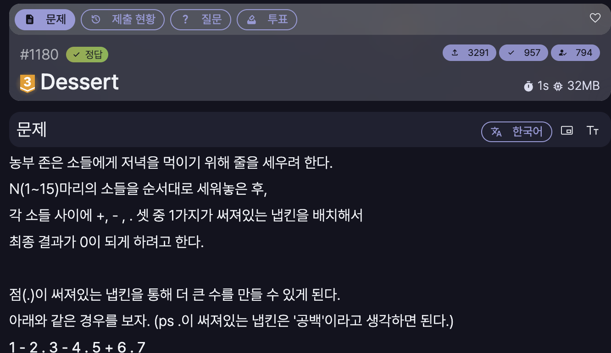

[문제 링크](https://jungol.co.kr/problem/1180)

## 문제

농부 존은 소들에게 저녁을 먹이기 위해 줄을 세우려 한다.

N(1~15)마리의 소들을 순서대로 세워놓은 후, 

각 소들 사이에 +, - , . 셋 중 1가지가 써져있는 냅킨을 배치해서

최종 결과가 0이 되게 하려고 한다.

 

점(.)이 써져있는 냅킨을 통해 더 큰 수를 만들 수 있게 된다. 

아래와 같은 경우를 보자. (ps .이 써져있는 냅킨은 '공백'이라고 생각하면 된다.)

1 - 2 . 3 - 4 . 5 + 6 . 7

이와 같은 배치는 1-23-45+67 을 나타낸다. 

결과는 0이다. 

10.11은 1011 로 해석된다.

## 입력

첫 번째 줄에는 소들의 수 N이 입력된다.

## 출력

처음 20줄에 대해 가능한 20가지 답을 출력하는데, 사전 순으로 앞선 것을 출력한다. 

순서는 +가 가장 앞서고 -와 .이 순서대로 뒤따른다. 답이 20개 미만이면 가능한 답을 모두 출력한다. 

마지막 줄에는 가능한 답의 총 가지 수를 출력한다.

## 풀이

백트래킹을 사용해서 풀이했다.

구현 중에 유의해야 할 점은 다음과 같다.


- `+`, `-` 기호만 존재하므로 연산자 우선순위는 고려할 필요 없이 앞에서부터 계산하면 된다.
- 순서는 `+`, `-`, `.` 순이므로 이 순서대로 재귀를 진행해야 한다.
- 처음 20줄에만 가능한 경우 식을 계산하면 된다.
- `10.11` 은 `1011` 로 게산해야 함을 유의해야 한다. 즉, 단순 10을 곱해 누적하는 방식은 옳지 않다.

---

- 정답 / Python 3 / 2431ms / 10.3MB

```py
# 1180 : Dessert
import sys
input = sys.stdin.readline

n = int(input().rstrip())
ans_cnt = 0

def calculate(left, ope, right):
    if ope == '+': return left + right
    if ope == '-': return left - right

def backtrack(pre_num, now_ope, now_num, next_num, order):
    global ans_cnt
    if next_num > n:
        if calculate(pre_num, now_ope, now_num) == 0:
            if ans_cnt < 20:
                string = "1"
                for i in range(n-1):
                    string += " " + order[i] + " " + str(i+2)

                print(string)
            ans_cnt += 1

        return

    # +
    backtrack(calculate(pre_num, now_ope, now_num), 
              '+',
              next_num,
              next_num + 1,
              order + '+')

    # -
    backtrack(calculate(pre_num, now_ope, now_num), 
              '-',
              next_num,
              next_num + 1,
              order + '-')

    # .
    backtrack(pre_num,
              now_ope,
              now_num * (10 if next_num < 10 else 100) + next_num,
              next_num + 1,
              order + '.')

backtrack(0, '+', 1, 2, '')

print(ans_cnt)
```