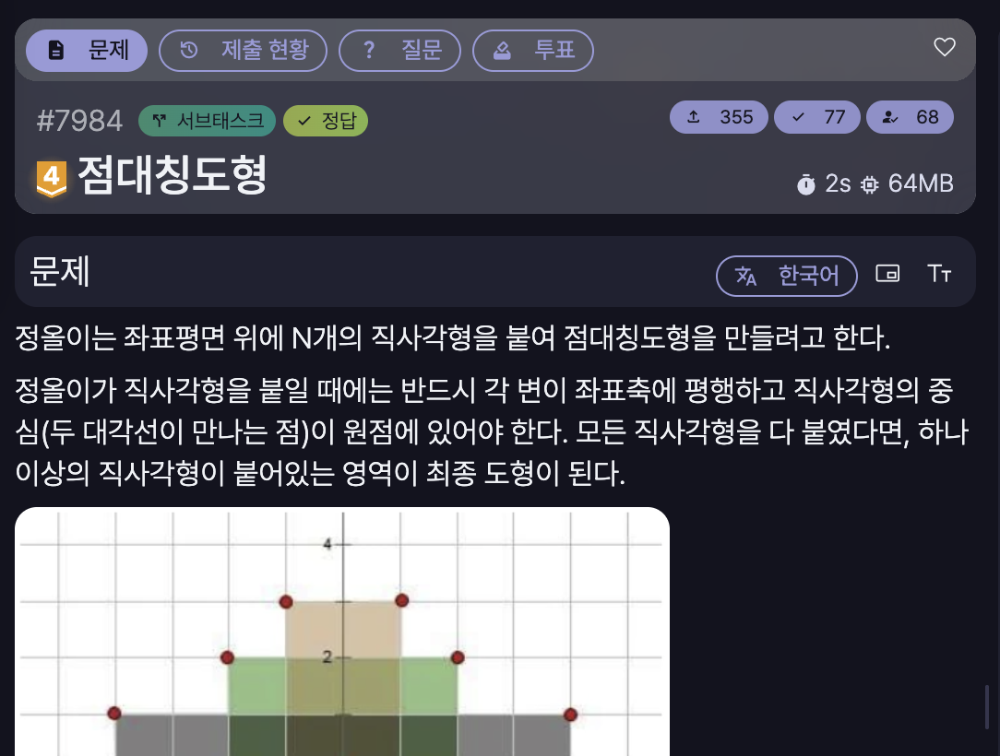

[문제 링크](https://jungol.co.kr/problem/7984)

## 문제

정올이는 좌표평면 위에 N개의 직사각형을 붙여 점대칭도형을 만들려고 한다.

정올이가 직사각형을 붙일 때에는 반드시 각 변이 좌표축에 평행하고 직사각형의 중심(두 대각선이 만나는 점)이 원점에 있어야 한다. 모든 직사각형을 다 붙였다면, 하나 이상의 직사각형이 붙어있는 영역이 최종 도형이 된다.

정올이가 붙인 직사각형의 가로 길이와 세로 길이가 주어졌을 때 정올이가 만든 최종 도형의 넓이를 구하여라.

## 입력

첫 번째 줄에 직사각형의 개수 N (1 ≤ N ≤ 1 000 000)이 주어진다.

다음 N개의 줄에는 각 직사각형의 크기(너비와 높이)를 나타내는 짝수 X와 Y (2 ≤ X, Y ≤ 10^7)가 주어진다.

## 출력

만들어진 점대칭도형의 넓이를 출력한다.

## 풀이

정렬 문제인 줄 알고, 최상단의 우측 점부터 시작해서 너비를 더해나가는 풀이를 적용했으나, 시간 초과였다.

- #2 시간 초과 / PyPy3 / 8000ms / 235.3MB

```py
# 7984 : 점대칭도형
import sys
input = sys.stdin.readline

n = int(input().rstrip())
dots = [list(map(int, input().rstrip().split())) for _ in range(n)]
dots.sort(key=lambda x:(-x[1], -x[0]))

ans = 0
pre_col = 0
for i in range(n):
    ans += max((dots[i][1]//2) * ((dots[i][0]//2) - pre_col), 0)
    pre_col = max(pre_col, (dots[i][0]//2))

print(ans * 4)
```

이 문제는 정렬을 이용하는게 아니라, 정렬을 하는 척 X, Y 범위 내에서 풀어야 하는 문제였다. 

- 정답 / PyPy3 / 975ms / 214.8MB

```py
# 7984 : 점대칭도형
import sys
input = sys.stdin.readline

n = int(input().rstrip())
dots = [list(map(int, input().rstrip().split())) for _ in range(n)]

max_cols = [0 for _ in range(5000001)]

for i in range(n):
    max_cols[dots[i][1]//2] = max(max_cols[dots[i][1]//2], dots[i][0]//2)

ans = 0
for i in range(5000000, 0, -1):
    ans += max_cols[i]
    max_cols[i-1] = max(max_cols[i-1], max_cols[i])

print(ans * 4)
```