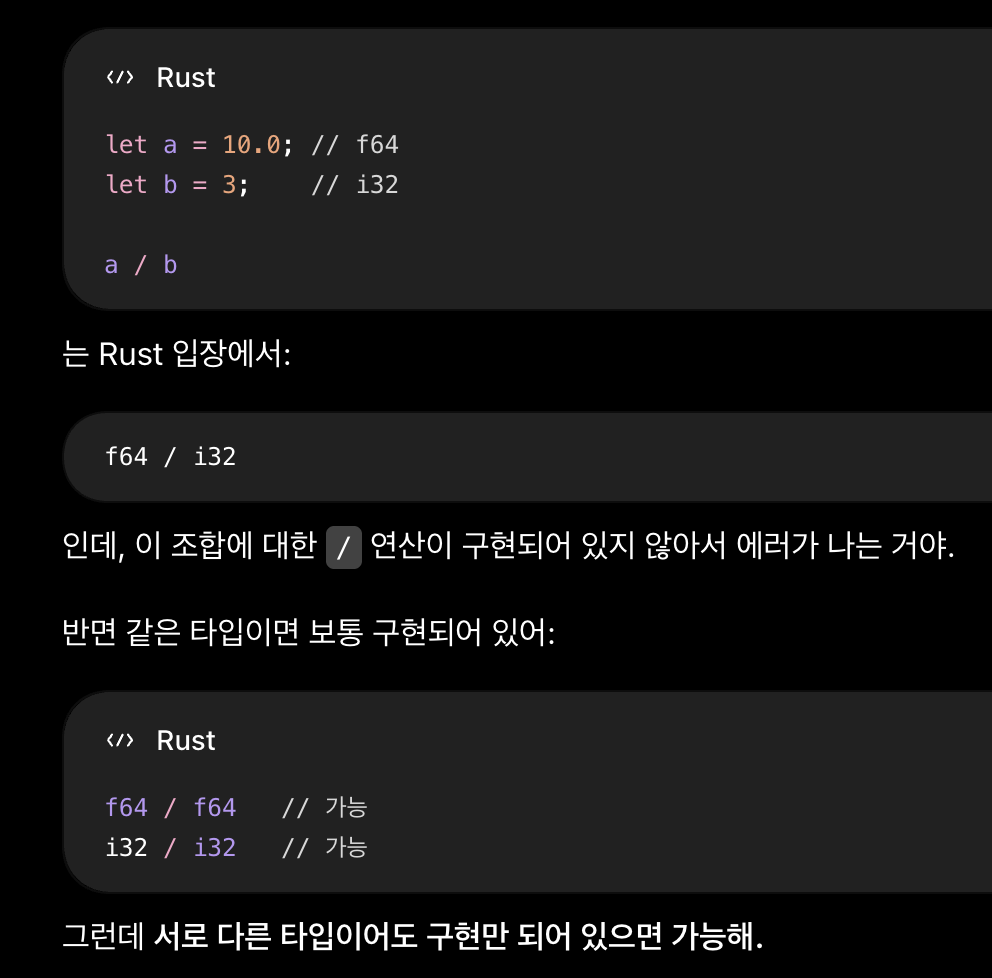

## 러스트란?

Rust는 Firefox 를 개발한 Mozilla 재단이 지원하는 오픈소스. 안정성, 속도, 동시성을 3대 요소로 개발 목표를 잡았다.
시스템 프로그래밍에 사용하던 C/C++ 외에, Firefox 속도 향상에 큰 기여를 한 Rust가 주목받게 된다.
C/C++ 언어에서 발생하는 메모리 관리의 복잡성을 해소한다고 하는데, 언어를 배우면서 어떻게 해결하는지 공부하고자 한다.

러스트는 패키지 관리 시스템 'Cargo' 가 존재한다. 빌드 시스템 역할도 수행한다.

- 러스트는 소유권 시스템으로 메모리를 관리한다.
- 러스트는 타입 추론 기능이 있다.


- 러스트 설치 명령어 : `curl --proto '=https' --tlsv1.2 -sSf https://sh.rustup.rs | sh`
- 러스트 업데이트 명령어 : `rustup update stable`
- 러스트 개발 편의성을 위한 VSCode Extension : `rust-analyzer`
- 러스트 소스 코드 파일 확장자 : `.rs`
- 러스트 컴파일 및 실행 명령어 : `rustc 파일명.rs`, `./파일명`

```rust
fn main() {
    println!("Hello World!");
}
```

- `println!` 이라는 매크로를 사용하여 Hello World! 를 출력한다.

> ### 매크로란? (간단하게)
> - 매크로란, 컴파일하기 전에 코드를 받아서, **다른 Rust 코드** 를 만들어내는 기능이다.
> 
> ```rust
> // 1. say_hello 라는 매크로를 생성한다. 
> // 호출 시 println!("Hello"); 를 만들어 낸다.
> macro_rules! say_hello {
>     () => {
>         println!("Hello!");
>     };
> }
> 
> fn main() {
>     say_hello!();
> }
> ```
> 
> ```rust
> // 2. create_function 이라는 매크로를 생성한다.
> // $name : 매크로 안에서 사용할 매크로 변수
> // ident : $name이 "식별자" 종류의 Rust 문법을 받는다고 정의
> macro_rules! create_function {
>     ($name:ident) => {
>         fn $name() {
>             println!("Hello!");
>         }
>     };
> }
> 
> create_function!(hello);
> /*
> fn hello() {
>     println!("Hello!");
> } 가 만들어짐.
> */
> 
> create_function!(world);
> /*
> fn world() {
>     println!("Hello!");
> } 가 만들어짐.
> */
> 
> 
> fn main() {
>     hello();
>     world();
> }
> ```
> 
> - 반복되는 코드 생성, 특정 코드에 기능 추가, 여러 개 인자 처리, 컴파일 타입 검사 등의 역할에 사용된다고 한다. 
> - 위는 `macro_rules!` 기반의 선언적 매크로고, 아래와 같이 절차적 매크로도 있다고 한다. 
> - 절차적 매크로란, "러스트 소스 코드" 를 입력으로 받아 새 러스트 코드를 반환하는 기능이다. 개념이 어려우니 일단 기초 단계에서는 넘어가고, 나중에 제대로 학습.
> 
> ```rust
> 
> #[derive(Debug)]  // 절차적 매크로 예시
> #[tokio::main]
> #[route("/")]
> ```

## 러스트 - 사칙연산

```rust
// 러스트에서의 정수 나눗셈
fn main() {
    let a = 10;
    let b = 3;
    println!("a / b : {}", a / b); // a / b : 3
}
```

```rust
// 러스트에서의 실수 / 정수 나눗셈
fn main() {
    let a = 10.0; 
    let b = 3;
    println!("a / b : {}", a / b); // 아래 오류가 발생한다.
    // 숫자라도 타입이 다르면 맞춰줘야 한다.
}
```

```sh
error[E0277]: cannot divide `{float}` by `{integer}`
 --> hello.rs:4:30
  |
4 |     println!("a / b : {}", a / b);
  |                              ^ no implementation for `{float} / {integer}`
  |
```

```rust
// 러스트에서의 실수 나눗셈
fn main() {
    let a = 10.0;
    let b = 3.0;
    println!("a / b : {}", a / b); // a / b : 3.3333333333333335
}
```

> ### 궁금증 : 다른 연산에서도 타입 다른 것이 문제가 되는가?
> ```rust
> fn main() {
>     let a = 10.0;
>     let b = 3;
>     println!("a + b : {}", a + b);
> }
> ```
> 
> ```sh
> error[E0277]: cannot add an integer to a float
>  --> hello.rs:4:30
>   |
> 4 |     println!("a + b : {}", a + b);
>   |                              ^ no implementation for `{float} + {integer}`
>   |
> ```
> 
> 이 외 빼기, 곱하기도 비슷한 오류를 낸다.
> 정확하게는, Rust는 해당 타입 조합에 대해 "연산이 구현되어 있어야 한다."
> 

## 러스트 - 조건문, 반복문

```rust
// 러스트의 조건문
if 조건 {

} else if 조건 { 

} else {
    
}

let a = if n % 2 == 0 { "even" } else { "odd" };

// 러스트의 반복문
for 변수 in 시작..종료+1 {

}
```

> ### 조건문을 괄호로 감싸면
> ```rust
> fn main() {
>     if (3 > 1) {
>         println!("Hi");
>     }
> }
> ```
> 
> ```sh
> warning: unnecessary parentheses around `if` condition
>  --> hello.rs:2:8
>   |
> 2 |     if (3 > 1) {
>   |        ^     ^
>   |
>   = note: `#[warn(unused_parens)]` (part of `#[warn(unused)]`) on by default
> help: remove these parentheses
>   |
> 2 -     if (3 > 1) {
> 2 +     if 3 > 1 {
>   |
> 
> warning: 1 warning emitted
> ```

## 러스트 - 포맷 지정자

```rust
println!("{}", value);
println!("{value}");

let arr = [1, 2, 3];
println!("{:?}", arr); // 디버그 출력. 배열, 벡터, 구조체를 확인할 때 사용

println!("{:<10}", "Hi"); // 10칸 왼쪽 정렬
println!("{:>10}", "Hi"); // 10칸 오른쪽 정렬
println!("{:^10}", "Hi"); // 10칸 가운데 정렬

println!("{:-<10}", "Hi"); // 10칸 왼쪽 정렬, 빈칸은 - 로 채우기
println!("{:->10}", "Hi"); // 10칸 오른쪽 정렬, 빈칸은 - 로 채우기
println!("{:-^10}", "Hi"); // 10칸 가운데 정렬, 빈칸은 - 로 채우기

println!("{:.2}", pi); // 3.14
println!("{:.4}", pi); // 3.1416
println!("{:10.2}", pi); // ______3.14 전체 10칸 중 소수점 두 자리까지

println!("{:b}", n); // 2진수 출력
println!("{:o}", n); // 8진수 출력
println!("{:x}", n); // 16진수 출력
println!("{:X}", n); // 16진수 대문자 출력

println!("{:#b}", n); // 0b 진법 접두사 포함 2진수 출력
                      // 그 외 0o, 0x..

println!("{:+}", 42); // 부호 출력 : +42
println!("{:+}", -42); // 부호 출력 : -42

println!("{:e}", 123456.0); // e 표기법. 1.23456e5
println!("{:E}", 123456.0); // E 표기법. 1.23456E5

println!("{value:.1}"); // 변수명과 같이 넣고 싶을때
println!("{value:.precision$}"); // 변수명을 지정자로 넣고 싶을때. 끝에 $ 필수
```

## 러스트 - 변수 선언

```rust 
let a = 30; // 러스트에서 변수는 기본적으로 immutable 이다.
let mut b = 30; // mut 키워드로 mutable 변수를 선언할 수 있다. 
```

```sh
# mut 없을 시 오류
error[E0384]: cannot assign twice to immutable variable `a`
 --> hello.rs:3:5
  |
2 |     let a = 1;
  |         - first assignment to `a`
3 |     a = a + 1;
  |     ^^^^^^^^^ cannot assign twice to immutable variable
  |
help: consider making this binding mutable
  |
2 |     let mut a = 1;
  |         +++

error: aborting due to 1 previous error
```

## 러스트 - 데이터 타입 

```rust
// i[ ] : [ ]비트 정수
// i8, i16, i32, i64, i128
// isize : 현재 OS 비트와 동일 크기의 정수

// u[ ] : [ ]비트 부호 없는 정수
// u8, u16, u32, u64, u128
// usize : 현재 OS 비트와 동일 크기의 부호 없는 정수

// f32 : 32비트 실수
// f64 : 64비트 실수

fn main() {
    // 해당 데이터 타입의 최소/최대 값은 타입::MIN, 타입::MAX 로 알 수 있다.
    println!("i32 : {} ~ {}", i32::MIN, i32::MAX);
    println!("isize = i{}", isize::BITS);

    // 타입 추론을 이용하지 않고, 직접 타입을 지정할 수 있다.
    let a : i32 = 30;
    let b : isize = 60;

    // 타입 변환은 as 키워드로 가능하다.
    let a = 'A' as i16; // char 타입을 i16 타입으로 강제 변환
}
```

## 러스트 - 함수 정의
```rust
fn main() {
    println!("{}", add(3, 2));
}

fn add(a: i64, b: i64) -> i64 {
    println!("덧셈 함수이다");
    a + b
}
```

- 파라미터와 리턴값의 타입을 무조건 선언해야 한다. (변수명: 타입) -> 반환 타입
- 리턴값은 값만 적어놓거나, return 값; 으로 사용한다.

```rust
fn main() {
    println!("{}", add(7, 2));
}

fn add(a: i64, b: i64) -> i64 {
    println!("덧셈 함수이다");
    if a > 3 {
        return a - b;
    } else {
        a + b
    }
}
```

## 러스트 - 클로저
러스트의 람다
```rust
fn main() {
    let print = |str| { print!("{}", str); }; // 타입 추론을 하기 때문에, 인수에 타입 정의를 안해도 된다.
    print("Hi");
}
```


> ### 클로저의 borrow?
> ```rust
> fn main() {
>     let mut a = 1;
>     let increase = || { a + 1 };
> 
>     println!("{}", increase());
> 
>     a = 3;
> 
>     println!("{}", increase());
> }
> ```
> 
> increase가 a를 참조해야 함 -> a를 불변 borrow -> increase가 나중에도 다시 사용됨 -> a에 대한 borrow를 계속 유지해야 함
> 중간에서 a의 값을 바꾸면 가변 접근이 필요하다. "어떤 값을 불변 참조하고 있는 동안에는 그 값을 변경할 수 없다."
> 가변 borrow 를 위해서는 increase도 mut 키워드가 필요하다.
>
> ```rust
> fn main() {
>     let mut a = 1;
>     let mut increase = || { 
>         a = a + 1;
>         a
>     };
> 
>     println!("{}", increase());
> 
>     a = 10;
> 
>     println!("{}", increase());
> }
> ```
> 
> 이것도 불가능하다. increase() 가 이번엔 가변으로 캡처하고 있기 때문. 
> increase를 이후에도 사용하겠다고 판단되면 그 상태로 &mut a 로 가지고 있기 때문에 a에 직접 접근이 불가능
> 클로저가 a 를 "캡처해서 가지고 있는다"는 느낌? 으로 생각하면 된다.
> 중간에 직접 접근할거면, 차라리 클로저의 인수로 받는 편이 더 좋다.
>
> ```rust
> fn main() {
>     let mut a = 1;
>     let mut increase = || { 
>         a = a + 1;
>         a
>     };
> 
>     println!("{}", increase());
> 
>     println!("{}", a);
>     
>     a = 10;
> 
>     println!("{}", a);
> }
> ```
> 
> 더 안 쓸거면 가능. 오류 안남.

## 러스트 - 배열 선언
```rust
fn main() {
    // 고정 길이 배열 선언
    let arr1 = [1, 2, 3, 4, 5];

    println!("{}", arr1[0]);
    println!("{}", arr1.len());

    let arr2: [i32; 3] = [1, 2, 3]; // i32 타입으로 길이 3 배열
    let arr3 = [0; 5]; // 길이 5만큼 0으로 초기화

        // 중요한 점 : "길이"까지 타입의 일부다!
        // [i32; 3] 과 [i32; 4] 는 "다른 타입"이다.
        // 따라서 길이는 바꿀 수 없다.
    
    // 가변 길이 배열 선언 (Vec 사용)
    let mut arr4 = vec![1, 2, 3]; // 타입은 Vec<i32> 가 된다.

    arr4.push(4); arr4.push(5);
    println!("{arr4:?}");

    let mut arr5: Vec<i32> = Vec::new();
}
```

## 러스트 - 참조 값
```rust
fn main() {
    let mut a = 10;
    add5(&mut a); // 변경될 변수는 &mut 키워드와 함께 전달
    println!("{a}");
}

fn add5(a: &mut i64) { // 인수에서도 &mut
    *a += 10; // C의 포인터처럼 역참조
}
```
